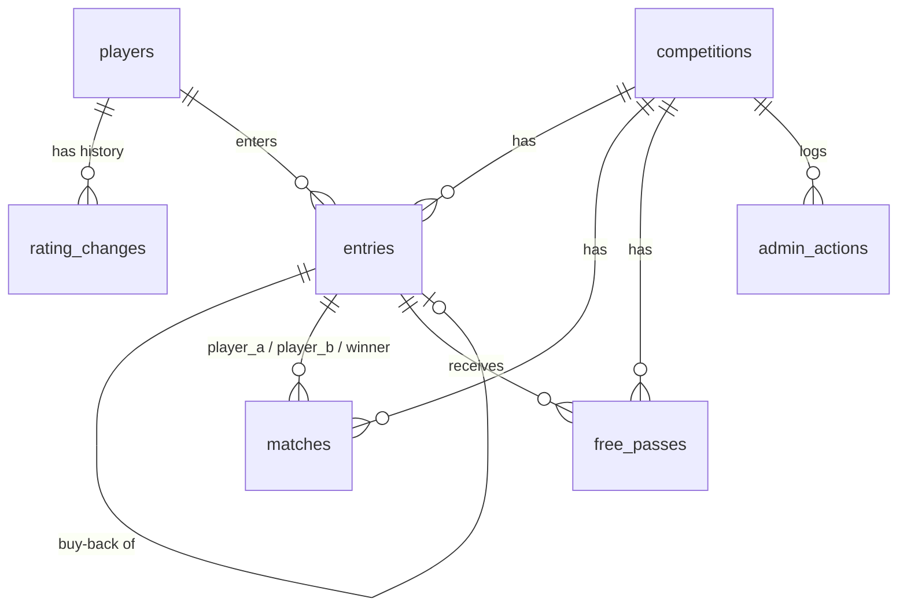

# Maroubra Seals Snooker Tournament App — Functional Specification

| | |
| --- | --- |
| Status | Revision 2 — the twelve open questions (O-1 … O-12) have been answered by the organiser and are now specified, not guessed |
| Date | 6 September 2026 |
| Sources | [snooker-comp-rules.md](snooker-comp-rules.md) (behaviour; Part B §8–13 are the functional requirements), [tournament-app-plan.md](tournament-app-plan.md) (hosting and infrastructure) |

Every requirement below is traced to a section of the rules document with a citation like **§10**. Part A sections (§1–7) are the player rules; Part B sections (§8–13) are the app specification. Where the two source documents were silent or said TBC, the organiser's ruling is recorded in [section 10, Decisions](#10-decisions), and the ruling's number (O-1 … O-12) is cited at the point it is implemented.

**Several of those rulings changed the rules document itself, and it has been updated to match** — [10.2](#102-amendments-applied-to-the-rules-document) lists every edit. The three worth knowing before reading on:

- **Ratings are golf-style handicaps: the lower the number, the better the player, and they can be negative.** The start goes to the player with the **higher** number, which is the weaker one. §6's "the lower-rated player starts" meant lower *in ability*; it is now worded so it cannot be read the other way (5.6).
- **O-1** sets a configurable scale on top of that: the night's top X finishers move by Y and the bottom Z by W, defaulting to top 3 by −1 and bottom 3 by +2 — a good night brings your number down.
- **O-4** allows **more than one round-one free pass**, replacing §11's "fills every possible round-one match before giving a free pass" (and matching §4).
- **O-10 / O-11** move hosting from Vercel to **Netlify** and settle the database on **Supabase**.

**How to read this document.** Sections 1–4 are written for the organiser and describe what the app does, screen by screen. Sections 5–10 are written for the developer and describe how it works underneath. Both halves use the vocabulary from the rules document:

| Term | Meaning (from the rules) |
| --- | --- |
| **Bracket size** | 16 or 32, the number of round-one slots (§1, §8) |
| **Slot** | One of the `1..B` round-one bracket positions. Slots `2k−1` and `2k` are match `k` (§8.2) |
| **Rating** | A player's stored handicap number (§6, §13). **Lower is better, and it can be negative** — like a golf handicap (5.6) |
| **Start** | The head start on points the weaker player — the one with the **higher** rating number — receives in a frame (§6) |
| **Waiting player** | A player in the current round with no opponent yet (Part B definition) |
| **Buy-back** | A round-one loser re-entering once for one more round-one match; also how a late arrival enters (§3) |
| **Free pass** | Advancing to the next round without playing (§4, §11) |
| **Force Pair** | Organiser action that pairs two waiting players at random, round one only (§10) |
| **Close Buy-Backs** | Organiser action that locks the player list for the night (§11) |
| **Master override** | Organiser screen that can change anything, bypassing the normal guards (O-5) |

---

# Part 1 — For the organiser

## 1. Overview

The app runs one snooker competition on one night. Before the night, the organiser keeps a list of club players and their ratings (§13). On the night, the organiser picks the bracket size, ticks the players who have entered, chooses a buy-back mode and presses **Start Competition**; the app draws the round-one bracket at random (§8). From then on the organiser uses the admin page on the club phone to start each match, watch the 25-minute clock, enter the winner, and record whether a round-one loser buys back (§12). Winners advance automatically, buy-back players fill the empty bracket slots and are paired according to the chosen mode (§9), the organiser can Force Pair waiting players when a table is free (§10), and Close Buy-Backs when the night's entries are done (§11). Everyone else in the club watches the public bracket page on their own phone, which shows every match, its state and clock, and every player's rating and start (plan: "Public page"). The competition is single-elimination and finishes when one player is left.

Nothing on the night is a one-way door. A match started by mistake can be un-started (O-5), a result can be corrected (§12), a whole competition can be abandoned (O-7), and the master override screen (3.9, O-5) can add or remove players and rebuild pairings at any point.

## 2. Roles and access

There are exactly two kinds of user (plan: "Admin Access").

| Role | How they get in | What they can do |
| --- | --- | --- |
| **Organiser** | Types one of the club's **admin codes** on the login screen. If it matches, the app sets a browser cookie so the phone stays logged in (plan). | Everything: manage players and ratings, set up and start the competition, add buy-backs, start and complete matches, cancel a start, correct results, Force Pair, Close Buy-Backs, switch buy-back mode, master override, abandon the night, adjust ratings afterwards. |
| **Public viewer** | Opens the public page. No login. | Read only: view the bracket, match states and clocks, players, ratings and starts. |

Rules that follow from the plan, the project constraints and the organiser's rulings:

- There are **several admin codes, one per organiser, each with a name** (O-8). The name attached to the code that was used is what the app records as "changed by" on every rating change (§13) and as the actor on every override (3.9). There are still no accounts, no password resets and no email (plan): the code *is* the identity.
- The organiser stays logged in on that phone until the cookie expires or **their** code is changed. Because each session cookie is signed with the code that created it, changing one person's code logs out only that person (7.1, 8.3).
- The public page **never** changes anything. Only a logged-in organiser can change match state, and every change is checked on the server, not just hidden in the interface.
- More than one device can be logged in at the same time, with the same code or with different ones.

## 3. Screens

All screens are designed for a phone held upright. Mockups are about 38 characters wide, which is a phone screen in a readable font. `●` marks a green in-play match, `■` a red finished match, `○` a match not started (§12 colours).

Screen list:

| # | Screen | Who | Route |
| --- | --- | --- | --- |
| 3.1 | Admin login | Organiser | `/admin/login` |
| 3.2 | Players and ratings | Organiser | `/admin/players` |
| 3.3 | Competition setup and draw | Organiser | `/admin/setup` |
| 3.4 | Admin bracket and match control | Organiser | `/admin` |
| 3.5 | Complete match / correct result | Organiser | dialog on 3.4 and 3.6 |
| 3.6 | Match timer view | Organiser | `/admin/match/{id}` |
| 3.7 | End-of-night rating review | Organiser | `/admin/ratings` |
| 3.8 | Public bracket | Everyone | `/` |
| 3.9 | Master override | Organiser | `/admin/override` |

### 3.1 Admin login

```
┌──────────────────────────────────────┐
│ Maroubra Seals Snooker               │
│ Organiser login                      │
│                                      │
│ Admin code                           │
│ ┌──────────────────────────────────┐ │
│ │ ••••••••                         │ │
│ └──────────────────────────────────┘ │
│ ┌──────────────────────────────────┐ │
│ │             Log in               │ │
│ └──────────────────────────────────┘ │
│                                      │
│ Code not accepted. Try again.        │  ← only after a wrong code
│                                      │
│ View the public bracket ›            │
└──────────────────────────────────────┘
```

**Data shown:** one input box (plan: "a single input box for the code"). The organiser types only the code; the app works out which organiser it belongs to (O-8), so nothing else has to be typed on a phone.

**Actions:**

| Action | What happens |
| --- | --- |
| Log in | The code is sent to the server and compared with each configured admin code. Match: a session cookie carrying that organiser's name is set and they are taken to the admin bracket (3.4), or to setup (3.3) if no competition is running. No match: "Code not accepted" is shown and nothing else changes. |
| View the public bracket | Goes to 3.8. |

Every admin screen shows **"Signed in as Gabriel"** in its header with a **Log out** link, so it is always obvious whose name will be recorded against a change.

Any admin page opened without a valid cookie redirects here.

### 3.2 Players and ratings

The club's player list persists from week to week. Each player has a stored rating (§13) and is either **active** or **inactive**. **Players are never deleted** (O-9): a player who has left the club is deactivated, which hides them from tonight's entry list while keeping their rating history and every past result intact.

```
┌──────────────────────────────────────┐
│ ‹ Admin          Players & ratings   │
│ Signed in as Gabriel                 │
│ ┌──────────────────────────────────┐ │
│ │ Search players…                  │ │
│ └──────────────────────────────────┘ │
│ [ + Add player ]   ☐ Show inactive   │
│                                      │
│ Name                 Rating          │
│ Alice Chen             45   [Edit]   │
│ Bob Smith              20   [Edit]   │
│ Carl Diaz              33   [Edit]   │
│ Dee Park               30   [Edit]   │
│ …                                    │
│ ── Inactive ──────────────────────   │  ← only with the box ticked
│ Jim Vale (inactive)    22   [Edit]   │
└──────────────────────────────────────┘

Edit sheet (slides up over the list):
┌──────────────────────────────────────┐
│ Bob Smith                            │
│ Rating        [ 20 ]                 │
│ Reason        [ weekly review    ]   │
│ Status        (•) Active ( ) Inactive│
│ Changed by    Gabriel  (signed in)   │
│ [ Save ]                  [ Cancel ] │
│                                      │
│ History                              │
│  18 → 20   30 Aug 2026  Gabriel      │
│  15 → 18   23 Aug 2026  Gabriel      │
└──────────────────────────────────────┘
```

**Data shown:** every active player's name and current rating, inactive players behind a toggle, and on the edit sheet the rating change history with who changed it and when (§13: "The app records who changed it and when").

**Actions:**

| Action | What happens |
| --- | --- |
| Add player | Enters a name and starting rating. The first rating is recorded as a rating change so its origin is in the history. |
| Edit → Save | Overrides the rating (§13: "The organiser can override any rating"). A history row is written with the old value, new value, the signed-in organiser's name and the time (O-8). **Changing a rating never changes the start of a match already created tonight** (see 5.6). |
| Active / Inactive | Deactivating hides the player from the entry list on 3.3 and from the public player list, and blocks them from being entered. Reactivating restores them. Neither touches their history. A player who is in tonight's competition cannot be deactivated until the night is complete or abandoned. |
| Cancel | Nothing changes. |

There is no delete (O-9). If a player was added by mistake, deactivate them.

### 3.3 Competition setup and draw

Shown when no competition is in progress. Implements §8.1–8.2.

```
┌──────────────────────────────────────┐
│ ‹ Admin        Tonight's competition │
│ Name        [ Friday 11 Sep 2026   ] │
│                                      │
│ Bracket size    (•) 16     ( ) 32    │
│                                      │
│ Buy-back mode                        │
│   (•) Random Draw (default)          │
│   ( ) Sequential Pairing             │
│                                      │
│ Match time limit   [ 25 ] minutes    │
│                                      │
│ Rating adjustment (applied on 3.7    │
│ after the night)                     │
│   Top    [ 3 ] finishers  [ -1 ] ea. │
│   Bottom [ 3 ] finishers  [ +2 ] ea. │
│                                      │
│ Entered players       13 of 16       │
│ ┌──────────────────────────────────┐ │
│ │ ☑ Alice Chen (45)                │ │
│ │ ☑ Bob Smith (20)                 │ │
│ │ ☐ Carl Diaz (33)                 │ │
│ │ ☑ Dee Park (30)                  │ │
│ │ …                                │ │
│ └──────────────────────────────────┘ │
│ [ + New player ]                     │
│                                      │
│ 13 players → 6 matches, 1 waiting    │
│ player, 3 open slots for buy-backs   │
│ ┌──────────────────────────────────┐ │
│ │        Start Competition         │ │
│ └──────────────────────────────────┘ │
└──────────────────────────────────────┘
```

**Data shown:** competition name, bracket size, buy-back mode, default match time limit (§12: "default is 25 minutes, configurable for the whole competition"), the four rating-adjustment settings (O-1), the **active** player list with a tick per entered player, and a live summary line.

**Actions:**

| Action | What happens |
| --- | --- |
| Bracket size | Choose 16 or 32 (§8.1). Disabled if more players are ticked than the chosen size allows. |
| Buy-back mode | Choose Random Draw or Sequential Pairing (§9). Random Draw is the default. Can also be switched later during round one (3.4). |
| Match time limit | Sets the default for every match tonight. Individual matches can override it before they start (§12). |
| Rating adjustment | Four numbers, carried over from the previous competition and editable here (O-1): how many of the night's best finishers are adjusted and by how much, and the same for the night's earliest losers. Defaults: top **3** by **−1**, bottom **3** by **+2**. They are snapshotted onto the competition, so changing them next week does not rewrite last week's review. |
| Tick / untick a player | Adds or removes them from tonight's entry list. The summary line updates: number of matches, whether there is a waiting player, and how many slots are left open. |
| New player | Opens the add-player sheet from 3.2 and ticks the new player. |
| **Start Competition** | Confirms ("Start with 13 players in a 16 bracket? The bracket size cannot be changed afterwards."). Then the app shuffles the entered players, fills the round-one bracket top to bottom with no gaps, leaves the remaining slots open for buy-backs and late arrivals, and makes any odd player out a waiting player (§8.2). The organiser lands on 3.4. |

After Start: the bracket size is locked (§8.1) and players can only be added as buy-backs (§8.3) — or through the master override (3.9), which is the deliberate escape hatch. The setup screen is not reachable again until the competition is complete or abandoned.

### 3.4 Admin bracket and match control

The main screen for the night. It lists every match in the current round with its state colour, the waiting players, and the round-one controls.

```
┌──────────────────────────────────────┐
│ Friday 11 Sep · Round 1   Gabriel ▾  │
│ Buy-backs OPEN · Random Draw         │
│ [ Close Buy-Backs ]  [ Force Pair ]  │
│ Mode: Random Draw  [ Switch mode ]   │
├──────────────────────────────────────┤
│ M1  ● IN PLAY             18:42 left │
│     Alice Chen (45)  starts on 17    │
│     Bob Smith (20)                   │
│     [ Complete ]  [ Timer ›]  [ ⤺ ]  │
├──────────────────────────────────────┤
│ M2  ○ NOT STARTED                    │
│     Carl Diaz (33)   starts on 2     │
│     Dee Park (30)                    │
│     [ Start ]      limit: 25 min ▾   │
├──────────────────────────────────────┤
│ M3  ■ FINISHED                       │
│   ✔ Eve Long (28)                    │
│     Fay Ng (41)  → bought back       │
│     [ Correct result ]               │
├──────────────────────────────────────┤
│ M4  ● IN PLAY  ⚠ TIMED OUT     00:00 │
│     Hal Ito (36)                     │
│     Ida Roy (36)     level, no start │
│     [ Complete ]  [ Timer ›]  [ ⤺ ]  │
├──────────────────────────────────────┤
│ M8  ○ AWAITING OPPONENT   slot 16    │
│     Fay Ng (41)      buy-back #1     │
├──────────────────────────────────────┤
│ Waiting players (2)                  │
│     Gus Ray (25)     first draw      │
│     Fay Ng (41)      buy-back #1     │
│ Open slots: 2 of 16                  │
│ [ + Add buy-back / late arrival ]    │
├──────────────────────────────────────┤
│ Players & ratings ›   Public page ›  │
│ Master override ›     Abandon night  │
└──────────────────────────────────────┘
```

`⤺` is **Cancel start** (O-5). A half-full round-one slot pair is shown as **AWAITING OPPONENT** so the organiser can see where the next buy-back will land (5.2).

From round two onwards the header changes and the round-one controls disappear (§10, §11):

```
│ Friday 11 Sep · Round 2              │
│ Buy-backs closed · 9 players         │
│ Free passes: Gus Ray (25),           │
│              Fay Ng (41)             │
├──────────────────────────────────────┤
│ M9  ○ NOT STARTED                    │
│ …                                    │
```

**Data shown:**

- Competition name, current round, the signed-in organiser (O-8), whether buy-backs are open or closed, and the current buy-back mode (round one only).
- Every match of the current round: number, state and colour (§12), both players with ratings, the weaker player's start (§13, 5.6), the countdown while in play, a timed-out warning at zero (§12), the winner tick and the loser's buy-back decision when finished.
- Round-one slot pairs holding one player, marked **awaiting opponent** with their slot number (5.2).
- Waiting players with how they entered (first draw or buy-back) and, for buy-backs, their order of re-entry (used by Sequential Pairing, §9).
- Open slots remaining out of the bracket size (§8.2, O-3).
- **All** free-pass holders for the round — round one can have more than one (§4, O-4).
- Earlier rounds are collapsed below the current round and can be expanded.

**Actions:**

| Action | Available when | What happens |
| --- | --- | --- |
| **Start** (on a match) | Match is not started | The match turns green and the countdown begins from the match's time limit (§12). The started time is stored on the server, so the clock keeps running wherever the organiser goes in the app, after a refresh, and while the phone is locked. |
| Time limit ▾ (on a match) | Match is not started | Overrides the time limit for this match only (§12: "overridable per match"). |
| **Timer ›** | Match is in play | Opens the timer view (3.6). |
| **Complete** | Match is in play | Opens the complete dialog (3.5). A result cannot be entered on a match that has not started (§12). |
| **⤺ Cancel start** | Match is in play | Confirms ("Cancel the start of M1? The clock is discarded and the match goes back to not started."). Returns the match to `not_started`, clears `started_at` and the frozen limit, and writes an audit row. For the wrong match having been started (O-5). The two players, the ratings and the start are untouched. |
| **Correct result** | Match is finished and the winner's next match has not started | Opens the correct dialog (3.5). The corrected winner is pulled back out of the next round (§12). If the winner's next match has started, the button is replaced by "Result locked: next match started" — and the master override (3.9) is the way through if it really has to change. |
| **Force Pair** | Round one, two or more waiting players | Picks two waiting players at random and creates a not-started match between them, whichever way they entered (§10). With fewer than two waiting players the button is disabled and shows "Needs 2 waiting players". It never touches an existing match. Hidden from round two (§10). |
| **Close Buy-Backs** | Round one, buy-backs open | Confirms, naming the consequence: "Close buy-backs? No more entries tonight. 2 players have no opponent and will go straight to round 2." Locks the player list, places any unplaced waiting players per 5.3, and gives a free pass to **every** player still without an opponent (O-4). The header changes to "Buy-backs closed". |
| **Switch mode** | Round one, buy-backs open | Switches between Random Draw and Sequential Pairing (§9: "can be switched at any time during round one"). Switching to Sequential immediately places waiting players in re-entry order. Switching to Random leaves existing matches alone; players who are still waiting wait for the close. |
| **Add buy-back / late arrival** | Round one, buy-backs open, at least one open slot | Picks an active player from the club list (or adds a new one) and enters them as a buy-back player (§3: "A player who arrives after the draw can enter as a buy-back player"; §8.3). They take one open slot and become a waiting player, then are placed per the mode. |
| **Master override ›** | Any time | Opens 3.9. |
| **Abandon night** | Competition in progress | Confirms ("Abandon Friday 11 Sep? Every match and result tonight is kept but the night is closed and a new competition can be set up.") Sets the competition to `abandoned` (O-7) and returns to setup. |

Automatic behaviour on this screen (no button):

- Buy-backs **close automatically** once every round-one loser has bought back or been marked Declined (§11). A banner says "Buy-backs closed automatically".
- When all round-one matches are finished and buy-backs are closed, the app **draws round two** from the winners and all free-pass holders and the screen moves to round two (§11). Later rounds follow the same way.
- When the last match of the final round is completed, the screen shows the winner and a link to the rating review (3.7).

### 3.5 Complete match / correct result

Dialog opened from 3.4 or 3.6. Implements §12 "Complete".

```
┌──────────────────────────────────────┐
│ Complete M1                          │
│                                      │
│ Winner                               │
│   (•) Alice Chen (45)                │
│   ( ) Bob Smith (20)                 │
│                                      │
│ Bob Smith lost in round one          │
│   (•) Buys back  ($2, 1 slot left)   │
│   ( ) Declines                       │
│                                      │
│ [ Save result ]           [ Cancel ] │
└──────────────────────────────────────┘
```

The buy-back section only appears for a round-one match where the loser has not already bought back tonight (§3: buy back **once**, and buying back is the player's choice, never automatic — O-4). From round two onwards there is only the winner choice (§1). If buy-backs are closed, the loser section reads "Buy-backs are closed. Bob Smith is out."

**Slots run out first come, first served** (O-3). Every buy-back consumes one of the bracket's open slots; when the last one goes, "Buys back" is disabled with "No open slots left — Bob Smith is out", and the loser is out even though they were willing to pay. The count of remaining slots is shown next to the option so the organiser can see it coming.

**Actions:**

| Action | What happens |
| --- | --- |
| Save result | The match turns red, the clock stops, and the winner is advanced automatically (§12). A loser who buys back takes an open slot and becomes a waiting player, then is placed per the mode (§9, 5.2). A loser who declines is out. If this was the last undecided round-one loser, buy-backs close automatically (§11). |
| Cancel | Nothing changes; the match stays in play. |

**Correct result** uses the same dialog with the title "Correct M1" and the current result pre-selected. Saving replaces the result: the previous winner is removed from the next round and the new winner takes their place (§12). What happens to the previous loser's buy-back is set out in 5.7: if that buy-back match has already started, the correction is refused (O-6 — "it should not happen"), and the master override (3.9) is the only way through.

### 3.6 Match timer view

A large, readable clock for one match, for the organiser to glance at from across the room. Implements §12 timer behaviour.

```
┌──────────────────────────────────────┐
│ ‹ Bracket              M1 · Round 1  │
│                                      │
│          Alice Chen (45)             │
│                 vs                   │
│          Bob Smith (20)              │
│         Alice starts on 17           │
│                                      │
│         ┌────────────────┐           │
│         │     18:42      │ ● IN PLAY │
│         └────────────────┘           │
│      started 7:32 pm · 25 min limit  │
│                                      │
│ ┌──────────────────────────────────┐ │
│ │          Complete match          │ │
│ └──────────────────────────────────┘ │
│ [ ⤺ Cancel start ]                   │
└──────────────────────────────────────┘

At zero:
│         ┌────────────────┐           │
│         │     00:00      │ ⚠ TIMED  │
│         └────────────────┘   OUT     │
│  "Match timed out". Player ahead on  │
│  points wins; if level, re-spotted   │
│  black decides (rule 5).             │
```

**Data shown:** both players and ratings, the start and who receives it (§13, 5.6), the countdown, the started time and the match's time limit, the state colour, and the timed-out warning at zero.

**Behaviour:**

- The countdown is worked out from the server's stored start time and the match's limit, not from a counter on the phone. Leaving the screen, refreshing, or locking the phone and coming back shows the correct remaining time (§12: "keeps running wherever the organiser is in the app").
- At zero the app plays the voice alert **"Match timed out"** and shows the warning (§12). The match stays green until a result is entered (§12). If the phone was locked when the clock hit zero, the alert plays once when the app is next visible.
- The alert plays on any admin page, not only this one, because the organiser may be on the bracket screen when time runs out.
- Phones only allow sound after the user has tapped something in the app. Pressing **Start** counts, so the alert works in normal use; if the organiser opens the admin page fresh while matches are already running, a one-time "Enable sound" prompt is shown.

**Actions:**

| Action | What happens |
| --- | --- |
| Complete match | Opens the complete dialog (3.5). |
| ⤺ Cancel start | As on 3.4: returns the match to not started and discards the clock (O-5). |
| ‹ Bracket | Back to 3.4. The clock keeps running. |

### 3.7 End-of-night rating review

Implements §13 with the scale the organiser set in O-1. The app **proposes** every new rating from the four settings on the competition (3.3) and the organiser can change any of them before saving (§13: "The organiser has final say").

```
┌──────────────────────────────────────┐
│ ‹ Admin         Ratings · 11 Sep     │
│ Scale: top 3 −1 · bottom 3 +2        │
│                                      │
│ Top finishers                        │
│  1 Alice Chen  won   45 → [ 44 ] −1  │
│  2 Dee Park    final 30 → [ 29 ] −1  │
│  3 Hal Ito     semi  36 → [ 35 ] −1  │
│                                      │
│ Bottom finishers                     │
│ 16 Bob Smith   R1     20 → [ 22 ] +2 │
│ 15 Carl Diaz   R1     33 → [ 35 ] +2 │
│ 14 Ivan Poe    R1     28 → [ 30 ] +2 │
│                                      │
│ Everyone else — unchanged            │
│    Eve Long    28                    │
│    …                                 │
│                                      │
│ Changed by  Gabriel (signed in)      │
│ ┌──────────────────────────────────┐ │
│ │      Save rating changes         │ │
│ └──────────────────────────────────┘ │
└──────────────────────────────────────┘
```

**Data shown:** every player who took part tonight, in finishing order (5.9), with the proposed new rating pre-filled in an editable box and the adjustment that produced it. The scale in use is shown at the top. Players outside both groups are listed as unchanged.

**Finishing order** is how far the player got: the winner of the night first, then the runner-up, then the beaten semi-finalists, and so on down to the players knocked out in round one who did not win a buy-back match (5.9). A player who bought back is ranked on the better of their two runs.

**Actions:**

| Action | What happens |
| --- | --- |
| Edit a box | Overrides the proposal for that player. |
| Save rating changes | Writes a rating change per player whose value differs from their current rating, with the signed-in organiser's name and the time (§13, O-8). Unchanged rows are not written. The review can be reopened and saved again; it always compares against the current rating, so saving twice does not apply the adjustment twice. |

### 3.8 Public bracket

Read-only. Anyone can view brackets, players and handicaps (plan: "Public page"). Refreshes itself every 10 seconds so clocks and results stay current without the viewer doing anything.

```
┌──────────────────────────────────────┐
│ Maroubra Seals Snooker               │
│ Friday 11 Sep 2026 · Round 1         │
│ Buy-backs open · Random Draw         │
│                                      │
│ ── Round 1 ─────────────────────────  │
│ ● Alice Chen 45 (+17) v Bob Smith 20 │
│   in play · 18:42 left               │
│ ○ Carl Diaz 33 (+2) v Dee Park 30    │
│   not started                        │
│ ■ Eve Long 28 ✔ v Fay Ng 41 (+9)     │
│   finished · Fay bought back         │
│ ● Hal Ito 36 v Ida Roy 36            │
│   in play · ⚠ timed out              │
│ ○ Fay Ng 41 · awaiting opponent      │
│ Waiting: Gus Ray, Fay Ng (buy-back)  │
│ Open slots: 2                        │
│                                      │
│ ── Round 2 ─────────────────────────  │
│   Drawn when round 1 is finished.    │
│                                      │
│ ── Players & ratings ───────────────  │
│   Alice Chen 45 · Bob Smith 20 · …   │
│                                      │
│ Organiser login ›                    │
└──────────────────────────────────────┘
```

**Data shown:** the same match list as 3.4 (state colour, players, ratings, start, countdown, timed-out warning, winner, buy-back decision), slot pairs awaiting an opponent, waiting players, open slots, all free-pass holders, the round structure for the whole night, and the **active** player list with ratings. When no competition is running it shows the player list and "No competition tonight yet". An abandoned competition is not shown at all.

**Actions:** none that change anything. Tapping a match expands it to show the start time and limit. "Organiser login" goes to 3.1.

### 3.9 Master override

The escape hatch (O-5). Everything the normal screens refuse to do is possible here, on the organiser's word. It exists because a club night goes wrong in ways no specification predicts: the wrong name was ticked, two players swapped tables, someone went home, a result was entered against the wrong match an hour ago.

```
┌──────────────────────────────────────┐
│ ‹ Admin           Master override    │
│ Signed in as Gabriel                 │
│ ⚠ These actions skip the normal      │
│   checks. Each one is logged.        │
│                                      │
│ Players tonight                      │
│  [ + Add a player to the night ]     │
│  Alice Chen  R2   [ Replace ][ Remove]│
│  Bob Smith   out  [ Replace ][ Remove]│
│  …                                   │
│                                      │
│ Matches                              │
│  M4 ● in play  [ Reset ] [ Delete ]  │
│  M3 ■ finished [ Reset ] [ Delete ]  │
│  [ + Pair two waiting players ]      │
│                                      │
│ Free passes                          │
│  Gus Ray → R2   [ Revoke ]           │
│  [ + Grant a free pass ]             │
│                                      │
│ The night                            │
│  [ Reopen buy-backs ]                │
│  [ Grow bracket 16 → 32 ]            │
│  [ Abandon this competition ]        │
│                                      │
│ Recent overrides                     │
│  8:14 pm Gabriel removed Jim Vale    │
│  7:58 pm Gabriel reset M4            │
└──────────────────────────────────────┘
```

**Data shown:** every player in tonight's competition with their current position, every match with its state, every free pass, the night-level switches, and the audit log of overrides already made tonight.

**Actions.** Each shows a plain-English confirmation naming every consequence before it runs, and each writes an audit row with the signed-in organiser's name (O-8):

| Action | What happens |
| --- | --- |
| Add a player to the night | Enters an active player at any point in the night, ignoring the bracket size, the closed buy-back window and the one-buy-back rule. They become a waiting player in the current round. If the bracket is full, the bracket is grown to 32 first (or the action is refused on a full 32). |
| Remove a player | Takes them out of tonight's competition. Their not-started matches are deleted and the opponent returns to waiting; a finished match they won is voided and the pairing behind it re-opened, as far back as the last round that has not started. Confirmation lists exactly which matches will change. |
| Replace a player in a match | Swaps one player for another in a not-started or in-play match. The start is recalculated from the two current ratings (5.6) and the clock is left alone. |
| Reset a match | Back to `not_started`: clears the result, the winner, the clock, and pulls the winner out of the next round if that round's match has not started. The same as Cancel start (O-5) but it also works on a finished match. |
| Delete a match | Removes the match; both players return to waiting in that round. |
| Pair two waiting players | Creates a match between any two chosen waiting players in the current round, in any round, without the §10 randomness. |
| Grant / revoke a free pass | Moves a player into the next round without playing, or takes that back. |
| Reopen buy-backs | Clears `buybacks_closed_at` and returns round one to open. The one place §3's "no more entries for the night" can be undone. |
| Grow bracket 16 → 32 | Adds slots 17–32 as open slots. Existing slots, matches and results are untouched. It cannot shrink. |
| Abandon this competition | As on 3.4 (O-7). |

The override screen refuses only one thing: it will not leave the competition in a state the app cannot render — a match with one player is fine (it becomes a slot awaiting an opponent), a match with the same player twice is not.

## 4. Match and tournament state machine

### 4.1 Match states (§12)

| State | Colour | Meaning |
| --- | --- | --- |
| `not_started` | none | Match exists, players are known, clock has not begun. |
| `in_play` | green | Clock is running (or has run out). |
| `finished` | red | Winner recorded, clock stopped, winner advanced. |

"Timed out" is **not** a separate state. It is a warning shown on an in-play match once the clock reaches zero; the match stays green until a result is entered (§12).

```
                Start (organiser)             Complete (organiser)
  not_started ───────────────────►  in_play ───────────────────────►  finished
       ▲                               │                                 │ ▲
       │  Cancel start (O-5)           │ clock reaches zero              │ │ Correct result (organiser)
       └───────────────────────────────┤                                 │ │ only while the winner's next
       │                               ▼                                 └─┘ match is not started
       │                         in_play + TIMED OUT warning
       │                         (still green, still in_play)
       └──────────── Reset, master override 3.9 (O-5) ───────────────────────┘
```

Transitions:

| From | To | Trigger | Guard | Side effects |
| --- | --- | --- | --- | --- |
| `not_started` | `in_play` | Organiser presses **Start** | Match has two players. | `started_at` set to now on the server. Time limit frozen for this match. |
| `in_play` | `not_started` | Organiser presses **Cancel start** (O-5) | Match is `in_play`. | `started_at` and the frozen limit cleared. Audit row written. No result is involved, so nothing else changes. |
| `in_play` | `in_play` (timed out) | Clock reaches zero | — | Voice alert "Match timed out" on the organiser's device; warning shown everywhere. No data change. |
| `in_play` | `finished` | Organiser presses **Complete** and saves | Winner chosen. Round one: loser's buy-back decision chosen (unless they have already bought back, buy-backs are closed, or no open slot remains). | Winner recorded, `finished_at` set. Winner advanced automatically. Loser: buy back (becomes waiting player, takes a slot, placed per mode) or declined/out. May trigger auto-close (§11) and, if this was the last match of the round, the next round draw (5.4). |
| `finished` | `finished` (new result) | Organiser presses **Correct result** and saves | The previous winner's next-round match has not started (§12), and the previous loser's buy-back match has not started (O-6). | Previous winner removed from the next round; new winner advanced. Details in 5.7. |
| any | `not_started` | Master override **Reset** (O-5) | None. | Result, winner and clock cleared; next round unwound as far as it can be. Audit row written. |

A result still cannot be entered on a `not_started` match (§12), and the server rejects it.

### 4.2 Tournament states

| State | Meaning | Organiser can |
| --- | --- | --- |
| `setup` | Players ticked, size, mode and rating scale chosen, nothing drawn. | Change anything on 3.3. |
| `in_progress`, round one, buy-backs open | Round one under way, entries still accepted. | Start/Complete/Cancel/Correct matches, add buy-backs, Force Pair, switch mode, Close Buy-Backs, override, abandon. |
| `in_progress`, round one, buy-backs closed | Round one under way, player list locked. | Start/Complete/Cancel/Correct matches, override, abandon. |
| `in_progress`, round 2, 3, … | Drawn from the players who advanced. No buy-backs, no Force Pair (§11). | Start/Complete/Cancel/Correct matches, override, abandon. |
| `complete` | One player left. | Review ratings (3.7). Start a new competition next week. |
| `abandoned` | The night was called off (O-7). | Nothing. The row is kept for the record; a new competition can be set up straight away. |

```
 setup ──Start Competition (§8)──► in_progress, round 1, buy-backs open
                                       │
                 Close Buy-Backs, or auto-close (§11)
                                       ▼
                            round 1, buy-backs closed
                                       │
                 all round-one matches finished (§11) → round 2 drawn
                                       ▼
                                 round 2, 3, …
                                       │  all matches finished → next round drawn
                                       │  … until one player remains
                                       ▼
                                   complete

 any in_progress state ──Abandon (O-7)──► abandoned
```

Reversal rules, after the O-5 and O-7 rulings:

- **Bracket size** cannot be reduced, and cannot be changed at all on the normal screens after Start (§8.1). The master override can grow 16 → 32 (3.9), which only adds open slots.
- **A mistaken Start is reversible** with Cancel start (O-5). There is no data to lose: the clock had not produced a result.
- **A mistaken draw** is handled by Abandon (O-7) and setting the night up again, or by rebuilding the pairings on 3.9.
- **Buy-backs closed** cannot be reopened on the normal screens (§3: "Once the organiser closes the buy-back window, no more entries for the night"), but the master override can reopen them (O-5).
- **Round advancement** is reversed through Correct result, and only while the affected winner's next match is not started (§12). Correcting a match can therefore dissolve a not-started next-round match (5.7). Past that point it is the master override's job.
- Round two and later are drawn automatically the moment the previous round's last match is finished. A correction to that last match re-draws the affected pairing rather than the whole round (5.7).

---

# Part 2 — For the developer

Architecture rules from CLAUDE.md apply throughout: all bracket logic in pure server-side functions under `lib/`; the database is the source of truth; every write route checks the admin cookie; the timer derives from `started_at`.

## 5. Bracket logic

All functions below are pure: they take the current competition data and return the new rows to write. Route handlers validate, call them, persist in one transaction, and return.

### 5.1 Round-one fill (§8.2)

Inputs: bracket size `B` ∈ {16, 32}, the list of `N` entered players, a random source.

Rules:

1. `2 ≤ N ≤ B`. Fewer than 2 players cannot form a match; more than `B` is rejected ("Choose the 32 bracket").
2. Shuffle the `N` players (Fisher–Yates with a cryptographically random source; only the resulting slots are stored).
3. Number the slots `1..B`. Place the shuffled players in slots `1..N`, top to bottom, no gaps.
4. Slots `2k−1` and `2k` form match `k`. A **match row exists only once both of its slots are occupied**, so matches `1..⌊N/2⌋` are created as `not_started`.
5. If `N` is odd, the player in slot `N` has no opponent and is a **waiting player** (§8.2: "an odd player out becomes a waiting player"). They keep their slot; their match `⌈N/2⌉` is *half-full* and shows as "awaiting opponent".
6. Slots `N+1..B` are **open slots**, reserved for buy-backs and late arrivals (§8.2). `open_slots = B − N`.

Worked fills:

| Bracket | Players | Matches created | Half-full match | Empty matches | Open slots |
| --- | --- | --- | --- | --- | --- |
| 16 | 16 | 8 | — | — | 0 |
| 16 | 13 | 6 | M7 (slot 13) | M8 | 3 |
| 16 | 10 | 5 | — | M6, M7, M8 | 6 |
| 32 | 32 | 16 | — | — | 0 |
| 32 | 21 | 10 | M11 (slot 21) | M12–M16 | 11 |
| 32 | 17 | 8 | M9 (slot 17) | M10–M16 | 15 |

**Slot capacity is the hard cap on buy-backs, first come first served** (O-3). Every buy-back, whether a round-one loser or a late arrival, consumes one open slot at the moment it is recorded. A full bracket (16 of 16) therefore accepts no buy-backs at all, and a 13-player 16-bracket accepts three. Requests are granted in the order they are recorded; when `open_slots` reaches zero the "Buys back" option is disabled and any further loser is out (3.5). The organiser who expects buy-backs chooses the bracket size accordingly, or grows the bracket on 3.9.

### 5.2 Where a buy-back goes: slot placement (§3, §8.2, §9, O-4)

A buy-back player is created when a round-one loser chooses "Buys back" on Complete, or when a late arrival is added. Buying back is always the player's choice and is available **once** per player (§3, O-4). In both cases the player consumes an open slot and becomes a waiting player with a `buyback_seq` (1, 2, 3, … in order of re-entry).

**The free-slot order.** When a waiting player is placed into the bracket, they take the first free slot in this order:

1. **Free slots whose match holds no first-draw player**, ascending by slot number.
2. Then **all other free slots**, ascending by slot number.

In plain words: buy-backs fill the empty matches first, two at a time, and only once those are used up does a buy-back go into the slot beside a first-draw player who is still waiting (O-4). That ordering is also what §3 asks for — buy-back players meeting each other in round one — and it falls out of one rule instead of two.

A match row is created the moment the second slot of a pair is filled.

**Worked example, 16 bracket, 13 first-draw players.** After the draw: M1–M6 full, M7 half-full (Gus Ray in slot 13), M8 empty. Free slots in order: **15, 16, 14**.

| Event | Slot taken | Result |
| --- | --- | --- |
| Buy-back #1 (Fay Ng) | 15 | M8 half-full, Fay waiting, "awaiting opponent" |
| Buy-back #2 (Ivan Poe) | 16 | **M8 created**: Fay v Ivan — two buy-backs, per §3 |
| Buy-back #3 (Jo Kerr) | 14 | **M7 created**: Gus v Jo — the first-draw waiter finally gets an opponent |

`open_slots` goes 3 → 2 → 1 → 0, and the bracket ends with 8 matches and no free pass.

**Worked example, 16 bracket, 10 first-draw players.** M1–M5 full, M6–M8 empty, no half-full match. Free slots in order: 11, 12, 13, 14, 15, 16. Buy-backs pair up as they arrive: #1+#2 make M6, #3+#4 make M7, #5+#6 make M8.

**When placement happens** depends on the mode (§9):

| Mode | When a waiting player is placed | Effect |
| --- | --- | --- |
| **Random Draw** (default) | Not on entry. Buy-backs hold their reserved slot count but no slot number, and stay unplaced until **Close Buy-Backs** (5.3) or **Force Pair** (5.5). | Fairest: the whole set is shuffled once, in one go. Tables can sit idle while the window is open, which is what §9 warns about. |
| **Sequential Pairing** | Immediately, at the moment the player enters. | A match forms as soon as the second slot of a pair fills, which is normally on every second buy-back. Keeps tables busy (§9). |

**Mode switch during round one** (§9: "can be switched at any time during round one"):

- Random → Sequential: place the currently waiting players immediately, in `buyback_seq` order (a first-draw waiting player is already in their slot from the draw and is not moved).
- Sequential → Random: nothing happens now. Existing matches are untouched (§10 principle: never break an existing match). New buy-backs accumulate unplaced until close.
- The switch is not offered after buy-backs close, and not in round two or later.

### 5.3 Close Buy-Backs and round-one free passes (§11, O-4)

**Trigger.** Either the organiser presses Close Buy-Backs, or the auto-close condition holds after a Complete: *every round-one loser has bought back or been marked Declined* (§11). Precisely: there is no first-draw player who is in a `not_started` or `in_play` round-one match, and every round-one loser who was eligible to buy back has recorded a decision. (A buy-back player who loses cannot buy back again, §3, so their match does not hold the window open. A loser who could not buy back because the slots ran out counts as decided, O-3.)

**Effect, in one transaction:**

1. Set `buybacks_closed_at`. No more entries can be added and no Complete may record "Buys back" from now on (§3).
2. Place every unplaced waiting player into the free-slot order of 5.2 — shuffled (Random Draw) or in `buyback_seq` order (Sequential, where normally nobody is left). Matches are created wherever a pair completes.
3. **Every player still without an opponent receives a free pass to round two** (O-4). There may be more than one, which is what §4 allows ("Round one can [have] one or more free passes").

Point 3 is the organiser's ruling in O-4 and it **replaces** §11's "fills every possible round-one match before giving a free pass. Only a player with no possible opponent gets one." The two leftovers of a 16-bracket are not paired with each other at close; they both go through.

Worked, 16 bracket, 13 first-draw players, Random Draw:

| Buy-backs taken at close | Placement | Free passes |
| --- | --- | --- |
| 3 | 15, 16, 14 → M8 and M7 both created | none |
| 2 | 15, 16 → M8 created | 1: Gus Ray, alone in M7 |
| 1 | 15 → nothing completes | **2: Gus Ray in M7, the buy-back in M8** |
| 0 | — | 1: Gus Ray |

The one-buy-back row is the case the organiser described: two matches each holding a single player, and both players go to round two. If the organiser would rather they played each other, **Force Pair** before closing does exactly that (5.5) — the manual action exists for this, which is why the automatic rule does not need to.

### 5.4 Advancing to round two and later rounds (§11, §4)

**Round two is drawn** automatically when `buybacks_closed_at` is set, no unplaced waiting player remains, and every round-one match is `finished`. The pool is every round-one winner plus **all** round-one free-pass holders (§11, O-4).

**Later rounds** are drawn from the players who advanced from the previous round (§11), using the same procedure, with no buy-backs and no Force Pair.

Procedure for round `r ≥ 2` with pool size `P`:

1. Shuffle the pool.
2. Pair players `1–2, 3–4, …` into `⌊P/2⌋` matches, `not_started`.
3. If `P` is odd, the one unpaired player receives a free pass to round `r+1` (§4: "one player drawn at random advances without playing"). Because the pool was shuffled, the leftover is random.
4. If `P = 1`, the competition is `complete` and that player is the winner of the night.

Rounds two onwards have no slots, so the multiple-free-pass rule of 5.3 does not apply there: **at most one free pass per round from round two on**. Pairings are random, not by fixed bracket position, which is the only workable reading once buy-back winners join round two and free passes change the count (O-4).

Round numbering for match labels: round-one matches are `M1..M{B/2}` by slot pair; later rounds continue from `B/2 + 1` in creation order.

### 5.5 Force Pair (§10)

Preconditions, checked on the server:

| Check | Failure response |
| --- | --- |
| Competition is in round one | 409 "Force Pair is only available in round one" (the button is hidden from round two) |
| At least two waiting players | 409 "Needs 2 waiting players" (no-op) |

Effect: choose two waiting players uniformly at random (any mix of first-draw and buy-back, placed or unplaced), and create one `not_started` round-one match between them.

- If one of the two already occupies a slot in a half-full match, the other is placed into that match's free slot.
- If both occupy slots in different half-full matches, the lower-numbered match is used and the other player's slot is released back to the free-slot order.
- If neither is placed, both go into the lowest-numbered empty match.

Nothing else changes: existing matches are never modified (§10), the mode setting is not changed, buy-backs remain open, and `open_slots` is unchanged because the players had already consumed their slots. Force Pair may be pressed repeatedly.

### 5.6 Handicap start (§6, §13)

**A rating here is a handicap, and it runs like a golf handicap: the lower the number, the better the player.** A player on 20 is stronger than a player on 45. Ratings **can go negative** — a player on −5 is stronger again — and nothing in the arithmetic cares about the sign.

This is what §6's phrase "the lower-rated player" means: the player rated lower *in ability*, who is the one carrying the **higher** handicap number. They are the one who receives the start. Read as "lower number" it says the opposite of what it means, which is why §6 has been reworded (10.2).

```
diff  = | rating_a − rating_b |
start = round_to_nearest( (2/3) × diff )
```

The start goes to the player with the **higher** rating number — the weaker player. Equal ratings: no start.

Worked example from §6: ratings 45 and 20, difference 25, two thirds is 16.67, rounded to the nearest point is **17**, and it goes to the player on **45**.

More cases:

| Ratings | Difference | Two thirds | Start | Goes to |
| --- | --- | --- | --- | --- |
| 45 v 20 | 25 | 16.67 | 17 | the 45 |
| 33 v 30 | 3 | 2.00 | 2 | the 33 |
| 41 v 28 | 13 | 8.67 | 9 | the 41 |
| 36 v 36 | 0 | 0 | 0 | nobody |
| 50 v 49 | 1 | 0.67 | 1 | the 50 |
| 40 v 38 | 2 | 1.33 | 1 | the 40 |
| 20 v −5 | 25 | 16.67 | 17 | the 20 |
| −2 v −8 | 6 | 4.00 | 4 | the −2 |
| 0 v 12 | 12 | 8.00 | 8 | the 12 |

Negative ratings are ordinary. The difference is an absolute value, so `20 v −5` and `45 v 20` produce the same 17-point start; only the sign of the stored number differs. Subtracting a negative is the one place a naive implementation goes wrong, so it is in the tests (5.13).

Two thirds of a whole number is never exactly `.5`, so "round to the nearest point" never needs a tie-break rule. Ratings are whole numbers — positive, zero or negative.

The start is calculated **when the match is created** (§13) and the ratings used are snapshotted on the match row (`rating_a`, `rating_b`, `start_points`, `start_entry_id`). A rating override later in the night (3.2) does not change a match already drawn; this keeps the bracket honest and is the boring option. The one thing that does recalculate a start is a player being swapped into a match on the master override (3.9), because the match is a different match afterwards.

### 5.7 Result correction (§12, O-6)

Allowed while the recorded winner's next match is `not_started` or does not yet exist. Rejected with 409 once that match is `in_play` or `finished`.

Effect of saving a corrected result on match `M` (round `r`) in one transaction:

1. **Previous winner `W`** is pulled back: if `W` is in a `not_started` round `r+1` match, that match is deleted and its other player becomes a waiting player in round `r+1`; if `W` holds a round `r+1` free pass, the free pass is removed. If round `r+1` has not been drawn yet, nothing to undo.
2. **New winner `W′`** is advanced exactly as a fresh Complete would: if round `r+1` has not been drawn, they simply join the pool; if it has, they take `W`'s former place (paired with the player left waiting in step 1, or given the free pass `W` held). This keeps the correction local rather than re-drawing the whole round.
3. **Round one only, previous loser `W′`'s buy-back**: if `W′` had bought back and their buy-back match is `not_started`, that match is deleted, the buy-back entry and its slot are released, their opponent returns to waiting, and `W′` is now simply the winner. If `W′`'s buy-back match is `in_play` or `finished`, the correction is **rejected** with 409 "Loser's buy-back match already started" (O-6: this should not happen; if it has, the master override on 3.9 is the way through, and it will say what it is about to unwind).
4. **New loser `W` in round one** must record buy back or decline in the correction dialog, subject to the same slot and closed-window checks as Complete (O-3).
5. `finished_at` is left as is; a `corrected_at` timestamp is set for the audit trail.

### 5.8 Cancel start (O-5)

`in_play → not_started` for a match that was started by mistake.

| Check | Failure response |
| --- | --- |
| Match is `in_play` | 409 "Only a match in play can have its start cancelled" |

Effect: clear `started_at` and the frozen `time_limit_minutes`, set `state = not_started`, write an `admin_actions` row naming the organiser and the match. No result exists yet, so nothing else in the bracket is affected — the two players, the snapshotted ratings and the start all stay as they were, and the match can be started again immediately.

There is deliberately no "pause" (§12 has no such concept). Cancelling and restarting gives the match a full clock again, which is the honest thing when the wrong match was started.

### 5.9 Rating adjustment after the night (§13, O-1)

Four settings, snapshotted on the competition (3.3): `rating_top_count` (default 3), `rating_top_delta` (default **−1**), `rating_bottom_count` (default 3), `rating_bottom_delta` (default **+2**).

**Finishing order.** For every player who took part, compute:

- `reached_round` — the highest round in which they had a match or held a free pass. A player with two entries (first draw plus buy-back) takes the higher of the two.
- `won_final` — true only for the winner of the night.

Best-first order is `(reached_round desc, won_final desc, rating asc, name asc)` — `rating asc` because the lower handicap is the better player (5.6). Worst-first order is the same keys reversed, with `rating desc`, so among players knocked out at the same point the weakest is first. The last two keys exist only to make the cut deterministic; they carry no meaning, and the organiser can move any player's number by hand on 3.7.

**Groups.**

- **Top group**: the first `rating_top_count` players in best-first order. Each gets `rating + rating_top_delta`.
- **Bottom group**: the first `rating_bottom_count` players in worst-first order, skipping anyone already in the top group. Each gets `rating + rating_bottom_delta`.
- Everyone else is unchanged.
- Results are clamped to the `−100..200` rating range (6.3). Nobody's handicap runs away in either direction, and the negative end is real: a player who keeps winning keeps going down through zero.

With the defaults on a full 16-player night: the winner, the runner-up and the better of the two beaten semi-finalists go **down** 1; the three weakest players knocked out in round one who did not win a buy-back match go **up** 2. Setting `rating_top_count` to 4 catches both semi-finalists.

**The direction is the right way round** and matches §6 ("winners go up, losers come down" — up and down in *standing*, not in the number). A good night lowers your handicap, which makes you the stronger-rated player, which means you *give away* more start next week (5.6). A bad night raises it and you receive more. The bottom delta being the larger of the two (+2 against −1) pulls the field together faster at the weak end than it stretches it at the strong end, which is the organiser's call and is a setting either way.

The review is idempotent: 3.7 always proposes `current rating + delta`, and saving twice with no edits in between writes nothing the second time, because the proposals are recomputed from the ratings as they now stand.

### 5.10 Master override (O-5)

The override actions in 3.9 are the same pure functions the normal routes use, called with their guards switched off, plus two of their own:

| Override | Reuses | Extra behaviour |
| --- | --- | --- |
| Reset a match | 5.8 (cancel start) and 5.7 step 1 (pull the winner back) | Works from `finished` as well as `in_play`. Unwinds forward one round only; if the next round's match has already started, it unwinds that too, and says so in the confirmation. |
| Delete a match | — | Both entries return to waiting in that round; round-one slots are released to the free-slot order. |
| Pair two waiting players | 5.5 (Force Pair placement) | No randomness and no round-one restriction. |
| Add a player to the night | 5.2 (placement) | Ignores `open_slots`, `buybacks_closed_at` and the one-buy-back rule. Grows the bracket to 32 first if 16 is full. |
| Remove a player | 5.7 | Cascades as far as the last round with no started match; refuses and names the match if it cannot go far enough. |
| Replace a player in a match | 5.6 | Recomputes `start_points`, `start_entry_id` and both rating snapshots. |
| Grant / revoke a free pass | 5.4 | Direct write to `free_passes`. |
| Reopen buy-backs | — | Clears `buybacks_closed_at`. |
| Grow bracket | 5.1 | `bracket_size` 16 → 32 only; slots 17–32 become open slots. |
| Abandon (O-7) | — | 5.11. |

Every override writes an `admin_actions` row: the organiser's name from the session (O-8), the action, and a JSON snapshot of what changed. That log is what makes the escape hatch safe to hand to a club phone.

### 5.11 Abandon a competition (O-7)

| Check | Failure response |
| --- | --- |
| Competition is `setup` or `in_progress` | 409 "Only a competition that is running can be abandoned" |

Effect: set `status = 'abandoned'` and `abandoned_at`, write an `admin_actions` row. Nothing is deleted — every match, entry and result is kept so the night can be looked at afterwards — but the competition is finished, it is hidden from the public page, and the partial unique index that allows only one competition `in_progress` is freed, so the organiser can set up a fresh one immediately. An abandoned competition never reaches the rating review.

### 5.12 Timer (§12)

Stored: `started_at` (server time, UTC) and `time_limit_minutes` (frozen at Start from the per-match override or the competition default).

Derived on any client, never stored:

```
ends_at        = started_at + time_limit_minutes
remaining      = max(0, ends_at − now)
timed_out      = state == 'in_play' AND now ≥ ends_at
```

The client reads `started_at` and the server's `now` in the same response and offsets its own clock by the difference, so a phone with a wrong clock still shows the right countdown. The alert fires when a client observes `timed_out` become true for a match it has not already alerted for (kept in memory per page load). The public page shows the warning but does not play the voice.

### 5.13 Test coverage

Per CLAUDE.md, these are the minimum unit tests over `lib/`:

- Round-one fill with 16 and 32 for full, even, and odd counts; open-slot arithmetic; half-full and empty match identification (5.1).
- The free-slot order: empty matches before the slot beside a first-draw player, both worked examples in 5.2, and the §3 property that buy-backs meet buy-backs while an empty match remains.
- Buy-back capacity: the cap is the open-slot count, granted first come first served, and "Buys back" is refused at zero (5.1, O-3).
- Close with 3, 2, 1 and 0 buy-backs on a 13-of-16 bracket produces 0, 1, **2** and 1 free passes respectively (5.3, O-4) — the two-free-pass case is the one that would regress to the old §11 behaviour.
- Rounds two onward never produce more than one free pass (5.4).
- Random Draw places everything at close; Sequential places on entry; both directions of mid-round switch (5.2).
- Force Pair: no-op under two waiting players, never touches existing matches, rejected in round two, and correct slot choice for each of the three placement cases (5.5).
- Handicap start: the §6 example (45 v 20 → 17) and the whole table in 5.6, including that the start goes to the **higher** number, and the three negative-rating rows (`20 v −5`, `−2 v −8`, `0 v 12`) — subtracting a negative is where this goes wrong.
- Correction pulling a winner out of a not-started next-round match and out of a free pass; rejection when the loser's buy-back match has started (5.7, O-6).
- Cancel start clears the clock and leaves the pairing intact, and the match can be started again (5.8).
- Rating adjustment: finishing order for a 16-player night with buy-backs, the default top-3/bottom-3 groups, no player in both groups, a winner whose handicap crosses zero into negative, clamping at −100 and 200, and idempotence on a second save (5.9).
- Auto-close condition (5.3), round draw trigger (5.4), and abandon freeing the `in_progress` slot (5.11).

## 6. Data model

Supabase Postgres. The plan file left the model "TBC"; **this is the model** (O-2 — "come up with a data model"). The migrations in `supabase/migrations/` are the record, and this section is kept in sync with them.

Two shapes here are worth reading before the tables:

- **A slot is an entry.** One row in `entries` occupies one round-one slot. A player who buys back gets a **second** entry row linked to their first, so `open_slots = bracket_size − count(entries)` is a plain count with no special cases (O-3).
- **A match row exists only when both of its slots are filled.** A slot pair holding one player is not a match; it is what the screens call "awaiting opponent" (5.2). This is what makes multiple round-one free passes fall out naturally at close (O-4).

### 6.1 ER diagram



In words: a **player** is a permanent club member with a rating history, active or inactive but never deleted. A **competition** is one night. An **entry** is one player in one slot of one competition, from the first draw or as a buy-back. A **match** joins two entries in a round. A **free pass** records one entry advancing without playing. An **admin action** records an override.

### 6.2 Enums

```sql
create type match_state as enum ('not_started', 'in_play', 'finished');
create type competition_status as enum ('setup', 'in_progress', 'complete', 'abandoned');
create type buyback_mode as enum ('random_draw', 'sequential');
create type entry_source as enum ('draw', 'buyback');
create type buyback_decision as enum ('bought_back', 'declined', 'no_slots');
create type match_origin as enum ('draw', 'sequential', 'force_pair', 'close', 'round_draw', 'correction', 'override');
```

`abandoned` is O-7. `no_slots` records a loser who wanted to buy back but found the bracket full (O-3), so the auto-close check can tell them apart from a decline. Round-one open/closed is derived from `competitions.buybacks_closed_at`, and the current round from the highest `matches.round`, so `competition_status` stays small.

### 6.3 Tables

**players** — the club list, persists across nights. Never deleted (O-9).

| Column | Type | Constraints |
| --- | --- | --- |
| id | uuid | PK, default `gen_random_uuid()` |
| name | text | not null, unique (case-insensitive), 1–60 chars |
| rating | integer | not null, `check (rating between -100 and 200)` — lower is better and **negative is allowed** (5.6) |
| active | boolean | not null, default `true` (O-9) |
| deactivated_at | timestamptz | nullable; `check ((deactivated_at is null) = active)` |
| created_at | timestamptz | not null, default now() |
| updated_at | timestamptz | not null, default now() |

There is no delete route and no `on delete cascade` anywhere pointing at this table: history and past entries always resolve to a real player.

**rating_changes** — §13 audit of every rating change.

| Column | Type | Constraints |
| --- | --- | --- |
| id | bigint | PK, identity |
| player_id | uuid | FK → players, not null |
| competition_id | uuid | FK → competitions, nullable (null for ad-hoc overrides) |
| old_rating | integer | nullable (null for the first rating) |
| new_rating | integer | not null |
| changed_by | text | not null — the signed-in organiser's name, taken from the session cookie, never typed (O-8) |
| reason | text | nullable |
| changed_at | timestamptz | not null, default now() |

**competitions** — one row per night.

| Column | Type | Constraints |
| --- | --- | --- |
| id | uuid | PK |
| name | text | not null |
| status | competition_status | not null, default `'setup'` |
| bracket_size | smallint | not null, `check (bracket_size in (16, 32))` |
| buyback_mode | buyback_mode | not null, default `'random_draw'` |
| default_time_limit_minutes | smallint | not null, default 25, `check (between 1 and 180)` |
| rating_top_count | smallint | not null, default 3, `check (>= 0)` (O-1) |
| rating_top_delta | smallint | not null, default **−1** (O-1) |
| rating_bottom_count | smallint | not null, default 3, `check (>= 0)` (O-1) |
| rating_bottom_delta | smallint | not null, default **+2** (O-1) |
| started_at | timestamptz | nullable; set by Start Competition, after which `bracket_size` may only be raised 16 → 32 by the override (3.9) |
| buybacks_closed_at | timestamptz | nullable |
| completed_at | timestamptz | nullable |
| abandoned_at | timestamptz | nullable (O-7); `check ((abandoned_at is null) = (status <> 'abandoned'))` |
| winner_entry_id | uuid | FK → entries, nullable |
| created_at | timestamptz | not null, default now() |

At most one competition may be `setup` or `in_progress` at a time: partial unique index on `(status) where status in ('setup','in_progress')`. Abandoning (5.11) frees it immediately.

The four rating columns are snapshotted from the previous competition when a new one is created, so last week's review is never rewritten by this week's settings (O-1).

**entries** — one player in one slot of one competition.

| Column | Type | Constraints |
| --- | --- | --- |
| id | uuid | PK |
| competition_id | uuid | FK → competitions, not null |
| player_id | uuid | FK → players, not null |
| source | entry_source | not null |
| slot | smallint | **nullable**, `check (slot between 1 and 32)`; unique `(competition_id, slot)` |
| buyback_seq | integer | nullable, set on a buy-back entry in order of re-entry; unique `(competition_id, buyback_seq)` |
| rebuy_of_entry_id | uuid | FK → entries, nullable, unique; set when this buy-back entry is a round-one loser re-entering (null for a late arrival) |
| buyback_decision | buyback_decision | nullable; set on a **first-draw** entry when it loses in round one |
| rating_at_entry | integer | not null, snapshot of the player's rating at entry time |
| entered_at | timestamptz | not null, default now() |

Constraints and consequences:

- Unique `(competition_id, player_id, source)`. A player therefore has at most two entries in a night — one `draw`, one `buyback` — which is §3's "buy back **once**" enforced by the schema (O-4).
- `check (source = 'buyback' or (buyback_seq is null and rebuy_of_entry_id is null))`.
- `slot` is null between the moment a buy-back is recorded and the moment it is placed (5.2). Under Sequential Pairing that gap is a single transaction; under Random Draw it lasts until Close Buy-Backs.
- **Open slots** are `bracket_size − count(entries in the competition)`. Because a buy-back is its own row, this is the whole of the O-3 cap: the insert is rejected inside the transaction if it would take the count past `bracket_size`.
- Derived per-entry status (not stored): *waiting* if it is in the current round with no match and no free pass; *in match*; *advanced*; *out*.

**matches** — a row exists only when both slots of a round-one pair are filled (5.1).

| Column | Type | Constraints |
| --- | --- | --- |
| id | uuid | PK |
| competition_id | uuid | FK → competitions, not null |
| round | smallint | not null, `check (round >= 1)` |
| number | smallint | not null; unique `(competition_id, number)`; round one uses the slot-pair index, later rounds continue from `bracket_size / 2 + 1`; display label `M{number}` |
| player_a_id | uuid | FK → entries, not null |
| player_b_id | uuid | FK → entries, not null, `check (player_a_id <> player_b_id)` |
| rating_a | integer | not null, snapshot |
| rating_b | integer | not null, snapshot |
| start_points | smallint | not null, `check (start_points >= 0)` |
| start_entry_id | uuid | FK → entries, nullable (null when `start_points = 0`) |
| state | match_state | not null, default `'not_started'` |
| origin | match_origin | not null |
| time_limit_minutes | smallint | nullable; per-match override before start, frozen at start, cleared again by Cancel start (O-5) |
| started_at | timestamptz | nullable; `check ((started_at is null) = (state = 'not_started'))` |
| finished_at | timestamptz | nullable; `check ((finished_at is null) = (state <> 'finished'))` |
| winner_id | uuid | FK → entries, nullable; `check ((winner_id is null) = (state <> 'finished'))`; must equal `player_a_id` or `player_b_id` |
| corrected_at | timestamptz | nullable |
| created_at | timestamptz | not null, default now() |

Indexes: `(competition_id, round)`, `(competition_id, state)`.

The `started_at` check is what makes Cancel start (5.8) a two-column write: set `state = 'not_started'` and `started_at = null` together, or the constraint rejects it.

**free_passes** — round one may hold several (O-4); rounds two onwards at most one.

| Column | Type | Constraints |
| --- | --- | --- |
| id | uuid | PK |
| competition_id | uuid | FK → competitions, not null |
| entry_id | uuid | FK → entries, not null |
| from_round | smallint | not null; the round in which the player had no opponent |
| granted_at | timestamptz | not null, default now() |

Unique `(competition_id, entry_id, from_round)`. There is deliberately **no** unique index on `(competition_id, from_round)`: round one can produce more than one row, which is the O-4 ruling, and a database constraint that forbade it would be the old §11 rule smuggled back in.

**admin_actions** — the audit trail behind Cancel start, Abandon and every master override (O-5, O-7, O-8).

| Column | Type | Constraints |
| --- | --- | --- |
| id | bigint | PK, identity |
| competition_id | uuid | FK → competitions, nullable |
| actor | text | not null — the signed-in organiser's name (O-8) |
| action | text | not null, e.g. `cancel_start`, `reset_match`, `remove_player`, `reopen_buybacks`, `grow_bracket`, `abandon` |
| details | jsonb | not null — what changed, enough to explain the action a week later |
| created_at | timestamptz | not null, default now() |

Index `(competition_id, created_at desc)` for the "Recent overrides" list on 3.9.

### 6.4 What the timer derives from

Only `matches.started_at` and `matches.time_limit_minutes` (falling back to `competitions.default_time_limit_minutes` for display before start). There is no `remaining_seconds`, `ends_at` or "paused" column, and no client-side counter is ever written back. The only client-side work is subtraction (5.12).

### 6.5 Access

Row Level Security is enabled on every table with **no policies**, so the anon key can read nothing. All reads and writes go through Next.js route handlers using the service-role key on the server. This is deliberately boring: one credential, one place it lives, and the Supabase dashboard remains available for on-the-night manual fixes — though after O-5 the master override screen (3.9) should be the first thing reached for, because it keeps the audit trail.

## 7. API routes

Next.js App Router route handlers under `app/api/`. JSON in, JSON out. Every route under `/api/admin/` runs the session check first and returns `401` without a valid cookie, **including reads**. Public routes are under `/api/public/` and are read-only. Errors return `{ error: "message" }` with `400` (bad input), `401` (no session), `404`, or `409` (not allowed in the current state).

State-changing routes use `update … where state = '…'` (or `select … for update` inside a transaction) so a double tap on a slow phone cannot start or complete a match twice.

Every write route resolves the organiser's name from the session cookie and passes it to whatever it writes — `rating_changes.changed_by`, `admin_actions.actor` (O-8). No route accepts a name from the request body.

### 7.1 Session

| Method + route | Input | Validation | Admin cookie |
| --- | --- | --- | --- |
| `POST /api/admin/login` | `{ code }` | Compare the code with **each** configured admin code in constant time and take the name of the one that matches (O-8). On success set cookie `seal_admin` = `{name}.{HMAC-SHA256(name, key = that organiser's code)}`, `HttpOnly; Secure; SameSite=Lax; Max-Age=30 days`. No match: `401`, and a 1-second delay before responding. | No (this is how you get one) |
| `POST /api/admin/logout` | — | Clears the cookie. | Yes |

Verifying a cookie means splitting off the name, looking it up in `ADMIN_CODES`, and recomputing the HMAC with that person's code. Two useful properties fall out (8.3): changing **one** organiser's code logs out only that organiser, and removing a name from `ADMIN_CODES` invalidates their sessions immediately. No session table, no extra secret.

### 7.2 Public reads

| Method + route | Input | Returns | Admin cookie |
| --- | --- | --- | --- |
| `GET /api/public/bracket` | — | The current (or most recent non-abandoned) competition: status, round, mode, `buybacks_closed_at`, open slots, all matches with players, ratings, start, state, `started_at`, `time_limit_minutes`, winner; slot pairs awaiting an opponent; waiting players; all free passes; and `server_now`. `Cache-Control: s-maxage=5, stale-while-revalidate=10`. | No |
| `GET /api/public/players` | — | All **active** players with ratings. | No |

The admin bracket screen calls the same bracket payload via `GET /api/admin/bracket` (cookie required, uncached) so the organiser is never behind the CDN.

### 7.3 Players and ratings (§13)

| Method + route | Input | Validation | Admin cookie |
| --- | --- | --- | --- |
| `GET /api/admin/players` | `?include_inactive=1` | — | Yes |
| `POST /api/admin/players` | `{ name, rating }` | name 1–60 chars, unique; rating integer −100–200 (negatives allowed, 5.6). Writes the player and an initial rating change attributed to the session (O-8). | Yes |
| `PATCH /api/admin/players/{id}` | any of `{ rating, reason, active }` | `rating` integer −100–200 (negatives allowed, 5.6); a change writes a `rating_changes` row. `active: false` is refused with `409` while the player is in a competition that is `setup` or `in_progress` (O-9). There is **no** `DELETE`. | Yes |
| `GET /api/admin/players/{id}/rating-history` | — | — | Yes |
| `GET /api/admin/competitions/{id}/rating-review` | — | Competition must be `complete`. Returns every player from the night in finishing order with their `reached_round`, current rating and the proposed new rating from 5.9 (O-1). | Yes |
| `POST /api/admin/competitions/{id}/rating-review` | `{ changes: [{ player_id, new_rating }] }` | Competition must be `complete`; each player must have an entry; each rating integer −100–200. One rating change per row where the value differs from the current rating. | Yes |

### 7.4 Competition setup and control (§8, §9, §10, §11)

| Method + route | Input | Validation | Admin cookie |
| --- | --- | --- | --- |
| `POST /api/admin/competitions` | `{ name, bracket_size, buyback_mode, default_time_limit_minutes, rating_* }` | No other competition `setup` or `in_progress`; size ∈ {16, 32}; mode valid; limit 1–180; rating counts ≥ 0. Rating settings default from the previous competition. Creates in `setup`. | Yes |
| `PATCH /api/admin/competitions/{id}` | any of `{ name, bracket_size, buyback_mode, default_time_limit_minutes, rating_* }` | `bracket_size` and `rating_*` only while `setup`. `buyback_mode` while `setup`, or while round one with buy-backs open (§9); switching runs 5.2. `default_time_limit_minutes` any time before `complete`; affects matches not yet started. | Yes |
| `POST /api/admin/competitions/{id}/entries` | `{ player_id }` or `{ new_player: { name, rating } }` | Player must be active (O-9). `setup`: adds a first-draw entry; total ≤ `bracket_size`. `in_progress` round one with buy-backs open: adds a late arrival as a `buyback` entry (§3, §8.3), requires an open slot (O-3), assigns `buyback_seq`, runs the mode placement. Otherwise `409`. | Yes |
| `DELETE /api/admin/competitions/{id}/entries/{entry_id}` | — | Only while `setup`. Removing a player from a running night is an override (7.7). | Yes |
| `POST /api/admin/competitions/{id}/start` | — | `setup`; `2 ≤ entries ≤ bracket_size`. Runs 5.1 in a transaction: snapshots ratings, assigns slots, creates matches with starts, sets `started_at`, `status = in_progress`. | Yes |
| `POST /api/admin/competitions/{id}/force-pair` | — | Round one only; ≥ 2 waiting players; else `409`. Runs 5.5. | Yes |
| `POST /api/admin/competitions/{id}/close-buybacks` | — | Round one, buy-backs open; else `409`. Runs 5.3. Response reports how many free passes were granted, so the screen can show it. | Yes |
| `POST /api/admin/competitions/{id}/abandon` | — | `setup` or `in_progress`; else `409`. Runs 5.11 and writes an `admin_actions` row (O-7). | Yes |
| `GET /api/admin/bracket` | — | Same payload as the public bracket, uncached. | Yes |

Automatic transitions (auto-close, round draw, completion) are not routes. They run inside the `complete`, `correct`, `close-buybacks`, `entries` and override handlers after the primary write, in the same transaction.

### 7.5 Matches (§12)

| Method + route | Input | Validation | Admin cookie |
| --- | --- | --- | --- |
| `PATCH /api/admin/matches/{id}` | `{ time_limit_minutes }` | Match `not_started`; 1–180 or `null` to revert to the competition default. | Yes |
| `POST /api/admin/matches/{id}/start` | `{ time_limit_minutes? }` | Match `not_started` (`409` otherwise). Sets `started_at = now()`, freezes the limit, `state = in_play`. | Yes |
| `POST /api/admin/matches/{id}/cancel-start` | — | Match `in_play` (`409` otherwise). Runs 5.8: clears `started_at` and the frozen limit, `state = not_started`, writes an `admin_actions` row (O-5). | Yes |
| `POST /api/admin/matches/{id}/complete` | `{ winner_entry_id, loser_decision? }` | Match `in_play` (`409` if `not_started`, per §12, or already `finished`). Winner must be a player of the match. Round one and loser eligible and buy-backs open: `loser_decision` required, ∈ {`bought_back`, `declined`}; `bought_back` requires an open slot or the server records `no_slots` and returns the reason (O-3). Round two onwards, or loser ineligible, or buy-backs closed: `loser_decision` must be absent. Then: `state = finished`, `finished_at`, `winner_id`; advance winner; apply decision; run mode placement (5.2); check auto-close (5.3); check round draw (5.4); check completion. | Yes |
| `POST /api/admin/matches/{id}/correct` | `{ winner_entry_id, loser_decision? }` | Match `finished`; guards in 5.7 — `409` if the winner's next match has started, or if the loser's buy-back match has started (O-6). Same decision rules as complete. Runs 5.7 and sets `corrected_at`. | Yes |

### 7.6 Master override (O-5)

Every route here is a normal admin route with the state guards removed, and every one writes an `admin_actions` row. They all accept `{ dry_run: true }`, which returns the list of changes the action would make without writing anything — that is what the confirmation dialog on 3.9 shows.

| Method + route | Input | What it does |
| --- | --- | --- |
| `POST /api/admin/competitions/{id}/override/entries` | `{ player_id }` | Adds a player at any point in the night, ignoring open slots, the closed window and the one-buy-back rule. Grows the bracket first if needed. |
| `DELETE /api/admin/competitions/{id}/override/entries/{entry_id}` | — | Removes a player and cascades per 5.10. `409` naming the match if the cascade cannot complete. |
| `POST /api/admin/matches/{id}/override/replace-player` | `{ slot: "a" \| "b", entry_id }` | Swaps a player in; recomputes the start (5.6). |
| `POST /api/admin/matches/{id}/override/reset` | — | Any state → `not_started`, unwinding the next round (5.10). |
| `DELETE /api/admin/matches/{id}/override` | — | Deletes the match; both entries return to waiting; round-one slots released. |
| `POST /api/admin/competitions/{id}/override/pair` | `{ entry_id_a, entry_id_b }` | Creates a match between two chosen waiting players in the current round. |
| `POST /api/admin/competitions/{id}/override/free-pass` | `{ entry_id, from_round }` | Grants a free pass. |
| `DELETE /api/admin/competitions/{id}/override/free-pass/{id}` | — | Revokes one. |
| `POST /api/admin/competitions/{id}/override/reopen-buybacks` | — | Clears `buybacks_closed_at`. |
| `POST /api/admin/competitions/{id}/override/grow-bracket` | — | `bracket_size` 16 → 32. `409` on a 32 bracket. |
| `GET /api/admin/competitions/{id}/admin-actions` | — | The audit log for 3.9. |

### 7.7 Housekeeping

| Method + route | Input | Validation | Admin cookie |
| --- | --- | --- | --- |
| `GET /api/cron/ping` | — | Header `Authorization: Bearer ${CRON_SECRET}`, sent by the Netlify scheduled function. Runs `select 1` against Supabase. Purpose: keep the free-tier database from pausing (see 9). | No (secret header instead) |

## 8. Deployment

**Netlify + Supabase** (O-10, O-11). Next.js deployed from GitHub to Netlify; Postgres on Supabase.

Why not Vercel: the Hobby tier is licensed for personal, non-commercial use, and a club competition with an entry fee is not obviously personal. Netlify's free tier carries no such restriction, runs Next.js from the same repo with the same GitHub auto-deploy, and costs the same nothing. Supabase stays for the reason CLAUDE.md picked it in the first place — a table editor the organiser can use to fix a row by hand on the night — and its free tier has never been restricted to personal use. The plan file's "use VERCEL" and "Turso: use this option" notes are superseded; [tournament-app-plan.md](tournament-app-plan.md) has been updated to match (O-11).

### 8.1 First-time setup

1. Push the repo to GitHub. Keep `main` as the production branch.
2. Create a Supabase project (free tier, region Sydney). Run the SQL migrations from `supabase/migrations/` in the SQL editor, or with the Supabase CLI. Enable RLS on every table (6.5).
3. In Netlify, "Add new site" → "Import an existing project" → the GitHub repo. Netlify detects Next.js and installs its Next.js runtime; build command `npm run build`, no publish directory to set.
4. Set the environment variables below under Site configuration → Environment variables, for Production and Deploy previews.
5. Add `netlify.toml` with the daily ping as a scheduled function:

   ```toml
   [build]
     command = "npm run build"

   [functions."ping"]
     schedule = "0 3 * * *"
   ```

   `netlify/functions/ping.mts` calls `/api/cron/ping` on the site's own URL with the `CRON_SECRET` bearer header (7.7).
6. Deploy. Open `/admin/login`, log in with one of the codes, add players.

`main` deploys to production; any other branch gets a deploy preview URL. Deploy previews share the same Supabase project unless a second project is created, so test on previews only with a throwaway competition — and abandon it (O-7) rather than leaving it `in_progress`, or the production site will refuse to start a new one.

### 8.2 Environment variables

| Variable | Where used | Server-only? | Notes |
| --- | --- | --- | --- |
| `ADMIN_CODES` | Login route, cookie signing | **Yes** | The organisers and their codes, as `Name:code` pairs separated by commas — e.g. `Gabriel:kf83hs2b,Steve:pw9dk21m` (O-8). Names are 1–40 characters and may not contain `:` or `,`. Codes are 12+ characters; they are typed on a phone, so avoid ambiguous characters. |
| `ADMIN_CODE` | Login route | **Yes** | Optional fallback for a single unnamed organiser. Used only when `ADMIN_CODES` is unset, and treated as `Organiser:{value}`. |
| `SUPABASE_URL` | Server Supabase client | Yes | Project URL. Not prefixed `NEXT_PUBLIC_` because no browser code talks to Supabase. |
| `SUPABASE_SERVICE_ROLE_KEY` | Server Supabase client | **Yes, never expose** | Full-access key. Must never be prefixed `NEXT_PUBLIC_`, imported in a client component, or logged. |
| `CRON_SECRET` | `/api/cron/ping` and the scheduled function | Yes | Any random string. |

No `NEXT_PUBLIC_*` variables are needed. Never commit `.env*` files; use `.env.example` with blank values for onboarding.

### 8.3 Rotating an admin code

1. In Netlify → Site configuration → Environment variables, edit `ADMIN_CODES`: change one person's code, add an organiser, or delete one.
2. Redeploy (Deploys → Trigger deploy → Deploy site). Environment changes take effect on a new deployment.
3. Because each session cookie is signed with the code that created it (7.1), **only the organiser whose code changed is logged out**; everyone else's phone stays logged in. Deleting a name logs that person out and stops them logging back in.

Do the same for the Supabase key if it is ever exposed: regenerate it in the Supabase dashboard, update the variable, redeploy.

## 9. Cost

Expected monthly cost: **AUD 0**. Optional custom domain roughly AUD 10–15 per year (plan).

| Item | Tier | Monthly cost |
| --- | --- | --- |
| Netlify Free | Free | 0 |
| Supabase Free | Free | 0 |
| Custom domain (optional) | — | ~1 (10–15/year) |

### 9.1 Expected usage for one night a week

Assumptions: up to 32 players, about 20 public viewers with the bracket open for 4 hours, public page refreshing every 10 seconds, organiser's admin page refreshing every 5 seconds.

| Measure | Per night | Per month (≈4.3 nights) |
| --- | --- | --- |
| Public bracket requests reaching the CDN | 20 × 360/hour × 4 h ≈ 29,000 | ≈ 125,000 |
| Public requests reaching a **function** (after the 5-second CDN cache) | 720/hour × 4 h ≈ 2,900 | ≈ 12,500 |
| Admin requests (never cached) | 720/hour × 4 h ≈ 3,000 | ≈ 13,000 |
| **Total function invocations** | ≈ 6,000 | **≈ 26,000** |
| Data transfer | ≈ 30,000 × 20 KB ≈ 0.6 GB | ≈ 2.6 GB |
| Database size | — | well under 10 MB after a year |

The `s-maxage=5` cache on `/api/public/bracket` (7.2) is what keeps this comfortable: viewers refresh every 10 seconds, but at most one of those refreshes every 5 seconds actually runs a function. Without it, the same night would invoke a function 29,000 times.

### 9.2 Free-tier limits that matter (as published at the time of writing; check the pricing pages before relying on them)

| Limit | Netlify Free | Supabase Free | Our usage | Comment |
| --- | --- | --- | --- | --- |
| Function invocations | 125,000 / month | — | ≈ 26,000 | Fine, thanks to the CDN cache. Without it we would be at roughly 138,000 and over the limit — so treat `s-maxage` on the public route as a cost control, not a nicety. |
| Bandwidth | 100 GB | 5 GB egress | ≈ 2.6 GB from Netlify, far less from Supabase | Fine. |
| Build minutes | 300 / month | — | a few minutes per deploy | Fine unless deploys become constant. |
| Database size | — | 500 MB | < 10 MB | Fine for years. |
| **Project pausing** | — | **Paused after 7 days without activity** | One night a week is exactly on the edge | This is the limit that matters. The daily scheduled ping (7.7, 8.1) keeps the project active. If it pauses anyway, the organiser restores it from the Supabase dashboard in about a minute; do this before the night, not during. |
| Active projects | — | 2 | 1 | Fine. |
| **Commercial use** | **Permitted** | **Permitted** | Club-run | This is the whole reason for the move off Vercel Hobby (O-10). |

### 9.3 What would push it onto a paid tier

- Consistently exceeding 125,000 function invocations. Mitigation before paying: lengthen the public refresh interval from 10 seconds and the CDN `s-maxage` from 5. Netlify Pro is about USD 19 per month.
- Several hundred viewers rather than twenty, or a build on every push during a heavy development week (300 build minutes).
- Wanting the Supabase project never to pause without relying on the ping: Supabase Pro is about USD 25 per month. Not recommended; the ping is enough.
- A second, unrelated Supabase project would use the last free slot; a third would need Pro.

## 10. Decisions

### 10.1 The twelve open questions, answered

Nothing below was implemented by guessing. Each row is the organiser's ruling and where it lives in this document.

| # | Question | Ruling | Where it is specified |
| --- | --- | --- | --- |
| O-1 | Handicap adjustment amounts (§13, "TBC") | **Configurable, four numbers.** The top X finishers of the night change by Y, the bottom Z by W, everyone else unchanged. Defaults **X = 3, Y = −1, Z = 3, W = +2**. | 3.3 (settings), 3.7 (review screen), 5.9 (finishing order and groups), 6.3 `competitions.rating_*` |
| O-2 | Data model detail (plan, "TBC") | **Produce one.** Section 6 is the model: one entry per slot, a second entry row for a buy-back, and a match row only once both slots of a pair are filled. | 6 |
| O-3 | Buy-back capacity | **Capped by the open slots, first come first served.** When the slots run out the loser is out, however willing they were. | 3.5, 5.1, 6.3 `entries` |
| O-4 | Free passes and later-round draws | **One optional buy-back per player.** Buy-backs fill the empty matches first and only then the slot beside a waiting first-draw player. At close, **every** player left without an opponent goes to round two, so round one may produce several free passes. Rounds two onwards are paired at random. | 5.2 (placement), 5.3 (close), 5.4 (later rounds), 6.3 `free_passes` |
| O-5 | Cancelling a mistaken Start | **Yes, reversible** — plus a master override screen that can add and remove players and rebuild pairings whenever the organiser wishes. | 3.4 and 3.6 (Cancel start), 3.9 (override screen), 5.8, 5.10, 7.5, 7.6 |
| O-6 | Correction when the loser's buy-back match has already started | **It should not happen.** The correction is refused; the master override is the way through if it does. | 5.7 step 3, 7.5 |
| O-7 | Abandoning a competition | **Yes, an explicit action.** The night is closed, everything is kept, a new competition can start immediately. | 3.4, 3.9, 4.2, 5.11, 7.4 |
| O-8 | "Who changed a rating" with one shared code | **Several admin codes, one per organiser, each with a name.** The name comes from the code that was used, so nothing is typed and nothing can be mistyped. | 2, 3.1, 6.3 `rating_changes.changed_by` / `admin_actions.actor`, 7.1, 8.2 |
| O-9 | Removing players from the club list | **Never remove — deactivate.** No delete route exists. | 3.2, 6.3 `players.active`, 7.3 |
| O-10 | Vercel Hobby's non-commercial terms | **Move off Vercel.** Host on Netlify, whose free tier permits club use. | 8, 9 |
| O-11 | Database choice (plan says Turso, spec says Supabase) | **Supabase**, on its free tier, which permits club use and has the row editor the organiser needs on the night. The plan file has been updated. | 8, 9, [tournament-app-plan.md](tournament-app-plan.md) |
| O-12 | Buy-backs after a manual close | **Confirmed as specified.** Close is allowed at any time in round one; losers who arise afterwards are out. | 3.4, 5.3 |

### 10.2 Amendments applied to the rules document

[snooker-comp-rules.md](snooker-comp-rules.md) has been updated so the three documents agree. What changed:

| Rules section | Was | Now |
| --- | --- | --- |
| §3, buy-backs | "Buy-back players play each other in round one" | Buying back is optional and once per player; buy-backs fill the empty slots, **empty matches first**, so they usually meet each other and only then a waiting first-draw player. Adds the **first-come-first-served slot cap** (O-3), which players need to know about because it can leave a willing loser out. Adds that the override can reopen a window closed by mistake (O-5). |
| §4, free passes | "Round one can one or more free passes" (unfinished sentence) | Spells out **why** round one can give several: at close, everyone still without an opponent goes through. Adds that Force Pair before closing is the way to avoid it, and that rounds two onwards give at most one (O-4). |
| **§6, handicaps** | "The lower-rated player starts the frame with two thirds of the rating difference" | **The lower the number, the better the player, and ratings can go below zero.** The start goes to the player with the **higher** number. The §6 example is restated as "the player on 45 starts on 17", with a negative worked example beside it. "Winners go up, losers come down" is now stated in numbers: a good night brings your number **down**. |
| §8, setup | Three steps | Adds **abandon the night** (O-7) and the **override screen** (O-5). |
| §9, buy-back modes | Two modes | Adds that either mode fills empty matches before the seat beside a waiting first-draw player (O-4). |
| §11, closing | "The system fills every possible round-one match before giving a free pass. Only a player with no possible opponent gets one." | Replaced: at close every player without an opponent gets a free pass, and there may be more than one (O-4). |
| §12, timer and status | Start, Complete, Correct | Adds **Cancel start** (O-5), and that the override can unwind a result once a correction is too late (O-6). |
| §13, ratings | "Proposed scale, amounts **TBC**" | The configurable top-X-by-Y / bottom-Z-by-W scale with its defaults (O-1), one code per organiser so "who changed it" needs no typing (O-8), and players being deactivated rather than deleted (O-9). |
| Footer | "Still to confirm: handicap adjustment amounts (13)" | Nothing outstanding; points at section 10 here for the rulings. |

The §6 change is the one to read twice: it is a **correction, not a new rule**. "Lower-rated player" always meant the player rated lower *in ability*, who carries the higher handicap number — so the rule always intended the weaker player to get the start, and this document's first revision had it backwards. Every mockup, table and route in sections 3–7 has been corrected to match (5.6).

### 10.3 Small things still worth a word from the organiser

None of these block building; each has a working answer in the app that can be changed in one place.

| Thing | What the app does now | Why it is flagged |
| --- | --- | --- |
| The default for **Z**, the size of the bottom group | 3, mirroring the top group | O-1 gave defaults for X (3), Y (−1) and W (+2) but not for Z. |
| **Ties inside a finishing group** — on a 16-player night, eight players are knocked out in round one and "bottom 3" has to choose between them | The cut is broken by handicap (the weakest first at the bottom, the best first at the top), then by name, and every value on 3.7 is editable before saving | This tie-break is the app's invention, not a rule. If the club would rather adjust *everyone* knocked out in round one, set Z to a number bigger than the field. |
| The **rating range**, now that negatives are allowed | Stored and validated as −100 to 200, and the review clamps to it | Nobody said where a handicap should stop. The club's numbers sit around 20–45, so −100 is far out of the way, but it is one line in the schema if you want it tighter. |
| Whether the **master override** should need a second, separate code | Any organiser code opens 3.9; every action is logged with their name | The override can undo a finished match, so a club with several organisers may want it narrower. |
| Fees (§2) | Not recorded anywhere. The complete dialog shows the $2 buy-back amount as a reminder only | O-9 answered player deletion but not fee tracking; Part B never asks for it, so nothing was built. |
