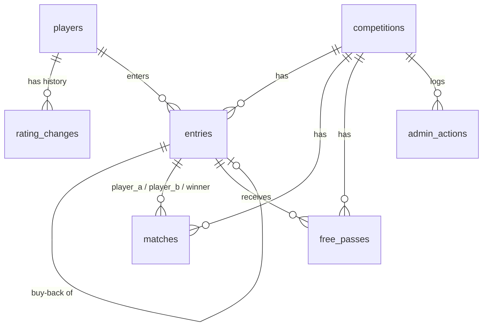

# Maroubra Seals Snooker Tournament App — Functional Specification

| | |
| --- | --- |
| Status | Revision 3 — the fixed bracket, immediate placement, tree view, settings page and logo (O-13, O-14) on top of the twelve original rulings (O-1 … O-12) |
| Date | 6 September 2026 |
| Sources | [snooker-comp-rules.md](snooker-comp-rules.md) (behaviour; Part B §8–13 are the functional requirements), [tournament-app-plan.md](tournament-app-plan.md) (hosting and infrastructure) |

Every requirement below is traced to a section of the rules document with a citation like **§10**. Part A sections (§1–7) are the player rules; Part B sections (§8–13) are the app specification. Where the two source documents were silent or said TBC, the organiser's ruling is recorded in [section 10, Decisions](#10-decisions), and the ruling's number (O-1 … O-14) is cited at the point it is implemented.

**Several of those rulings changed the rules document itself, and it has been updated to match** — [10.2](#102-amendments-applied-to-the-rules-document) lists every edit. The three worth knowing before reading on:

- **Ratings are golf-style handicaps: the lower the number, the better the player, and they can be negative.** The start goes to the player with the **higher** number, which is the weaker one. §6's "the lower-rated player starts" meant lower *in ability*; it is now worded so it cannot be read the other way (5.6).
- **O-1** sets a configurable scale on top of that: the night's top X finishers move by Y and the bottom Z by W, defaulting to top 3 by −1 and bottom 3 by +2 — a good night brings your number down.
- **O-4** allows **more than one round-one free pass**, replacing §11's "fills every possible round-one match before giving a free pass" (and matching §4).
- **O-10 / O-11** move hosting from Vercel to **Netlify** and settle the database on **Supabase**.
- **O-13** replaces the two buy-back modes with one placement rule: a buy-back goes straight into a **random empty match**, and once none is left beside a **random waiting player** (5.2).
- **O-14** makes the bracket **fixed**: winners climb to the box above the moment their match finishes, free passes are what an empty half of the tree gives you, and the tree view draws it (5.4).

**How to read this document.** Sections 1–4 are written for the organiser and describe what the app does, screen by screen. Sections 5–10 are written for the developer and describe how it works underneath. Both halves use the vocabulary from the rules document:

| Term | Meaning (from the rules) |
| --- | --- |
| **Bracket size** | 16 or 32, the number of round-one slots (§1, §8) |
| **Slot** | One of the `1..B` round-one bracket positions. Slots `2k−1` and `2k` are match `k` (§8.2) |
| **Rating** | A player's stored handicap number (§6, §13). **Lower is better, and it can be negative** — like a golf handicap (5.6) |
| **Start** | The head start on points the weaker player — the one with the **higher** rating number — receives in a frame (§6) |
| **Waiting player** | A player in the current round with no opponent yet (Part B definition) |
| **Buy-back** | A round-one loser re-entering once for one more round-one match (§3) |
| **Late arrival** | A player who joins after the draw: takes an open slot and is placed like a buy-back, but is flagged `late`, not `buyback`, and may still buy back once if they lose (§3, §8.3) |
| **Box** | One position of the fixed tree: box `k` of round `r` covers slots `(k−1)·2^r+1 .. k·2^r` and is fed by boxes `2k−1` and `2k` of the round below (5.4) |
| **Free pass** | Advancing to the next round without playing (§4, §11) |
| **Force Pair** | Organiser action that pairs two waiting players at random, round one only (§10) |
| **Close Buy-Backs** | Organiser action that locks the player list for the night (§11) |
| **Master override** | Organiser screen that can change anything, bypassing the normal guards (O-5) |

---

# Part 1 — For the organiser

## 1. Overview

The app runs one snooker competition on one night. Before the night, the organiser keeps a list of club players and their ratings (§13). On the night, the organiser picks the bracket size, ticks the players who have entered and presses **Start Competition**; the app draws the round-one bracket at random (§8). From then on the organiser uses the admin page on the club phone to start each match, watch the 25-minute clock, enter the winner, and record whether a round-one loser buys back (§12). Winners climb a fixed bracket automatically (§4, §11), buy-back players go straight into a random empty match (§9), the organiser can Force Pair waiting players when a table is free (§10), and Close Buy-Backs when the night's entries are done (§11). Everyone else in the club watches the public bracket page on their own phone, which shows every match, its state and clock, and every player's rating and start (plan: "Public page"). The competition is single-elimination and finishes when one player is left.

Nothing on the night is a one-way door. A match started by mistake can be un-started (O-5), a result can be corrected (§12), a whole competition can be abandoned (O-7), and the master override screen (3.9, O-5) can add or remove players and rebuild pairings at any point.

## 2. Roles and access

There are exactly two kinds of user (plan: "Admin Access").

| Role | How they get in | What they can do |
| --- | --- | --- |
| **Organiser** | Types one of the club's **admin codes** on the login screen. If it matches, the app sets a browser cookie so the phone stays logged in (plan). | Everything: manage players and ratings, set up and start the competition, add buy-backs, start and complete matches, cancel a start, correct results, Force Pair, Close Buy-Backs, master override, abandon the night, adjust ratings afterwards, and change the time limit and rating scale on the settings page. |
| **Public viewer** | Opens the public page. No login. | Read only: view the bracket, match states and clocks, players, ratings and starts. |

Rules that follow from the plan, the project constraints and the organiser's rulings:

- There are **several admin codes, one per organiser, each with a name** (O-8). The name attached to the code that was used is what the app records as "changed by" on every rating change (§13) and as the actor on every override (3.9). There are still no accounts, no password resets and no email (plan): the code *is* the identity.
- The organiser stays logged in on that phone until the cookie expires or **their** code is changed. Because each session cookie is signed with the code that created it, changing one person's code logs out only that person (7.1, 8.3).
- The public page **never** changes anything. Only a logged-in organiser can change match state, and every change is checked on the server, not just hidden in the interface.
- More than one device can be logged in at the same time, with the same code or with different ones.

## 3. Screens

All screens are designed for a phone held upright. Mockups are about 38 characters wide, which is a phone screen in a readable font. `●` marks a green in-play match, `■` a red finished match, `○` a match not started (§12 colours).

Screen list:

| # | Screen | Who | Route |
| --- | --- | --- | --- |
| 3.1 | Admin login | Organiser | `/admin/login` |
| 3.2 | Players and ratings | Organiser | `/admin/players` |
| 3.3 | Competition setup and draw | Organiser | `/admin/setup` |
| 3.4 | Admin bracket and match control | Organiser | `/admin` |
| 3.5 | Complete match / correct result | Organiser | dialog on 3.4 |
| 3.6 | Match timer view | — | *Removed in revision 4: the countdown on the match card is the clock.* |
| 3.7 | End-of-night rating review | Organiser | `/admin/ratings` |
| 3.8 | Public bracket | Everyone | `/` |
| 3.9 | Master override | Organiser | `/admin/override` |
| 3.10 | Settings | Organiser | `/admin/settings` (linked from the bottom of 3.3, not from the top bar) |
| 3.11 | History | Organiser | `/admin/history` |

The club badge (`assets/club-logo-source.png`, served in three sizes from `public/` and `app/icon.png`) is the browser icon, sits above the title on 3.1 and 3.8, and at the left of the admin top bar.

### 3.1 Admin login

```
┌──────────────────────────────────────┐
│ Maroubra Seals Snooker               │
│ Organiser login                      │
│                                      │
│ Admin code                           │
│ ┌──────────────────────────────────┐ │
│ │ ••••••••                         │ │
│ └──────────────────────────────────┘ │
│ ┌──────────────────────────────────┐ │
│ │             Log in               │ │
│ └──────────────────────────────────┘ │
│                                      │
│ Code not accepted. Try again.        │  ← only after a wrong code
│                                      │
│ View the public bracket ›            │
└──────────────────────────────────────┘
```

**Data shown:** one input box (plan: "a single input box for the code"). The organiser types only the code; the app works out which organiser it belongs to (O-8), so nothing else has to be typed on a phone.

**Actions:**

| Action | What happens |
| --- | --- |
| Log in | The code is sent to the server and compared with each configured admin code. Match: a session cookie carrying that organiser's name is set and they are taken to the admin bracket (3.4), or to setup (3.3) if no competition is running. No match: "Code not accepted" is shown and nothing else changes. |
| View the public bracket | Goes to 3.8. |

Every admin screen shows **"Signed in as Gabriel"** in its header with a **Log out** link, so it is always obvious whose name will be recorded against a change.

Any admin page opened without a valid cookie redirects here.

### 3.2 Players and ratings

The club's player list persists from week to week. Each player has a stored rating (§13) and is either **active** or **inactive**. **Players are never deleted** (O-9): a player who has left the club is deactivated, which hides them from tonight's entry list while keeping their rating history and every past result intact.

```
┌──────────────────────────────────────┐
│ ‹ Admin          Players & ratings   │
│ Signed in as Gabriel                 │
│ ┌──────────────────────────────────┐ │
│ │ Search players…                  │ │
│ └──────────────────────────────────┘ │
│ [ + Add player ]   ☐ Show inactive   │
│                                      │
│ Name                 Rating          │
│ Alice Chen             45   [Edit]   │
│ Bob Smith              20   [Edit]   │
│ Carl Diaz              33   [Edit]   │
│ Dee Park               30   [Edit]   │
│ …                                    │
│ ── Inactive ──────────────────────   │  ← only with the box ticked
│ Jim Vale (inactive)    22   [Edit]   │
└──────────────────────────────────────┘

Edit sheet (slides up over the list):
┌──────────────────────────────────────┐
│ Bob Smith                            │
│ Rating        [ 20 ]                 │
│ Reason        [ weekly review    ]   │
│ Status        (•) Active ( ) Inactive│
│ Changed by    Gabriel  (signed in)   │
│ [ Save ]                  [ Cancel ] │
│                                      │
│ History                              │
│  18 → 20   30 Aug 2026  Gabriel      │
│  15 → 18   23 Aug 2026  Gabriel      │
└──────────────────────────────────────┘
```

**Data shown:** every active player's name and current rating, inactive players behind a toggle, and on the edit sheet the rating change history with who changed it and when (§13: "The app records who changed it and when").

**Actions:**

| Action | What happens |
| --- | --- |
| Add player | Enters a name and starting rating. The first rating is recorded as a rating change so its origin is in the history. |
| Edit → Save | Overrides the rating (§13: "The organiser can override any rating"). A history row is written with the old value, new value, the signed-in organiser's name and the time (O-8). **Changing a rating never changes the start of a match already created tonight** (see 5.6). |
| Active / Inactive | Deactivating hides the player from the entry list on 3.3 and from the public player list, and blocks them from being entered. Reactivating restores them. Neither touches their history. A player who is in tonight's competition cannot be deactivated until the night is complete or abandoned. |
| Cancel | Nothing changes. |

There is no delete (O-9). If a player was added by mistake, deactivate them.

### 3.3 Competition setup and draw

Shown when no competition is in progress. Implements §8.1–8.2.

```
┌──────────────────────────────────────┐
│ ‹ Admin        Tonight's competition │
│ Name        [ Friday 11 Sep 2026   ] │
│                                      │
│ Bracket size    (•) 16     ( ) 32    │
│ Time limit 25 min · top 3 by −1,     │
│ bottom 3 by +2          Change ›     │
│                                      │
│ Club players  17 avail │ Tonight  13 of 16 │
│ [ Find a player…     ] │                   │
│ ☑ Carl Diaz       33   │ ☐ Alice Chen  45  │
│ ☐ Ida Roy         36   │ ☐ Bob Smith   20  │
│ ☑ Pat Quin        31   │ ☐ Dee Park    30  │
│ …                      │ …                 │
│ [ Add 2 › ] [+ New player] │ [ ‹ Remove ]  │
│                                      │
│ 13 players → 6 matches, 1 waiting    │
│ player, 3 open slots for buy-backs   │
│ ┌──────────────────────────────────┐ │
│ │        Start Competition         │ │
│ └──────────────────────────────────┘ │
└──────────────────────────────────────┘
```

**Data shown:** competition name, bracket size, a one-line reminder of the time limit and rating scale with a link to 3.10, two lists side by side (stacked on a phone) — the **active** club players not yet entered, with a search box, and tonight's entered players — and a live summary line.

**Actions:**

| Action | What happens |
| --- | --- |
| Bracket size | Choose 16 or 32 (§8.1). Disabled if more players are ticked than the chosen size allows. |
| Change › / Settings › | Opens 3.10, where the match time limit and the rating scale live. They are deliberately off this screen so the night's setup is two decisions: size and players. |
| Add › / ‹ Remove | Tick any number of players in one list and move them across in **one request** (`player_ids` / `entry_ids`, 7.4); the reply carries the bracket, so the screen never re-fetches. Add is disabled, with the reason, when the ticked players would not fit the bracket. The summary line updates: number of matches, whether there is a waiting player, and how many slots are left open. |
| New player | Opens the add-player dialog from 3.2 and enters the new player straight into tonight's list. |
| **Start Competition** | Confirms ("Start with 13 players in a 16 bracket? The bracket size cannot be changed afterwards."). Then the app shuffles the entered players, fills the round-one bracket top to bottom with no gaps, leaves the remaining slots open for buy-backs and late arrivals, and makes any odd player out a waiting player (§8.2). Each player's slot fixes their place in the whole tree (5.4). The organiser lands on 3.4. |

After Start: the bracket size is locked (§8.1) and players can only be added as buy-backs (§8.3) — or through the master override (3.9), which is the deliberate escape hatch. The setup screen is not reachable again until the competition is complete or abandoned.

### 3.4 Admin bracket and match control

The main screen for the night. It lists every match with its state colour, the players awaiting an opponent, and the round-one controls, with a **List | Tree** switch at the top. The list lays the cards out in columns on a wide screen and one column on a phone; the tree is the whole night drawn as a fixed bracket (5.4), filling the width of the screen and scrolling sideways on a phone. Both run matches: every box in the tree carries its own **Start** button (**Complete** once in play), and tapping the box itself opens the same card, with the same buttons, as the list, for the rarer taps (time limit, cancel start, correct result). The default is the **tree on a wide screen** (a desktop, or a tablet in landscape: 900 px or wider) and the **list on a phone**; a tap on the switch is remembered on that device and wins over the default from then on.

```
┌──────────────────────────────────────┐
│ Friday 11 Sep · Round 1  [List|Tree] │
│ Buy-backs OPEN      Open slots: 2/16 │
│ [ No More Buy-Backs / Late Entries ] │
│ [ Force Pair ]                       │
│ [ + Add late arrival ]               │
├──────────────────────────────────────┤
│ R1M1 ● IN PLAY            18:42 left │
│     Alice Chen (45)  starts on 17    │
│     Bob Smith (20)                   │
│     Alice Chen starts on 17 — two    │
│     thirds of the 25 difference      │
│ ┌──────────────────────────────────┐ │
│ │            Complete              │ │
│ └──────────────────────────────────┘ │
│     [ ⤺ Cancel start ]               │
├──────────────────────────────────────┤
│ R1M2 ○ NOT STARTED limit: 25 min ▾   │
│     Carl Diaz (33)   starts on 2     │
│     Dee Park (30)                    │
│     Carl Diaz starts on 2 — two      │
│     thirds of the 3 difference       │
│ ┌──────────────────────────────────┐ │
│ │             Start                │ │
│ └──────────────────────────────────┘ │
├──────────────────────────────────────┤
│ R1M3 ■ FINISHED                      │
│   ✔ Eve Long (28)                    │
│     Fay Ng (41)  → bought back       │
│     [ Review result ]                │
├──────────────────────────────────────┤
│ R1M4 ● IN PLAY  ⚠ TIMED OUT    00:00 │
│     Hal Ito (36)                     │
│     Ida Roy (36)                     │
│     level, no start                  │
│ ┌──────────────────────────────────┐ │
│ │            Complete              │ │
│ └──────────────────────────────────┘ │
│     [ ⤺ Cancel start ]               │
├──────────────────────────────────────┤
│ R1M8 ○ AWAITING OPPONENT  slot 15    │
│     Fay Ng (41)      buy-back #1     │
│     open seat — next buy-back        │
├──────────────────────────────────────┤
│ R1M7 ○ AWAITING OPPONENT  slot 13    │
│     Gus Ray (25)     first draw      │
│     open seat — next buy-back        │
├──────────────────────────────────────┤
│ Open slots: 2 of 16                  │
├──────────────────────────────────────┤
│ Players & ratings ›   Public page ›  │
│ Master override ›     Abandon night  │
└──────────────────────────────────────┘
```

`⤺` is **Cancel start** (O-5). A box holding one player is shown as **AWAITING OPPONENT** in every round: in round one it is a half-full slot pair, from round two a winner whose opponent's match is still going (5.4).

**Start** and **Complete** are the taps of the night, so each is **the full width of its card** — in the list card and in the tree box alike; the rarer buttons (Cancel start, Review result, the time limit) stay small and wrap underneath.

**The handicap start is shown twice on a card** (§6, 5.6): as "starts on 17" on the weaker player's own line — the player receiving it, the one with the higher number — and again as the working under both names, "Alice Chen starts on 17 — two thirds of the 25 difference", so the number can be checked at the table without arithmetic. Level ratings read "level, no start". In the tree, where there is no room for the working, the start rides beside the weaker player's rating as "+17".

**Matches are named by round and position**: R1M1 … R1M8, R2M1 … R2M4, R3M1, R3M2 and **Final** for a 16 bracket (R1M1 … R1M16 up to R4M2 and Final for 32). A card is one match with two seats. A card still waiting for its second player says who fills it: in round one the next buy-back or late arrival (5.2), from round two the winner of the box below ("winner of R1M6"), and an empty box in the tree names both feeders ("winner of R1M1", "winner of R1M2"). The stored match number stays positional (5.4); only the display name changed.

**The tapped button shows what it is doing.** The button the organiser tapped is disabled and carries a spinner, and every other button on the page is disabled, until the server answers; the reply carries the new bracket, so the screen updates without a second request. A double tap cannot start or complete a match twice. The same rule applies to every button and every player picker in the app: the control that caused a request shows a spinner until the reply lands.

Rounds overlap: R2M1 (the winners of R1M1 and R1M2) can be in play while R1M7 has not started, so the list shows every round that has anything in it, newest first, with finished rounds collapsed. Once buy-backs close the round-one controls disappear (§10, §11):

```
│ Friday 11 Sep · Round 1  [List|Tree] │
│ Buy-backs closed                     │
├──────────────────────────────────────┤
│ ── Round 2 ─────────────────────────  │
│ Free passes to round 3: Gus Ray (25) │
│ R2M1 ○ NOT STARTED                   │
│ R2M3 ○ AWAITING OPPONENT             │
│     Eve Long (28)                    │
│     winner of R1M6                   │
│ ── Round 1 ─────────────────────────  │
│ …                                    │
```

**Data shown:**

- Competition name, the lowest round still being played, the signed-in organiser (O-8), and whether buy-backs are open or closed (round one).
- Every match of the current round: number, state and colour (§12), both players with ratings, the weaker player's start (§13, 5.6), the countdown while in play, a timed-out warning at zero (§12), the winner tick and the loser's buy-back decision when finished.
- Boxes holding one player, marked **awaiting opponent**, with the slot number in round one (5.2, 5.4). There is no separate waiting list: everyone is placed the moment they enter (O-13).
- Open slots remaining out of the bracket size (§8.2, O-3).
- **All** free-pass holders for the round — round one can have more than one (§4, O-4).
- Earlier rounds are collapsed below the current round and can be expanded.

**Actions:**

| Action | Available when | What happens |
| --- | --- | --- |
| **Start** (on a match) | Match is not started | The match turns green and the countdown begins from the match's time limit (§12). The started time is stored on the server, so the clock keeps running wherever the organiser goes in the app, after a refresh, and while the phone is locked. |
| limit: 25 min ▾ (the note on a not-started card) | Match is not started | Overrides the time limit for this match only (§12: "overridable per match"). Rarely needed, so it hides behind the note rather than taking a button. |
| **Complete** | Match is in play | Opens the complete dialog (3.5). A result cannot be entered on a match that has not started (§12). |
| **⤺ Cancel start** | Match is in play | Confirms ("Cancel the start of R1M1? The clock is discarded and the match goes back to not started."). Returns the match to `not_started`, clears `started_at` and the frozen limit, and writes an audit row. For the wrong match having been started (O-5). The two players, the ratings and the start are untouched. |
| **Review result** | Match is finished and the winner's next match has not started | Opens the review dialog (3.5) to change the result. The corrected winner is pulled back out of the next round (§12). If the winner's next match has started, the button is replaced by "Result locked: next match started" — and the master override (3.9) is the way through if it really has to change. |
| **Force Pair** | Buy-backs open, two or more players alone in round one | Picks two waiting players at random and creates a not-started match between them, whichever way they entered (§10). With fewer than two waiting players the button is disabled and shows "Needs 2 waiting players". It never touches an existing match. Hidden once buy-backs close (§10). |
| **No More Buy-Backs / Late Entries** (Close Buy-Backs, §11) | Buy-backs open | Confirms, naming the consequence: "No more buy-backs or late entries? The player list is locked for the night. 2 players have no opponent and will go straight to round 2." Locks the player list and gives a free pass to **every** round-one player still without an opponent (O-4); the tree then moves on (5.3, 5.4). The header changes to "Buy-backs closed". This tap is the **only** way the window closes (O-15): once every round-one match is finished a notice says so, names anyone still waiting alone, and the button turns primary to prompt the tap. |
| **List \| Tree** | Always | Switches between the match list and the tree drawing. Defaults to the tree on a wide screen and the list on a phone; the choice, once made, is remembered on that device. In the tree, every match box has a Start button (Complete while in play) on the box itself; tapping the box opens its card in a dialog with the same buttons as the list; a box in play shows its countdown. |
| **Add late arrival** | Buy-backs open, at least one open slot | A **New player — not on the club list** tick chooses the form: unticked shows only the club-player list, ticked hides it and shows only Name and Rating (a new player is added to the club list too, so they are on it next week). Either way the player must be an active one **not in tonight's competition** and enters them as a **late arrival** (§3, §8.3): a `late` entry, tagged "late arrival" on the cards and "la" in the tree, not a buy-back. They take one open slot and go straight into the bracket per 5.2: the reply says "Placed into R1M8, awaiting an opponent" or "Placed into R1M7 v Gus Ray". If they lose in round one they are offered the buy-back like a first-draw player. A round-one loser is not offered here (409, naming the fix): they buy back through **Review result** on their match (3.5). |
| **Master override ›** | Any time | Opens 3.9. |
| **End night here ›** | Competition in progress | The night has run out of time (O-16). Confirms with what the tap costs, from a `dry_run`: "End Friday 11 Sep here? 3 matches are left unplayed. 1 running clock is discarded. Still in: Alice Chen, Gus Ray, … The night is kept and counts, but no winner is recorded and the rating review opens. This cannot be undone." Closes the night as `complete` with **no winner** (5.11); the header reads "Complete (unfinished)", the banner says the night ended early, and the rating review link is the same one a finished night gets. |
| **Abandon night** | Competition in progress | Confirms ("Abandon Friday 11 Sep? Every match and result tonight is kept but the night is closed and a new competition can be set up.") Sets the competition to `abandoned` (O-7) and returns to setup. |

Automatic behaviour on this screen (no button):

- Buy-backs **never close by themselves** (O-15). Buy-backs and late arrivals keep taking open slots until the organiser taps No More Buy-Backs / Late Entries, however far round one has got; once every round-one match is finished the screen prompts for the tap, naming anyone still waiting alone.
- Every result **moves its winner up the tree at once** (§11, 5.4): into the next match if the player on the other side is ready, otherwise into that box as *awaiting opponent*. Once buy-backs are closed, a player whose other side is empty gets a free pass and keeps climbing. The Complete dialog's reply says which: "Alice Chen goes to R2M1", "Alice Chen waits in round 2 for an opponent", "Alice Chen has a free pass to round 3".
- When the final is completed, the screen shows the winner and a link to the rating review (3.7). A night ended early (O-16) shows the same link under "Night ended early — no winner. Every result is kept."
- **The night hands over to the rating review by itself.** The moment the competition turns `complete` on this screen — the final completed, or End night here — the organiser is taken to `/admin/ratings?competition=<id>`, because the review is always the next step (§13). Only that transition redirects: opening a finished night's bracket again stays where it is, and the links on the banner (Rating review, History) are still there for it. The review then hands over to history in the same way (3.7).

### 3.5 Complete match / correct result

Dialog opened from 3.4 (list or tree), centred on the screen like every dialog in the app. Implements §12 "Complete".

**Every dialog in the app is the app's own.** `alert()`, `confirm()` and `prompt()` are not used anywhere: the browser's dialogs cannot be styled or laid out, have no room for the list of consequences a confirmation here has to show, and a phone or browser set to suppress them answers "cancel" without the organiser ever seeing the question. Confirmations and the one text field that used to be a `prompt` (the per-match time limit) are the same centred `.sheet` card as this one — a title that asks the question, the explanation, the consequences as bullets read from the action's `dry_run`, then **the button that goes ahead first** (red when the tap cannot be undone) and the one that backs out beside it. Escape and a tap on the backdrop back out; a text field validates in place, so a wrong number is corrected where it was typed rather than bouncing back as an error banner. An ESLint rule (`no-restricted-globals`) keeps the browser dialogs out.

```
┌──────────────────────────────────────┐
│ Complete R1M1                        │
│                                      │
│ Winner                               │
│   (•) Alice Chen (45)                │
│   ( ) Bob Smith (20)                 │
│                                      │
│ Bob Smith lost in round one          │
│   (•) Buys back  ($2, 1 slot left)   │
│   ( ) Declines                       │
│                                      │
│ [ Save result ]           [ Cancel ] │
└──────────────────────────────────────┘
```

The buy-back section only appears for a round-one match where the loser has not already bought back tonight (§3: buy back **once**, and buying back is the player's choice, never automatic — O-4). From round two onwards there is only the winner choice (§1). If buy-backs are closed, the loser section reads "Buy-backs are closed. Bob Smith is out."

**Slots run out first come, first served** (O-3). Every buy-back consumes one of the bracket's open slots; when the last one goes, "Buys back" is disabled with "No open slots left — Bob Smith is out", and the loser is out even though they were willing to pay. The count of remaining slots is shown next to the option so the organiser can see it coming.

**Actions:**

| Action | What happens |
| --- | --- |
| Save result | The match turns red, the clock stops, and the winner is advanced automatically up the tree (§12, 5.4). A loser who buys back takes an open slot and goes straight into the bracket (§9, 5.2). A loser who declines is out. The buy-back window is untouched by a result (O-15). The reply says where the winner and the buy-back went. |
| Cancel | Nothing changes; the match stays in play. |

**Review result** uses the same dialog with the title "Review R1M1" and the current result pre-selected. Saving replaces the result: the previous winner is removed from the next round and the new winner takes their place (§12). What happens to the previous loser's buy-back is set out in 5.7: if that buy-back match has already started, the correction is refused (O-6 — "it should not happen"), and the master override (3.9) is the only way through.

### 3.6 Match timer view

**Removed in revision 4** at the organiser's request: the countdown on the match card (3.4, list and tree) is the clock, and a separate full-screen timer was a screen nobody used. Everything the timer view did lives on the card: the countdown is worked out from the server's stored start time and the match's limit, not from a counter on the phone, so leaving the screen, refreshing, or locking the phone and coming back shows the correct remaining time (§12); at zero the app plays the voice alert **"Match timed out"** on any admin page and shows the warning (§12, 5.12); the match stays green until a result is entered. `/admin/match/{id}` no longer exists.

### 3.7 End-of-night rating review

Implements §13 with the scale the organiser set in O-1. The app **proposes** every new rating from the four settings on the competition (3.3) and the organiser can change any of them before saving (§13: "The organiser has final say").

```
┌──────────────────────────────────────┐
│ ‹ Admin         Ratings · 11 Sep     │
│ Scale: top 3 −1 · bottom 3 +2        │
│                                      │
│ Top finishers                        │
│  1 Alice Chen  won   45 → [ 44 ] −1  │
│  2 Dee Park    final 30 → [ 29 ] −1  │
│  3 Hal Ito     semi  36 → [ 35 ] −1  │
│                                      │
│ Bottom finishers                     │
│ 16 Bob Smith   R1     20 → [ 22 ] +2 │
│ 15 Carl Diaz   R1     33 → [ 35 ] +2 │
│ 14 Ivan Poe    R1     28 → [ 30 ] +2 │
│                                      │
│ Everyone else — unchanged            │
│    Eve Long    28                    │
│    …                                 │
│                                      │
│ Changed by  Gabriel (signed in)      │
│ ┌──────────────────────────────────┐ │
│ │      Save rating changes         │ │
│ └──────────────────────────────────┘ │
└──────────────────────────────────────┘
```

**Data shown:** every player who took part tonight, in finishing order (5.9), with the proposed new rating pre-filled in an editable box and the adjustment that produced it. The scale in use is shown at the top. Players outside both groups are listed as unchanged.

**Finishing order** is how far the player got: the winner of the night first, then the runner-up, then the beaten semi-finalists, and so on down to the players knocked out in round one who did not win a buy-back match (5.9). A player who bought back is ranked on the better of their two runs.

**Actions:**

| Action | What happens |
| --- | --- |
| Edit a box | Overrides the proposal for that player. |
| Save rating changes | Writes a rating change per player whose value differs from their current rating, with the signed-in organiser's name and the time (§13, O-8). Unchanged rows are not written. The review can be reopened and saved again; it always compares against the current rating, so saving twice does not apply the adjustment twice. On success the organiser is taken to **that night in the history** (`/admin/history?night=<id>`), where the changes just saved are listed under Handicap results (3.11) — the last step of the night, so the flow ends where the night is filed. |

### 3.8 Public bracket

Read-only. Anyone can view brackets, players and handicaps (plan: "Public page"). Refreshes itself every 10 seconds so clocks and results stay current without the viewer doing anything.

```
┌──────────────────────────────────────┐
│ (badge)  Maroubra Seals Snooker      │
│ Friday 11 Sep 2026 · Round 1         │
│ Buy-backs open · 2 slots [List|Tree] │
│                                      │
│ ── Round 1 ─────────────────────────  │
│ ● Alice Chen 45 (+17) v Bob Smith 20 │
│   in play · 18:42 left               │
│ ○ Carl Diaz 33 (+2) v Dee Park 30    │
│   not started                        │
│ ■ Eve Long 28 ✔ v Fay Ng 41 (+9)     │
│   finished · Fay bought back         │
│ ● Hal Ito 36 v Ida Roy 36            │
│   in play · ⚠ timed out              │
│ ○ Fay Ng 41 · awaiting opponent      │
│ ○ Gus Ray 25 · awaiting opponent     │
│ Open slots: 2                        │
│                                      │
│ ── Players & ratings ───────────────  │
│   Alice Chen 45 · Bob Smith 20 · …   │
│                                      │
│ Organiser login ›                    │
└──────────────────────────────────────┘
```

**Data shown:** the same match list as 3.4 (state colour, players, ratings, start, countdown, timed-out warning, winner, buy-back decision), boxes awaiting an opponent, open slots, all free-pass holders, the round structure for the whole night, and the **active** player list with ratings — or, with the switch on **Tree**, the whole bracket drawn as on paper (5.4): every box of every round, connectors between them, the winner at the right, empty boxes dashed, free passes marked. When no competition is running it shows the player list and "No competition tonight yet". An abandoned competition is not shown at all. A night ended early on time (O-16) is shown as it stands, headed "Complete (unfinished)" with "Night ended early — no winner this week." in place of the winner.

**Actions:** none that change anything. Tapping a match expands it to show the start time and limit; List | Tree defaults to the tree on a wide screen and the list on a phone, and a tap on the switch is remembered on that device. "Organiser login" goes to 3.1.

### 3.9 Master override

The escape hatch (O-5). Everything the normal screens refuse to do is possible here, on the organiser's word. It exists because a club night goes wrong in ways no specification predicts: the wrong name was ticked, two players swapped tables, someone went home, a result was entered against the wrong match an hour ago.

```
┌──────────────────────────────────────┐
│ ‹ Admin           Master override    │
│ Signed in as Gabriel                 │
│ ⚠ These actions skip the normal      │
│   checks. Each one is logged.        │
│                                      │
│ Players tonight                      │
│  [ + Add a player to the night ]     │
│  Alice Chen  R2   [ Replace ][ Remove]│
│  Bob Smith   out  [ Replace ][ Remove]│
│  …                                   │
│                                      │
│ Matches                              │
│  M4 ● in play  [ Reset ] [ Delete ]  │
│  M3 ■ finished [ Reset ] [ Delete ]  │
│  [ + Pair two waiting players ]      │
│                                      │
│ Free passes                          │
│  Gus Ray → R2   [ Revoke ]           │
│  [ + Grant a free pass ]             │
│                                      │
│ The night                            │
│  [ Reopen buy-backs ]                │
│  [ Grow bracket 16 → 32 ]            │
│  [ Abandon this competition ]        │
│                                      │
│ Recent overrides                     │
│  8:14 pm Gabriel removed Jim Vale    │
│  7:58 pm Gabriel reset M4            │
└──────────────────────────────────────┘
```

**Data shown:** every player in tonight's competition with their current position, every match with its state, every free pass, the night-level switches, and the audit log of overrides already made tonight.

**Actions.** Each shows a plain-English confirmation naming every consequence before it runs, and each writes an audit row with the signed-in organiser's name (O-8):

| Action | What happens |
| --- | --- |
| Add a player to the night | Enters an active player at any point in the night, ignoring the bracket size, the closed buy-back window and the one-buy-back rule. They become a waiting player in the current round. If the bracket is full, the bracket is grown to 32 first (or the action is refused on a full 32). |
| Remove a player | Takes them out of tonight's competition. Their not-started matches are deleted and the opponent returns to waiting; a finished match they won is voided and the pairing behind it re-opened, as far back as the last round that has not started. Confirmation lists exactly which matches will change. |
| Replace a player in a match | Swaps one player for another in a not-started or in-play match. The start is recalculated from the two current ratings (5.6) and the clock is left alone. |
| Reset a match | Back to `not_started`: clears the result, the winner, the clock, and pulls the winner out of the next round if that round's match has not started. The same as Cancel start (O-5) but it also works on a finished match. |
| Delete a match | Removes the match; both players return to waiting in that round. |
| Pair two waiting players | Creates a match between any two chosen waiting players in the current round, in any round, without the §10 randomness. |
| Grant / revoke a free pass | Moves a player into the next round without playing, or takes that back. |
| Reopen buy-backs | Clears `buybacks_closed_at` and returns round one to open. The one place §3's "no more entries for the night" can be undone. |
| Grow bracket 16 → 32 | Adds slots 17–32 as open slots. Existing slots, matches and results are untouched. It cannot shrink. |
| Abandon this competition | As on 3.4 (O-7). |

The override screen refuses only one thing: it will not leave the competition in a state the app cannot render — a match with one player is fine (it becomes a slot awaiting an opponent), a match with the same player twice is not.

### 3.10 Settings

The two things that rarely change, kept off the setup screen so the night's setup is size and players only (organiser's request, revision 3).

```
┌──────────────────────────────────────┐
│ Settings                             │
│ Applies to Friday 11 Sep 2026.       │
│ Match time limit   [ 25 ] minutes    │
│ Rating adjustment (applied on 3.7)   │
│   Top    [ 3 ] finishers  [ -1 ] ea. │
│   Bottom [ 3 ] finishers  [ +2 ] ea. │
│ [ Save ]                             │
└──────────────────────────────────────┘
```

**Data shown:** the live competition's default match time limit (§12) and the four rating-adjustment numbers (O-1). With no competition set up it says so and links to 3.3: a new night starts with the previous night's values (7.4), so there is nothing to edit until one exists.

**Actions:** Save writes through `PATCH /api/admin/competitions/{id}`. The time limit can change any time before the night is complete and affects matches not yet started; the rating scale is locked once the night has started (7.4). Reached from "Settings ›" at the bottom of 3.3, 3.4 and 3.9; not in the top bar.

### 3.11 History

Every past night in one place, and how the handicaps have moved across them (§13: the app keeps the record of every rating change). Two tabs, **Comp history** and **Handicap history**, switched by `?tab=` so either can be bookmarked.

```
┌──────────────────────────────────────┐
│ History    [Comp history|Handicap history]
│                                      │
│ [8 Sep] [1 Sep] [25 Aug (abandoned)] │
│                                      │
│ Monday 8 Sep                         │
│ 16 bracket · 13 players ·            │
│ winner Alice Chen · runner-up Dee    │
│ Park · Rating review ›               │
│ ┌ Round 1 ─┐ ┌ Round 2 ─┐ … Winner   │
│ │ R1M1 …   │ │ R2M1 …   │  (the tree)│
│                                      │
│ Handicap results                     │
│ Player      Was  Now  Change  By     │
│ Alice Chen   44   43    −1  Gabriel  │
│ …                                    │
└──────────────────────────────────────┘
┌──────────────────────────────────────┐
│ History    [Comp history|Handicap history]
│                                      │
│ Handicaps by night                   │
│ Player     25 Aug  1 Sep   8 Sep Now │
│ Alice Chen   44     43 −1    –    43 │
│ Bob Smith    22 +2   –     24 +2  24 │
│ Carl Diaz     –     35 +2    –    35 │
│ …                                    │
└──────────────────────────────────────┘
```

**Comp history** (the default tab): a row of past nights newest first, one selected (`?night=<id>`, the newest by default). For the selected night: name, date, bracket size, players, winner and runner-up (blank when the title came by free pass, and "ended early, no winner" for a night closed on time, O-16 — its tab is tagged "(unfinished)"), a link to its rating review (3.7), then the whole night as the **tree** of 3.4 — read-only, every match with its winner ticked, free passes and late arrivals tagged — and under it **Handicap results**: the rating changes saved against that night in its review, with who saved them (O-8). An abandoned night shows its summary, no tree and no results. The competition in progress tonight is not history yet and does not appear.

**Handicap history**: a grid of every player who took part in a completed night against every completed night, oldest at the left, newest at the right, with the rating each player left the night with after the review (3.7), the change that produced it, and their rating today in the last column. A dash means they played and their number did not change; a blank means they did not play. Each date links to that night's comp history.

**Actions:** none that change anything. Ratings are changed on 3.7 (the review) or 3.2 (a player's edit sheet). The screen reads the database directly, like 3.7; it needs no API route.

## 4. Match and tournament state machine

### 4.1 Match states (§12)

| State | Colour | Meaning |
| --- | --- | --- |
| `not_started` | none | Match exists, players are known, clock has not begun. |
| `in_play` | green | Clock is running (or has run out). |
| `finished` | red | Winner recorded, clock stopped, winner advanced. |

"Timed out" is **not** a separate state. It is a warning shown on an in-play match once the clock reaches zero; the match stays green until a result is entered (§12).

```
                Start (organiser)             Complete (organiser)
  not_started ───────────────────►  in_play ───────────────────────►  finished
       ▲                               │                                 │ ▲
       │  Cancel start (O-5)           │ clock reaches zero              │ │ Review result (organiser)
       └───────────────────────────────┤                                 │ │ only while the winner's next
       │                               ▼                                 └─┘ match is not started
       │                         in_play + TIMED OUT warning
       │                         (still green, still in_play)
       └──────────── Reset, master override 3.9 (O-5) ───────────────────────┘
```

Transitions:

| From | To | Trigger | Guard | Side effects |
| --- | --- | --- | --- | --- |
| `not_started` | `in_play` | Organiser presses **Start** | Match has two players. | `started_at` set to now on the server. Time limit frozen for this match. |
| `in_play` | `not_started` | Organiser presses **Cancel start** (O-5) | Match is `in_play`. | `started_at` and the frozen limit cleared. Audit row written. No result is involved, so nothing else changes. |
| `in_play` | `in_play` (timed out) | Clock reaches zero | — | Voice alert "Match timed out" on the organiser's device; warning shown everywhere. No data change. |
| `in_play` | `finished` | Organiser presses **Complete** and saves | Winner chosen. Round one: loser's buy-back decision chosen (unless they have already bought back, buy-backs are closed, or no open slot remains). | Winner recorded, `finished_at` set. Winner advanced up the tree (5.4). Loser: buy back (takes a slot, placed at once per 5.2) or declined/out. The buy-back window stays as it was (O-15). |
| `finished` | `finished` (new result) | Organiser presses **Review result** and saves | The previous winner's next-round match has not started (§12), and the previous loser's buy-back match has not started (O-6). | Previous winner removed from the next round; new winner advanced. Details in 5.7. |
| any | `not_started` | Master override **Reset** (O-5) | None. | Result, winner and clock cleared; next round unwound as far as it can be. Audit row written. |

A result still cannot be entered on a `not_started` match (§12), and the server rejects it.

### 4.2 Tournament states

| State | Meaning | Organiser can |
| --- | --- | --- |
| `setup` | Players ticked, size chosen (rating scale and time limit on 3.10), nothing drawn. | Change anything on 3.3 and 3.10. |
| `in_progress`, buy-backs open | Round one under way, entries still accepted. Later-round matches form as their feeders finish, so rounds overlap. | Start/Complete/Cancel/Correct matches, add buy-backs, Force Pair, Close Buy-Backs, override, abandon. |
| `in_progress`, buy-backs closed | Player list locked. Winners climb the fixed bracket; empty halves give free passes (5.4). No buy-backs, no Force Pair (§11). | Start/Complete/Cancel/Correct matches, override, abandon. |
| `complete` | One player left. | Review ratings (3.7). Start a new competition next week. |
| `abandoned` | The night was called off (O-7). | Nothing. The row is kept for the record; a new competition can be set up straight away. |

```
 setup ──Start Competition (§8)──► in_progress, buy-backs open
                                       │  every result moves its winner up the tree;
                                       │  a round-two match forms when both feeders are done
                 Close Buy-Backs: the organiser's tap, never automatic (§11, O-15)
                                       ▼
                            in_progress, buy-backs closed
                                       │  free passes for every lone player (O-4) and for
                                       │  every empty half of the tree (O-14), then climb …
                                       │  … until the final is won
                                       ▼
                                   complete

 any in_progress state ──Abandon (O-7)───────► abandoned
 in_progress ──End night here (O-16)──► complete, no winner ("unfinished")
```

Reversal rules, after the O-5 and O-7 rulings:

- **Bracket size** cannot be reduced, and cannot be changed at all on the normal screens after Start (§8.1). The master override can grow 16 → 32 (3.9), which only adds open slots.
- **A mistaken Start is reversible** with Cancel start (O-5). There is no data to lose: the clock had not produced a result.
- **Ending the night on time** is not reversible: End night here (O-16) closes the night as complete with no winner, and a complete night has no route back. Abandon (O-7) is the other one-way door.
- **A mistaken draw** is handled by Abandon (O-7) and setting the night up again, or by rebuilding the pairings on 3.9.
- **Buy-backs closed** cannot be reopened on the normal screens (§3: "Once the organiser closes the buy-back window, no more entries for the night"), but the master override can reopen them (O-5).
- **Round advancement** is reversed through Review result, and only while the affected winner's next match is not started (§12). Correcting a match can therefore dissolve a not-started next-round match (5.7). Past that point it is the master override's job.
- There is no round draw to reverse: a winner's next match exists only because of their result, so correcting the result deletes that match (if not started) and the new winner takes the same box (5.7).

---

# Part 2 — For the developer

Architecture rules from CLAUDE.md apply throughout: all bracket logic in pure server-side functions under `lib/`; the database is the source of truth; every write route checks the admin cookie; the timer derives from `started_at`.

## 5. Bracket logic

All functions below are pure: they take the current competition data and return the new rows to write. Route handlers validate, call them, persist in one transaction, and return.

### 5.1 Round-one fill (§8.2)

Inputs: bracket size `B` ∈ {16, 32}, the list of `N` entered players, a random source.

Rules:

1. `2 ≤ N ≤ B`. Fewer than 2 players cannot form a match; more than `B` is rejected ("Choose the 32 bracket").
2. Shuffle the `N` players (Fisher–Yates with a cryptographically random source; only the resulting slots are stored).
3. Number the slots `1..B`. Place the shuffled players in slots `1..N`, top to bottom, no gaps.
4. Slots `2k−1` and `2k` form match `k`. A **match row exists only once both of its slots are occupied**, so matches `1..⌊N/2⌋` are created as `not_started`.
5. If `N` is odd, the player in slot `N` has no opponent and is a **waiting player** (§8.2: "an odd player out becomes a waiting player"). They keep their slot; their match `⌈N/2⌉` is *half-full* and shows as "awaiting opponent".
6. Slots `N+1..B` are **open slots**, reserved for buy-backs and late arrivals (§8.2). `open_slots = B − N`.

Worked fills:

| Bracket | Players | Matches created | Half-full match | Empty matches | Open slots |
| --- | --- | --- | --- | --- | --- |
| 16 | 16 | 8 | — | — | 0 |
| 16 | 13 | 6 | M7 (slot 13) | M8 | 3 |
| 16 | 10 | 5 | — | M6, M7, M8 | 6 |
| 32 | 32 | 16 | — | — | 0 |
| 32 | 21 | 10 | M11 (slot 21) | M12–M16 | 11 |
| 32 | 17 | 8 | M9 (slot 17) | M10–M16 | 15 |

**Slot capacity is the hard cap on buy-backs, first come first served** (O-3). Every buy-back, whether a round-one loser or a late arrival, consumes one open slot at the moment it is recorded. A full bracket (16 of 16) therefore accepts no buy-backs at all, and a 13-player 16-bracket accepts three. Requests are granted in the order they are recorded; when `open_slots` reaches zero the "Buys back" option is disabled and any further loser is out (3.5). The organiser who expects buy-backs chooses the bracket size accordingly, or grows the bracket on 3.9.

### 5.2 Where a buy-back goes: placement on entry (§3, §8.2, §9, O-13)

A buy-back player is created when a round-one loser chooses "Buys back" on Complete. Buying back is always the player's choice and is available **once** per player (§3, O-4). The player consumes an open slot, gets a `buyback_seq` (1, 2, 3, … in order of re-entry), and is **placed into a slot in the same transaction** — there is no unplaced state and no waiting list (O-13). A **late arrival** (3.4 "Add late arrival") consumes an open slot and is placed by the same rule, but as a `late` entry with no `buyback_seq`: they keep their one buy-back for if they lose (§3).

**The placement rule** (`pickFreeSlot`, random with the injected source):

1. While any **empty match** remains (both slots of a pair free), a random one; the player takes its lower slot and shows as *awaiting opponent*.
2. Otherwise a random **free seat beside a player who is waiting in round one**, first-draw or buy-back alike. The match is created at once.

A seat beside a player who is not waiting (a free-pass holder after close) is not free — filling it would pair someone who has already advanced. If nothing is free the entry is refused ("No free slot in the bracket"), which the O-3 slot cap already prevents in normal play.

**Worked example, 16 bracket, 13 first-draw players.** After the draw: M1–M6 full, M7 half-full (Gus Ray in slot 13), M8 empty.

| Event | Slot taken | Result |
| --- | --- | --- |
| Buy-back #1 (Fay Ng) | 15 | M8 is the only empty match. Fay waits there, "awaiting opponent" |
| Buy-back #2 (Ivan Poe) | 14 or 16, at random | **M7 created** (Gus v Ivan) or **M8 created** (Fay v Ivan) |
| Buy-back #3 (Jo Kerr) | the remaining seat | The other match is created |

`open_slots` goes 3 → 2 → 1 → 0, and the bracket ends with 8 matches and no free pass.

**Worked example, 16 bracket, 10 first-draw players.** M1–M5 full, M6–M8 empty. Buy-backs #1, #2 and #3 each take a **different** empty match, in random order, and each waits alone; #4 sits down beside one of them at random and that match forms. This is the organiser's worked example (O-13): a buy-back takes an empty match even while another player is waiting alone, and only when nothing is empty does it pair with a random lone player.

**Force Pair** (5.5) is the organiser's tool for pairing two lone players sooner than the rule would.

### 5.3 Close Buy-Backs and round-one free passes (§11, O-4)

**Trigger.** The organiser presses **No More Buy-Backs / Late Entries**, and nothing else (O-15). There is no automatic close: after the last round-one result the window is still open, late arrivals and buy-backs still take open slots, and lone players keep waiting for one. Screen 3.4 prompts for the tap once every round-one match is finished. (An earlier revision closed the window by itself once every round-one loser had decided; the organiser asked for entries to stay open until they say otherwise.)

**Effect, in one transaction:**

1. Set `buybacks_closed_at`. No more entries can be added and no Complete may record "Buys back" from now on (§3).
2. Run the advancement step (5.4). Its round-one rule gives **every player still without an opponent a free pass to round two** (O-4) — there may be several — and then everything above moves as far as it can: two pass-holders whose boxes feed the same round-two box meet there at once; a pass-holder whose other side is empty passes again.

Point 2's first half is the organiser's ruling in O-4 and it **replaces** §11's old "fills every possible round-one match before giving a free pass." The two leftovers of a 16-bracket are not paired with each other in round one at close; they both go through — and if they happen to feed the same round-two box (M7 and M8 do), they meet there.

Worked, 16 bracket, 13 first-draw players:

| Buy-backs taken before the close | Round one at close | Free passes | What follows |
| --- | --- | --- | --- |
| 3 | M8 and M7 both created | none | — |
| 2 | one of M7/M8 created, one lone player | 1 | the lone player waits in round two for the other match's winner |
| 1 | Gus Ray alone in M7, the buy-back alone in M8 | **2** | both feed box 4 of round two: **M12 is created at once**, Gus v the buy-back |
| 0 | Gus alone in M7, M8 empty | 1 | M8 is empty, so Gus passes round two as well and waits in M14 |

The one-buy-back row is the case the organiser described: two matches each holding a single player, and both players go to round two. If the organiser would rather they played each other *in round one*, **Force Pair** before closing does exactly that (5.5).

### 5.4 The fixed bracket: advancing up the tree (§4, §11, O-14)

The bracket is a fixed single-elimination tree and every player's place in it follows from their round-one `slot`:

- Rounds run `1 .. log2(B)`: four for a 16 bracket, five for 32. The final is the last round, box 1.
- **Box** `k` of round `r` covers slots `(k−1)·2^r + 1 .. k·2^r` and is fed by boxes `2k−1` and `2k` of round `r−1`. A player in slot `s` sits in box `⌈s / 2^r⌉` of round `r`. The two halves of a box are the slots of its two feeders; a player's opponent must come from the *other* half.
- **Match numbers are positional**: box `k` of round `r` is `M(B − B/2^(r−1) + k)`. For 16: M1–M8, M9–M12, M13–M14, M15. For 32: M1–M16, M17–M24, M25–M28, M29–M30, M31. Growing 16 → 32 renumbers later rounds by this formula (5.10). The screens name a box by round and position instead — `R{r}M{k}`, the last round as Final (3.4) — so a renumbering never shows.

**Advancement is progressive, not per round.** After every write — a result, a placement, a close, an override — one automatic step (`advanceAll`) pushes every waiting player as far up the tree as their position allows, and repeats until nothing moves:

| Waiting in | Condition | Effect |
| --- | --- | --- |
| round `r ≥ 2`, box `k` | someone is waiting in round `r` in the other half of the box | **match `(r, k)` is created**, `not_started`, lower slot as player A, origin `advance` |
| round `r ≥ 2`, box `k` | buy-backs closed, and nobody in the other half can still reach round `r` (it is empty, or everyone there is out) | **free pass from round `r`**; the player is now waiting in round `r+1` and the step runs again for them |
| round `r ≥ 2`, box `k` | otherwise (a feeder match is still to be played, or the half is empty but buy-backs are still open) | waits in the box as *awaiting opponent* |
| round 1, after close | seat-mate missing or out | free pass from round one (O-4). Two waiting seat-mates (a deleted match) are left for the organiser |
| beyond the final round | — | the competition is **complete** and this player is the winner |

While buy-backs are open nothing skips a round: an empty half may still fill with a buy-back, so a winner whose other side is empty waits. The moment the window closes those waits resolve.

**Consequences worth knowing** (recorded in rules §4):

- A round-two match is ready as soon as both matches feeding it are done, while the rest of round one is still going. Rounds overlap; the screens show every round with anything in it.
- A round can hold **more than one free pass**, and the same player can receive several in a row. With 9 players in a 16 bracket and no buy-backs, the player in slot 9 passes rounds one, two and three and plays only the final. Buy-backs filling random empty matches make this rare; the 13-player night with three buy-backs is a perfect eight with no free pass at all.
- With 8 players in a 16 bracket the top half decides the night: M13's winner passes the empty bottom half and is champion. The tree draws that honestly.

**A player left waiting when nothing can resolve them** cannot happen after close in normal play, because an empty half gives a pass. A correction (5.7) or an override (5.10) that leaves two seat-mates waiting in round one is the one case, and it is the organiser's to pair.

### 5.5 Force Pair (§10)

Preconditions, checked on the server:

| Check | Failure response |
| --- | --- |
| Buy-backs are open | 409 "Force Pair is only available in round one, while buy-backs are open" (the button is hidden after the close) |
| At least two waiting players | 409 "Needs 2 waiting players" (no-op) |

Effect: choose two waiting players uniformly at random (any mix of first-draw and buy-back, placed or unplaced), and create one `not_started` round-one match between them.

- If one of the two already occupies a slot in a half-full match, the other is placed into that match's free slot.
- If both occupy slots in different half-full matches, the lower-numbered match is used and the other player's slot is released back to the free-slot order.
- If neither is placed, both go into the lowest-numbered empty match.

Nothing else changes: existing matches are never modified (§10), buy-backs remain open, and `open_slots` is unchanged because the players had already consumed their slots. Force Pair may be pressed repeatedly, and is refused once buy-backs close (there is nobody left waiting in round one by then).

### 5.6 Handicap start (§6, §13)

**A rating here is a handicap, and it runs like a golf handicap: the lower the number, the better the player.** A player on 20 is stronger than a player on 45. Ratings **can go negative** — a player on −5 is stronger again — and nothing in the arithmetic cares about the sign.

This is what §6's phrase "the lower-rated player" means: the player rated lower *in ability*, who is the one carrying the **higher** handicap number. They are the one who receives the start. Read as "lower number" it says the opposite of what it means, which is why §6 has been reworded (10.2).

```
diff  = | rating_a − rating_b |
start = round_to_nearest( (2/3) × diff )
```

The start goes to the player with the **higher** rating number — the weaker player. Equal ratings: no start.

Worked example from §6: ratings 45 and 20, difference 25, two thirds is 16.67, rounded to the nearest point is **17**, and it goes to the player on **45**.

More cases:

| Ratings | Difference | Two thirds | Start | Goes to |
| --- | --- | --- | --- | --- |
| 45 v 20 | 25 | 16.67 | 17 | the 45 |
| 33 v 30 | 3 | 2.00 | 2 | the 33 |
| 41 v 28 | 13 | 8.67 | 9 | the 41 |
| 36 v 36 | 0 | 0 | 0 | nobody |
| 50 v 49 | 1 | 0.67 | 1 | the 50 |
| 40 v 38 | 2 | 1.33 | 1 | the 40 |
| 20 v −5 | 25 | 16.67 | 17 | the 20 |
| −2 v −8 | 6 | 4.00 | 4 | the −2 |
| 0 v 12 | 12 | 8.00 | 8 | the 12 |

Negative ratings are ordinary. The difference is an absolute value, so `20 v −5` and `45 v 20` produce the same 17-point start; only the sign of the stored number differs. Subtracting a negative is the one place a naive implementation goes wrong, so it is in the tests (5.13).

Two thirds of a whole number is never exactly `.5`, so "round to the nearest point" never needs a tie-break rule. Ratings are whole numbers — positive, zero or negative.

The start is calculated **when the match is created** (§13) and the ratings used are snapshotted on the match row (`rating_a`, `rating_b`, `start_points`, `start_entry_id`). A rating override later in the night (3.2) does not change a match already drawn; this keeps the bracket honest and is the boring option. The one thing that does recalculate a start is a player being swapped into a match on the master override (3.9), because the match is a different match afterwards.

### 5.7 Result correction (§12, O-6)

Allowed while the recorded winner's next match is `not_started` or does not yet exist. Rejected with 409 once that match is `in_play` or `finished`.

Effect of saving a corrected result on match `M` (round `r`) in one transaction:

1. **Previous winner `W`** is pulled back out of every later round: their `not_started` later matches are deleted (the other player returns to waiting in that box) and their later free passes removed. If `W` had not gone anywhere yet, nothing to undo.
2. **New winner `W′`** is advanced exactly as a fresh Complete would, by the automatic step of 5.4: they take the same box, so they meet the player left waiting in step 1, or receive the free pass `W` held. The correction is local by construction — the tree has only one place for the winner of `M`.
3. **Round one only, previous loser `W′`'s buy-back**: if `W′` had bought back and their buy-back match is `not_started`, that match is deleted, the buy-back entry and its slot are released, their opponent returns to waiting, and `W′` is now simply the winner. If `W′`'s buy-back match is `in_play` or `finished`, the correction is **rejected** with 409 "Loser's buy-back match already started" (O-6: this should not happen; if it has, the master override on 3.9 is the way through, and it will say what it is about to unwind).
4. **New loser `W` in round one** must record buy back or decline in the correction dialog, subject to the same slot and closed-window checks as Complete (O-3).
5. `finished_at` is left as is; a `corrected_at` timestamp is set for the audit trail.

### 5.8 Cancel start (O-5)

`in_play → not_started` for a match that was started by mistake.

| Check | Failure response |
| --- | --- |
| Match is `in_play` | 409 "Only a match in play can have its start cancelled" |

Effect: clear `started_at` and the frozen `time_limit_minutes`, set `state = not_started`, write an `admin_actions` row naming the organiser and the match. No result exists yet, so nothing else in the bracket is affected — the two players, the snapshotted ratings and the start all stay as they were, and the match can be started again immediately.

There is deliberately no "pause" (§12 has no such concept). Cancelling and restarting gives the match a full clock again, which is the honest thing when the wrong match was started.

### 5.9 Rating adjustment after the night (§13, O-1)

Four settings, snapshotted on the competition (3.3): `rating_top_count` (default 3), `rating_top_delta` (default **−1**), `rating_bottom_count` (default 3), `rating_bottom_delta` (default **+2**).

**Finishing order.** For every player who took part, compute:

- `reached_round` — the highest round in which they had a match or held a free pass. A player with two entries (first draw plus buy-back) takes the higher of the two.
- `won_final` — true only for the winner of the night. A night ended early (O-16) has no winner, and its display labels are the plain round reached: nothing is called "final" when no final was played.

Best-first order is `(reached_round desc, won_final desc, rating asc, name asc)` — `rating asc` because the lower handicap is the better player (5.6). Worst-first order is the same keys reversed, with `rating desc`, so among players knocked out at the same point the weakest is first. The last two keys exist only to make the cut deterministic; they carry no meaning, and the organiser can move any player's number by hand on 3.7.

**Groups.**

- **Top group**: the first `rating_top_count` players in best-first order. Each gets `rating + rating_top_delta`.
- **Bottom group**: the first `rating_bottom_count` players in worst-first order, skipping anyone already in the top group. Each gets `rating + rating_bottom_delta`.
- Everyone else is unchanged.
- Results are clamped to the `−100..200` rating range (6.3). Nobody's handicap runs away in either direction, and the negative end is real: a player who keeps winning keeps going down through zero.

With the defaults on a full 16-player night: the winner, the runner-up and the better of the two beaten semi-finalists go **down** 1; the three weakest players knocked out in round one who did not win a buy-back match go **up** 2. Setting `rating_top_count` to 4 catches both semi-finalists.

**The direction is the right way round** and matches §6 ("winners go up, losers come down" — up and down in *standing*, not in the number). A good night lowers your handicap, which makes you the stronger-rated player, which means you *give away* more start next week (5.6). A bad night raises it and you receive more. The bottom delta being the larger of the two (+2 against −1) pulls the field together faster at the weak end than it stretches it at the strong end, which is the organiser's call and is a setting either way.

The review is idempotent: 3.7 always proposes `current rating + delta`, and saving twice with no edits in between writes nothing the second time, because the proposals are recomputed from the ratings as they now stand.

### 5.10 Master override (O-5)

The override actions in 3.9 are the same pure functions the normal routes use, called with their guards switched off, plus two of their own:

| Override | Reuses | Extra behaviour |
| --- | --- | --- |
| Reset a match | 5.8 (cancel start) and 5.7 step 1 (pull the winner back) | Works from `finished` as well as `in_play`. Unwinds every later match and pass of the winner; if a later match has already started, it resets that too, and says so in the confirmation. |
| Delete a match | — | **Round one only.** Both entries return to waiting and keep their slots, so the pair shows as two waiting players who can be re-paired by Force Pair or "Pair two waiting players". From round two the tree has exactly one place for those two players, so the automatic step would put the match straight back — Reset or Replace a player are the tools there; the route answers 409. |
| Remove a player | 5.7 | Their not-started matches are deleted and finished matches they **won** are voided, unwinding the winner's later place; a finished match they **lost** stays as history (and so does that entry row). Refuses, naming the match, if one of theirs is in play or a later match has started. The automatic step then runs: a seat-mate left alone after close goes through. |
| Pair two waiting players | 5.5 (Force Pair placement) | No randomness. In round one any two waiting players; from round two both must be waiting in the **same box** (409 otherwise). |
| Add a player to the night | 5.2 (placement) | Ignores `open_slots`, `buybacks_closed_at` and the one-buy-back rule. Takes an **open place** — an empty round-one slot not under a box already decided (a free pass through it, or a match created in it) — chosen by the placement rule of 5.2: an empty match first, then a seat beside a lone waiting player (O-13), and the lowest open place only when neither is open; grows the bracket to 32 first if none is left; 409 if a 32 bracket has none. The automatic step then climbs them until they meet someone. |
| Replace a player in a match | 5.6 | Recomputes `start_points`, `start_entry_id` and both rating snapshots. In round one the two players swap slots; from round two the newcomer must be waiting in the match's box. |
| Grant / revoke a free pass | 5.4 | Direct write to `free_passes`, then the automatic step (grant). A revoke is refused once the holder is in a later match. |
| Reopen buy-backs | — | Clears `buybacks_closed_at` **and takes back what the close caused**: every free pass, and the not-started matches their holders reached through them. Refuses, naming the match, if one of those has started. |
| Grow bracket | 5.1, 5.4 | `bracket_size` 16 → 32; slots 17–32 become open slots and later-round matches are renumbered by position (M9 becomes M17). |
| Abandon (O-7) | — | 5.11. |

Every override writes an `admin_actions` row: the organiser's name from the session (O-8), the action, and a JSON snapshot of what changed. That log is what makes the escape hatch safe to hand to a club phone.

### 5.11 Closing a night: End night here, and Abandon (O-7)

Two ways to close a night that has not played itself out. **End night here** is the ordinary one — the club's time is up, which is how most nights end. **Abandon** is for a night that should not count at all.

**End night here** (O-16)

| Check | Failure response |
| --- | --- |
| Competition is `in_progress` | 409 "Only a competition that is running can be ended" |

Effect: any match still `in_play` goes back to `not_started` with its clock thrown away (5.8 — the frame was not played out, and a countdown running on a closed night would be a lie); then `status = 'complete'`, `completed_at` set, `winner_entry_id` left **null**, and an `admin_actions` row (`end_early`) recording what was left unplayed and who was still in. Nothing is deleted: every finished match, entry, buy-back and free pass is kept.

A complete competition with no `winner_entry_id` is exactly what "ended early" means, so no column is needed for it: the admin bracket, the public page and history all read **"completed (unfinished)"** from it, and the rating review (5.9) labels everyone by the round they reached rather than calling the furthest round played "the final". The night **counts**: it appears in history and its rating review opens as usual, because the review ranks on finishing order and never needed a champion. Confirming the tap shows what it costs — matches left unplayed, clocks discarded, who was still in — from a `dry_run`.

**Abandon** (O-7)

| Check | Failure response |
| --- | --- |
| Competition is `setup` or `in_progress` | 409 "Only a competition that is running can be abandoned" |

Effect: set `status = 'abandoned'` and `abandoned_at`, write an `admin_actions` row. Nothing is deleted — every match, entry and result is kept so the night can be looked at afterwards — but the competition is finished, it is hidden from the public page, and the partial unique index that allows only one competition `in_progress` is freed, so the organiser can set up a fresh one immediately. An abandoned competition never reaches the rating review.

Both free the live slot, so a fresh competition can be set up straight away.

### 5.12 Timer (§12)

Stored: `started_at` (server time, UTC) and `time_limit_minutes` (frozen at Start from the per-match override or the competition default).

Derived on any client, never stored:

```
ends_at        = started_at + time_limit_minutes
remaining      = max(0, ends_at − now)
timed_out      = state == 'in_play' AND now ≥ ends_at
```

The client reads `started_at` and the server's `now` in the same response and offsets its own clock by the difference, so a phone with a wrong clock still shows the right countdown. The alert fires when a client observes `timed_out` become true for a match it has not already alerted for (kept in memory per page load). The public page shows the warning but does not play the voice.

### 5.13 Test coverage

Per CLAUDE.md, these are the minimum unit tests over `lib/`:

- Round-one fill with 16 and 32 for full, even, and odd counts; open-slot arithmetic; half-full and empty match identification (5.1).
- Placement (O-13): the one empty match before the seat beside the lone first-draw player (13 of 16 → slot 15); a random empty match, not always the same one (10 of 16); three buy-backs take three different empty matches and the fourth joins one; the organiser's 5-player example; a full bracket has nowhere to place (5.2).
- Buy-back capacity: the cap is the open-slot count, granted first come first served, and "Buys back" is refused at zero (5.1, O-3).
- Close with 3, 2, 1 and 0 buy-backs on a 13-of-16 bracket produces 0, 1, **2** and 1 free passes respectively (5.3, O-4), and with 1 the two pass-holders meet in M12 at once.
- The tree (O-14): positional numbering for 16 and 32; a round-two match forms while round one is still going; nobody skips a round while buy-backs are open; a dead half gives an immediate pass after close and cascades (9 players: slot 9 reaches the final unplayed); 13 players and 3 buy-backs make a perfect eight ending in M15; 4 players in a 32 bracket pass through the empty rounds to the title (5.4).
- Force Pair: no-op under two waiting players, never touches existing matches, rejected after close, and the right slot for each placement case (5.5).
- Handicap start: the §6 example (45 v 20 → 17) and the whole table in 5.6, including that the start goes to the **higher** number, and the three negative-rating rows (`20 v −5`, `−2 v −8`, `0 v 12`) — subtracting a negative is where this goes wrong.
- Correction pulling a winner out of a not-started next-round match (the other player waits in the box until the new winner arrives) and out of a free pass (which the new winner receives); rejection when the loser's buy-back match has started (5.7, O-6).
- Cancel start clears the clock and leaves the pairing intact, and the match can be started again (5.8).
- Rating adjustment: finishing order for a 16-player night with buy-backs, the default top-3/bottom-3 groups, no player in both groups, a winner whose handicap crosses zero into negative, clamping at −100 and 200, and idempotence on a second save (5.9).
- Overrides: delete refused from round two, pair needs the same box, add takes an open place and climbs, grow renumbers M9 → M17, reopen takes the close's passes back and refuses once a match reached through one has started (5.10).
- No automatic close: the window outlives the last round-one result and a late arrival still gets in until the tap (5.3, O-15); abandon freeing the `in_progress` slot (5.11).
- End night here (O-16, 5.11): the night becomes complete with a null winner and every finished match kept, a match in play has its clock thrown away, the players left standing are named, a second tap is refused, the `dry_run` writes nothing, and the rating review still opens — labelling the furthest round reached `R2`, not "final", because no final was played.

## 6. Data model

Supabase Postgres. The plan file left the model "TBC"; **this is the model** (O-2 — "come up with a data model"). The migrations in `supabase/migrations/` are the record, and this section is kept in sync with them.

Two shapes here are worth reading before the tables:

- **A slot is an entry, and the slot is the player's place in the whole tree.** One row in `entries` occupies one round-one slot; box `⌈slot / 2^r⌉` is where that player plays in round `r` (5.4, O-14). A player who buys back gets a **second** entry row linked to their first, so `open_slots = bracket_size − count(entries)` is a plain count with no special cases (O-3).
- **A match row exists only when both of its players are known.** A box holding one player is not a match; it is what the screens call "awaiting opponent" (5.2, 5.4). This is what makes multiple free passes fall out naturally (O-4, O-14).

### 6.1 ER diagram



In words: a **player** is a permanent club member with a rating history, active or inactive but never deleted. A **competition** is one night. An **entry** is one player in one slot of one competition, from the first draw or as a buy-back. A **match** joins two entries in a round. A **free pass** records one entry advancing without playing. An **admin action** records an override.

### 6.2 Enums

```sql
create type match_state as enum ('not_started', 'in_play', 'finished');
create type competition_status as enum ('setup', 'in_progress', 'complete', 'abandoned');
create type entry_source as enum ('draw', 'buyback', 'late'); -- 'late' added by 0003_late_arrivals.sql
create type buyback_decision as enum ('bought_back', 'declined', 'no_slots');
create type match_origin as enum ('draw', 'placement', 'force_pair', 'close', 'advance', 'correction', 'override');
```

`abandoned` is O-7. `no_slots` records a loser who wanted to buy back but found the bracket full (O-3), so the auto-close check can tell them apart from a decline. Round-one open/closed is derived from `competitions.buybacks_closed_at`, and the current round from the lowest round with anything unfinished, so `competition_status` stays small. `placement` is a buy-back sitting down beside a lone player; `advance` is a match the tree formed from two winners. Migration `0002_fixed_bracket.sql` dropped the `buyback_mode` type and column and renamed the two origins.

### 6.3 Tables

**players** — the club list, persists across nights. Never deleted (O-9).

| Column | Type | Constraints |
| --- | --- | --- |
| id | uuid | PK, default `gen_random_uuid()` |
| name | text | not null, unique (case-insensitive), 1–60 chars |
| rating | integer | not null, `check (rating between -100 and 200)` — lower is better and **negative is allowed** (5.6) |
| active | boolean | not null, default `true` (O-9) |
| deactivated_at | timestamptz | nullable; `check ((deactivated_at is null) = active)` |
| created_at | timestamptz | not null, default now() |
| updated_at | timestamptz | not null, default now() |

There is no delete route and no `on delete cascade` anywhere pointing at this table: history and past entries always resolve to a real player.

**rating_changes** — §13 audit of every rating change.

| Column | Type | Constraints |
| --- | --- | --- |
| id | bigint | PK, identity |
| player_id | uuid | FK → players, not null |
| competition_id | uuid | FK → competitions, nullable (null for ad-hoc overrides) |
| old_rating | integer | nullable (null for the first rating) |
| new_rating | integer | not null |
| changed_by | text | not null — the signed-in organiser's name, taken from the session cookie, never typed (O-8) |
| reason | text | nullable |
| changed_at | timestamptz | not null, default now() |

**competitions** — one row per night.

| Column | Type | Constraints |
| --- | --- | --- |
| id | uuid | PK |
| name | text | not null |
| status | competition_status | not null, default `'setup'` |
| bracket_size | smallint | not null, `check (bracket_size in (16, 32))` |
| default_time_limit_minutes | smallint | not null, default 25, `check (between 1 and 180)` |
| rating_top_count | smallint | not null, default 3, `check (>= 0)` (O-1) |
| rating_top_delta | smallint | not null, default **−1** (O-1) |
| rating_bottom_count | smallint | not null, default 3, `check (>= 0)` (O-1) |
| rating_bottom_delta | smallint | not null, default **+2** (O-1) |
| started_at | timestamptz | nullable; set by Start Competition, after which `bracket_size` may only be raised 16 → 32 by the override (3.9) |
| buybacks_closed_at | timestamptz | nullable |
| completed_at | timestamptz | nullable |
| abandoned_at | timestamptz | nullable (O-7); `check ((abandoned_at is null) = (status <> 'abandoned'))` |
| winner_entry_id | uuid | FK → entries, nullable |
| created_at | timestamptz | not null, default now() |

At most one competition may be `setup` or `in_progress` at a time: partial unique index on a constant, `((1)) where status in ('setup','in_progress')`, so one of each is not allowed either. Abandoning (5.11) frees it immediately.

The four rating columns are snapshotted from the previous competition when a new one is created, so last week's review is never rewritten by this week's settings (O-1).

**entries** — one player in one slot of one competition.

| Column | Type | Constraints |
| --- | --- | --- |
| id | uuid | PK |
| competition_id | uuid | FK → competitions, not null |
| player_id | uuid | FK → players, not null |
| source | entry_source | not null. `draw` = the first draw; `late` = a late arrival (§3, 3.4), a first-life entry that arrived after the draw; `buyback` = a round-one loser re-entering |
| slot | smallint | nullable in the schema, **always set once the night has started**; `check (slot between 1 and 32)`; unique `(competition_id, slot)`. Fixes the player's box in every round (5.4) |
| buyback_seq | integer | nullable, set on a buy-back entry in order of re-entry; unique `(competition_id, buyback_seq)` |
| rebuy_of_entry_id | uuid | FK → entries, nullable, unique; on a buy-back entry, the `draw` or `late` entry that lost (null only when the override added the buy-back without one) |
| buyback_decision | buyback_decision | nullable; set on a `draw` or `late` entry when it loses in round one |
| rating_at_entry | integer | not null, snapshot of the player's rating at entry time |
| joined_round | smallint | not null, default 1. Always 1 now: an override-added player takes a round-one slot and climbs with free passes (5.10). Kept for history |
| entered_at | timestamptz | not null, default now() |

Constraints and consequences:

- Unique `(competition_id, player_id, source)`. A player therefore has at most one buy-back entry in a night, beside their one first-life entry (`draw` or `late`) — which is §3's "buy back **once**" enforced by the schema (O-4). The logic never creates both a `draw` and a `late` row for one player.
- `check (source = 'buyback' or (buyback_seq is null and rebuy_of_entry_id is null))`.
- `slot` is null only before Start. A buy-back is placed in the same transaction that records it (5.2, O-13).
- **Open slots** are `bracket_size − count(entries in the competition)`. Because a buy-back is its own row, this is the whole of the O-3 cap: the insert is rejected inside the transaction if it would take the count past `bracket_size`.
- Derived per-entry status (not stored): *waiting* in round `r` (reached `r` through wins and passes, no match there yet); *in match*; *out*; *winner*.

**matches** — a row exists only when both players of a box are known (5.1, 5.4).

| Column | Type | Constraints |
| --- | --- | --- |
| id | uuid | PK |
| competition_id | uuid | FK → competitions, not null |
| round | smallint | not null, `check (round >= 1)` |
| number | smallint | not null; unique `(competition_id, number)`, deferrable so a grow can renumber; positional: box `k` of round `r` is `B − B/2^(r−1) + k` (5.4); display label `M{number}` |
| player_a_id | uuid | FK → entries, not null |
| player_b_id | uuid | FK → entries, not null, `check (player_a_id <> player_b_id)` |
| rating_a | integer | not null, snapshot |
| rating_b | integer | not null, snapshot |
| start_points | smallint | not null, `check (start_points >= 0)` |
| start_entry_id | uuid | FK → entries, nullable (null when `start_points = 0`) |
| state | match_state | not null, default `'not_started'` |
| origin | match_origin | not null |
| time_limit_minutes | smallint | nullable; per-match override before start, frozen at start, cleared again by Cancel start (O-5) |
| started_at | timestamptz | nullable; `check ((started_at is null) = (state = 'not_started'))` |
| finished_at | timestamptz | nullable; `check ((finished_at is null) = (state <> 'finished'))` |
| winner_id | uuid | FK → entries, nullable; `check ((winner_id is null) = (state <> 'finished'))`; must equal `player_a_id` or `player_b_id` |
| corrected_at | timestamptz | nullable |
| created_at | timestamptz | not null, default now() |

Indexes: `(competition_id, round)`, `(competition_id, state)`.

The `started_at` check is what makes Cancel start (5.8) a two-column write: set `state = 'not_started'` and `started_at = null` together, or the constraint rejects it.

**free_passes** — any round may hold several (O-4, O-14): one per box whose other half is empty.

| Column | Type | Constraints |
| --- | --- | --- |
| id | uuid | PK |
| competition_id | uuid | FK → competitions, not null |
| entry_id | uuid | FK → entries, not null |
| from_round | smallint | not null; the round in which the player had no opponent |
| granted_at | timestamptz | not null, default now() |

Unique `(competition_id, entry_id, from_round)`. There is deliberately **no** unique index on `(competition_id, from_round)`: a round can produce more than one row, which is the O-4 and O-14 rulings, and a database constraint that forbade it would be the old §11 rule smuggled back in.

**admin_actions** — the audit trail behind Cancel start, Abandon and every master override (O-5, O-7, O-8).

| Column | Type | Constraints |
| --- | --- | --- |
| id | bigint | PK, identity |
| competition_id | uuid | FK → competitions, nullable |
| actor | text | not null — the signed-in organiser's name (O-8) |
| action | text | not null, e.g. `cancel_start`, `reset_match`, `remove_player`, `reopen_buybacks`, `grow_bracket`, `abandon` |
| details | jsonb | not null — what changed, enough to explain the action a week later |
| created_at | timestamptz | not null, default now() |

Index `(competition_id, created_at desc)` for the "Recent overrides" list on 3.9.

### 6.4 What the timer derives from

Only `matches.started_at` and `matches.time_limit_minutes` (falling back to `competitions.default_time_limit_minutes` for display before start). There is no `remaining_seconds`, `ends_at` or "paused" column, and no client-side counter is ever written back. The only client-side work is subtraction (5.12).

### 6.5 Access

Row Level Security is enabled on every table with **no policies**, so the anon key can read nothing. All reads and writes go through Next.js route handlers using the service-role key on the server. This is deliberately boring: one credential, one place it lives, and the Supabase dashboard remains available for on-the-night manual fixes — though after O-5 the master override screen (3.9) should be the first thing reached for, because it keeps the audit trail.

## 7. API routes

Next.js App Router route handlers under `app/api/`. JSON in, JSON out. Every route under `/api/admin/` runs the session check first and returns `401` without a valid cookie, **including reads**. Public routes are under `/api/public/` and are read-only. Errors return `{ error: "message" }` with `400` (bad input), `401` (no session), `404`, or `409` (not allowed in the current state).

State-changing routes use `update … where state = '…'` (or `select … for update` inside a transaction) so a double tap on a slow phone cannot start or complete a match twice.

Every write route resolves the organiser's name from the session cookie and passes it to whatever it writes — `rating_changes.changed_by`, `admin_actions.actor` (O-8). No route accepts a name from the request body.

### 7.1 Session

| Method + route | Input | Validation | Admin cookie |
| --- | --- | --- | --- |
| `POST /api/admin/login` | `{ code }` | Compare the code with **each** configured admin code in constant time and take the name of the one that matches (O-8). On success set cookie `seal_admin` = `{name}.{HMAC-SHA256(name, key = that organiser's code)}`, `HttpOnly; Secure; SameSite=Lax; Max-Age=30 days`. No match: `401`, and a 1-second delay before responding. | No (this is how you get one) |
| `POST /api/admin/logout` | — | Clears the cookie. | Yes |

Verifying a cookie means splitting off the name, looking it up in `ADMIN_CODES`, and recomputing the HMAC with that person's code. Two useful properties fall out (8.3): changing **one** organiser's code logs out only that organiser, and removing a name from `ADMIN_CODES` invalidates their sessions immediately. No session table, no extra secret.

### 7.2 Public reads

| Method + route | Input | Returns | Admin cookie |
| --- | --- | --- | --- |
| `GET /api/public/bracket` | — | The current (or most recent non-abandoned) competition: status, current round, `rounds_total`, `buybacks_closed_at`, open slots, and for every round its matches (players, ratings, start, state, `started_at`, `time_limit_minutes`, winner), the boxes awaiting an opponent, all free passes, and `boxes` — every box of the round for the tree view (match, lone player, pass-through, or empty); the winner; and `server_now`. `Cache-Control: s-maxage=5, stale-while-revalidate=10`. | No |
| `GET /api/public/players` | — | All **active** players with ratings. | No |

The admin bracket screen calls the same bracket payload via `GET /api/admin/bracket` (cookie required, uncached) so the organiser is never behind the CDN.

### 7.3 Players and ratings (§13)

| Method + route | Input | Validation | Admin cookie |
| --- | --- | --- | --- |
| `GET /api/admin/players` | `?include_inactive=1` | — | Yes |
| `POST /api/admin/players` | `{ name, rating }` | name 1–60 chars, unique; rating integer −100–200 (negatives allowed, 5.6). Writes the player and an initial rating change attributed to the session (O-8). | Yes |
| `PATCH /api/admin/players/{id}` | any of `{ rating, reason, active }` | `rating` integer −100–200 (negatives allowed, 5.6); a change writes a `rating_changes` row. `active: false` is refused with `409` while the player is in a competition that is `setup` or `in_progress` (O-9). There is **no** `DELETE`. | Yes |
| `GET /api/admin/players/{id}/rating-history` | — | — | Yes |
| `GET /api/admin/competitions/{id}/rating-review` | — | Competition must be `complete`. Returns every player from the night in finishing order with their `reached_round`, current rating and the proposed new rating from 5.9 (O-1). | Yes |
| `POST /api/admin/competitions/{id}/rating-review` | `{ changes: [{ player_id, new_rating }] }` | Competition must be `complete`; each player must have an entry; each rating integer −100–200. One rating change per row where the value differs from the current rating. | Yes |

### 7.4 Competition setup and control (§8, §9, §10, §11)

| Method + route | Input | Validation | Admin cookie |
| --- | --- | --- | --- |
| `POST /api/admin/competitions` | `{ name, bracket_size, default_time_limit_minutes?, rating_*? }` | No other competition `setup` or `in_progress`; size ∈ {16, 32}; limit 1–180; rating counts ≥ 0. Time limit and rating settings default from the previous competition (3.10). Creates in `setup`; the reply carries the empty `bracket` so 3.3 needs no second request. | Yes |
| `PATCH /api/admin/competitions/{id}` | any of `{ name, bracket_size, default_time_limit_minutes, rating_* }` | `bracket_size` and `rating_*` only while `setup`. `default_time_limit_minutes` any time before `complete`; affects matches not yet started. This is what 3.3 and 3.10 call. | Yes |
| `POST /api/admin/competitions/{id}/entries` | `{ player_id }` or `{ new_player: { name, rating } }`, or `{ player_ids: [...] }` | Player must be active (O-9). `setup`: adds a first-draw entry; total ≤ `bracket_size`. `in_progress` with buy-backs open: adds a late arrival as a `late` entry (§3, §8.3), requires an open slot (O-3), places them at once (5.2); the reply carries `match_number` or `awaiting_in`. A player already in tonight's competition is `409`, and a round-one loser is `409` naming Review result as the way to buy them back. Otherwise `409`. `player_ids` (up to 64) enters several first-draw players in one request and is `setup` only; the reply carries `entry_ids`. | Yes |
| `DELETE /api/admin/competitions/{id}/entries/{entry_id}` | — | Only while `setup`. Removing a player from a running night is an override (7.7). | Yes |
| `DELETE /api/admin/competitions/{id}/entries` | `{ entry_ids: [...] }` | Several at once, `setup` only. | Yes |
| `POST /api/admin/competitions/{id}/start` | — | `setup`; `2 ≤ entries ≤ bracket_size`. Runs 5.1 in a transaction: snapshots ratings, assigns slots, creates matches with starts, sets `started_at`, `status = in_progress`. | Yes |
| `POST /api/admin/competitions/{id}/force-pair` | — | Buy-backs open; ≥ 2 waiting players; else `409`. Runs 5.5. | Yes |
| `POST /api/admin/competitions/{id}/close-buybacks` | `{ dry_run? }` | Buy-backs open; else `409`. Runs 5.3. Response reports how many round-one free passes were granted and to whom, and which matches the cascade created, so the screen can show it; `{ dry_run: true }` returns the same answer without writing, which is what the confirmation on 3.4 uses. | Yes |
| `POST /api/admin/competitions/{id}/abandon` | — | `setup` or `in_progress`; else `409`. Runs 5.11 and writes an `admin_actions` row (O-7). | Yes |
| `POST /api/admin/competitions/{id}/end` | `dry_run?` | `in_progress`; else `409`. Runs "End night here" (5.11, O-16): the night is closed as `complete` with no winner. Returns `unplayed`, `clocks_cancelled` and `still_in`; with `dry_run` it returns those and writes nothing. Writes an `admin_actions` row. | Yes |
| `GET /api/admin/bracket` | — | Same payload as the public bracket, uncached. | Yes |

Automatic transitions (advancement up the tree, completion) are not routes. They run inside the `complete`, `correct`, `close-buybacks`, `entries` and override handlers after the primary write, in the same transaction. Every mutating route returns the fresh `bracket` payload, and the screens use it directly instead of fetching again (one round trip per tap).

### 7.5 Matches (§12)

| Method + route | Input | Validation | Admin cookie |
| --- | --- | --- | --- |
| `PATCH /api/admin/matches/{id}` | `{ time_limit_minutes }` | Match `not_started`; 1–180 or `null` to revert to the competition default. | Yes |
| `POST /api/admin/matches/{id}/start` | `{ time_limit_minutes? }` | Match `not_started` (`409` otherwise). Sets `started_at = now()`, freezes the limit, `state = in_play`. | Yes |
| `POST /api/admin/matches/{id}/cancel-start` | — | Match `in_play` (`409` otherwise). Runs 5.8: clears `started_at` and the frozen limit, `state = not_started`, writes an `admin_actions` row (O-5). | Yes |
| `POST /api/admin/matches/{id}/complete` | `{ winner_entry_id, loser_decision? }` | Match `in_play` (`409` if `not_started`, per §12, or already `finished`). Winner must be a player of the match. Round one and loser eligible and buy-backs open: `loser_decision` required, ∈ {`bought_back`, `declined`}; `bought_back` requires an open slot or the server records `no_slots` and returns the reason (O-3). Round two onwards, or loser ineligible, or buy-backs closed: `loser_decision` must be absent. Then: `state = finished`, `finished_at`, `winner_id`; apply the decision and place a buy-back (5.2); run advancement (5.4), which also detects completion. The buy-back window is untouched (O-15). The reply's `winner_to` says where the winner went: `match` (with `match_number`), `awaiting`, `free_pass` (with `round`) or `winner`. | Yes |
| `POST /api/admin/matches/{id}/correct` | `{ winner_entry_id, loser_decision? }` | Match `finished`; guards in 5.7 — `409` if the winner's next match has started, or if the loser's buy-back match has started (O-6). Same decision rules as complete. Runs 5.7 and sets `corrected_at`. | Yes |

### 7.6 Master override (O-5)

Every route here is a normal admin route with the state guards removed, and every one writes an `admin_actions` row. They all accept `{ dry_run: true }`, which returns the list of changes the action would make without writing anything — that is what the confirmation dialog on 3.9 shows.

| Method + route | Input | What it does |
| --- | --- | --- |
| `POST /api/admin/competitions/{id}/override/entries` | `{ player_id }` or `{ new_player }` | Adds a player at any point in the night into an open place of the tree chosen by the 5.2 placement rule (an empty match first), ignoring open slots, the closed window and the one-buy-back rule. Grows the bracket first if needed; `409` if a 32 bracket has no open place. |
| `DELETE /api/admin/competitions/{id}/override/entries/{entry_id}` | — | Removes a player and cascades per 5.10. `409` naming the match if the cascade cannot complete. |
| `POST /api/admin/matches/{id}/override/replace-player` | `{ slot: "a" \| "b", entry_id }` | Swaps a player in; recomputes the start (5.6). |
| `POST /api/admin/matches/{id}/override/reset` | — | Any state → `not_started`, unwinding the next round (5.10). |
| `DELETE /api/admin/matches/{id}/override` | — | Round one only: deletes the match; both entries return to waiting and keep their slots. `409` from round two. |
| `POST /api/admin/competitions/{id}/override/pair` | `{ entry_id_a, entry_id_b }` | Creates a match between two chosen waiting players in the same round — and, from round two, the same box. |
| `POST /api/admin/competitions/{id}/override/free-pass` | `{ entry_id, from_round }` | Grants a free pass. |
| `DELETE /api/admin/competitions/{id}/override/free-pass/{id}` | — | Revokes one. |
| `POST /api/admin/competitions/{id}/override/reopen-buybacks` | — | Clears `buybacks_closed_at` and takes back every free pass and the not-started matches reached through them; `409` naming a match that has started. |
| `POST /api/admin/competitions/{id}/override/grow-bracket` | — | `bracket_size` 16 → 32, renumbering later rounds. `409` on a 32 bracket. |
| `GET /api/admin/competitions/{id}/admin-actions` | — | The audit log for 3.9. |

### 7.7 Housekeeping

| Method + route | Input | Validation | Admin cookie |
| --- | --- | --- | --- |
| `GET /api/cron/ping` | — | Header `Authorization: Bearer ${CRON_SECRET}`, sent by the Netlify scheduled function. Runs `select 1` against Supabase. Purpose: keep the free-tier database from pausing (see 9). | No (secret header instead) |

## 8. Deployment

**Netlify + Supabase** (O-10, O-11). Next.js deployed from GitHub to Netlify; Postgres on Supabase.

Why not Vercel: the Hobby tier is licensed for personal, non-commercial use, and a club competition with an entry fee is not obviously personal. Netlify's free tier carries no such restriction, runs Next.js from the same repo with the same GitHub auto-deploy, and costs the same nothing. Supabase stays for the reason CLAUDE.md picked it in the first place — a table editor the organiser can use to fix a row by hand on the night — and its free tier has never been restricted to personal use. The plan file's "use VERCEL" and "Turso: use this option" notes are superseded; [tournament-app-plan.md](tournament-app-plan.md) has been updated to match (O-11).

### 8.1 First-time setup

1. Push the repo to GitHub. Keep `main` as the production branch.
2. Create a Supabase project (free tier, region Sydney). Apply the schema: run `DATABASE_URL=<session-pooler connection string> npm run db:migrate` locally, which applies every file in `supabase/migrations/` not yet recorded in `schema_migrations` (or paste them into the SQL editor in order). The first migration enables RLS on every table itself (6.5). Run the same command after any deploy that adds a migration.
3. In Netlify, "Add new site" → "Import an existing project" → the GitHub repo. Netlify detects Next.js and installs its Next.js runtime; build command `npm run build`, no publish directory to set. **Set the functions region to Sydney (ap-southeast-2)** in Site configuration: functions default to a US region, the database is in Sydney, and every one of the handful of round trips a tap makes would otherwise cross the Pacific twice.
4. Set the environment variables below under Site configuration → Environment variables, for Production and Deploy previews.
5. Add `netlify.toml` with the daily ping as a scheduled function:

   ```toml
   [build]
     command = "npm run build"

   [functions."ping"]
     schedule = "0 3 * * *"
   ```

   `netlify/functions/ping.mts` calls `/api/cron/ping` on the site's own URL with the `CRON_SECRET` bearer header (7.7).
6. Deploy. Open `/admin/login`, log in with one of the codes, add players.

`main` deploys to production; any other branch gets a deploy preview URL. Deploy previews share the same Supabase project unless a second project is created, so test on previews only with a throwaway competition — and abandon it (O-7) rather than leaving it `in_progress`, or the production site will refuse to start a new one.

### 8.2 Environment variables

| Variable | Where used | Server-only? | Notes |
| --- | --- | --- | --- |
| `ADMIN_CODES` | Login route, cookie signing | **Yes** | The organisers and their codes, as `Name:code` pairs separated by commas — e.g. `Gabriel:kf83hs2b,Steve:pw9dk21m` (O-8). Names are 1–40 characters and may not contain `:` or `,`. Codes are 12+ characters; they are typed on a phone, so avoid ambiguous characters. |
| `ADMIN_CODE` | Login route | **Yes** | Optional fallback for a single unnamed organiser. Used only when `ADMIN_CODES` is unset, and treated as `Organiser:{value}`. |
| `DATABASE_URL` | Server Postgres client (postgres.js) | **Yes, never expose** | The Supabase connection string (Project settings → Database → Connection string, **Transaction** pooler, port 6543). It carries the database password, so it must never be prefixed `NEXT_PUBLIC_`, imported in a client component, or logged. The app talks to Postgres directly rather than through the Supabase JS client because the writes in section 7 need real transactions and `select … for update`. |
| `CRON_SECRET` | `/api/cron/ping` and the scheduled function | Yes | Any random string. |

No `NEXT_PUBLIC_*` variables are needed. Never commit `.env*` files; use `.env.example` with blank values for onboarding.

**Local development needs no database service.** When `DATABASE_URL` is unset the app runs on PGlite, an embedded Postgres, stored under `.data/pglite` (gitignored) and migrated automatically on first start; `npm run db:seed` adds sample players. The tests use the same engine in memory. Delete `.data/pglite` to start again from an empty database.

### 8.3 Rotating an admin code

1. In Netlify → Site configuration → Environment variables, edit `ADMIN_CODES`: change one person's code, add an organiser, or delete one.
2. Redeploy (Deploys → Trigger deploy → Deploy site). Environment changes take effect on a new deployment.
3. Because each session cookie is signed with the code that created it (7.1), **only the organiser whose code changed is logged out**; everyone else's phone stays logged in. Deleting a name logs that person out and stops them logging back in.

Do the same for the Supabase key if it is ever exposed: regenerate it in the Supabase dashboard, update the variable, redeploy.

## 9. Cost

Expected monthly cost: **AUD 0**. Optional custom domain roughly AUD 10–15 per year (plan).

| Item | Tier | Monthly cost |
| --- | --- | --- |
| Netlify Free | Free | 0 |
| Supabase Free | Free | 0 |
| Custom domain (optional) | — | ~1 (10–15/year) |

### 9.1 Expected usage for one night a week

Assumptions: up to 32 players, about 20 public viewers with the bracket open for 4 hours, public page refreshing every 10 seconds, organiser's admin page refreshing every 5 seconds.

| Measure | Per night | Per month (≈4.3 nights) |
| --- | --- | --- |
| Public bracket requests reaching the CDN | 20 × 360/hour × 4 h ≈ 29,000 | ≈ 125,000 |
| Public requests reaching a **function** (after the 5-second CDN cache) | 720/hour × 4 h ≈ 2,900 | ≈ 12,500 |
| Admin requests (never cached) | 720/hour × 4 h ≈ 3,000 | ≈ 13,000 |
| **Total function invocations** | ≈ 6,000 | **≈ 26,000** |
| Data transfer | ≈ 30,000 × 20 KB ≈ 0.6 GB | ≈ 2.6 GB |
| Database size | — | well under 10 MB after a year |

The `s-maxage=5` cache on `/api/public/bracket` (7.2) is what keeps this comfortable: viewers refresh every 10 seconds, but at most one of those refreshes every 5 seconds actually runs a function. Without it, the same night would invoke a function 29,000 times.

### 9.2 Free-tier limits that matter (as published at the time of writing; check the pricing pages before relying on them)

| Limit | Netlify Free | Supabase Free | Our usage | Comment |
| --- | --- | --- | --- | --- |
| Function invocations | 125,000 / month | — | ≈ 26,000 | Fine, thanks to the CDN cache. Without it we would be at roughly 138,000 and over the limit — so treat `s-maxage` on the public route as a cost control, not a nicety. |
| Bandwidth | 100 GB | 5 GB egress | ≈ 2.6 GB from Netlify, far less from Supabase | Fine. |
| Build minutes | 300 / month | — | a few minutes per deploy | Fine unless deploys become constant. |
| Database size | — | 500 MB | < 10 MB | Fine for years. |
| **Project pausing** | — | **Paused after 7 days without activity** | One night a week is exactly on the edge | This is the limit that matters. The daily scheduled ping (7.7, 8.1) keeps the project active. If it pauses anyway, the organiser restores it from the Supabase dashboard in about a minute; do this before the night, not during. |
| Active projects | — | 2 | 1 | Fine. |
| **Commercial use** | **Permitted** | **Permitted** | Club-run | This is the whole reason for the move off Vercel Hobby (O-10). |

### 9.3 What would push it onto a paid tier

- Consistently exceeding 125,000 function invocations. Mitigation before paying: lengthen the public refresh interval from 10 seconds and the CDN `s-maxage` from 5. Netlify Pro is about USD 19 per month.
- Several hundred viewers rather than twenty, or a build on every push during a heavy development week (300 build minutes).
- Wanting the Supabase project never to pause without relying on the ping: Supabase Pro is about USD 25 per month. Not recommended; the ping is enough.
- A second, unrelated Supabase project would use the last free slot; a third would need Pro.

## 10. Decisions

### 10.1 The organiser's rulings

Nothing below was implemented by guessing. Each row is the organiser's ruling and where it lives in this document.

| # | Question | Ruling | Where it is specified |
| --- | --- | --- | --- |
| O-1 | Handicap adjustment amounts (§13, "TBC") | **Configurable, four numbers.** The top X finishers of the night change by Y, the bottom Z by W, everyone else unchanged. Defaults **X = 3, Y = −1, Z = 3, W = +2**. | 3.3 (settings), 3.7 (review screen), 5.9 (finishing order and groups), 6.3 `competitions.rating_*` |
| O-2 | Data model detail (plan, "TBC") | **Produce one.** Section 6 is the model: one entry per slot, a second entry row for a buy-back, and a match row only once both slots of a pair are filled. | 6 |
| O-3 | Buy-back capacity | **Capped by the open slots, first come first served.** When the slots run out the loser is out, however willing they were. | 3.5, 5.1, 6.3 `entries` |
| O-4 | Free passes and later-round draws | **One optional buy-back per player.** At close, **every** player left without an opponent goes to round two, so round one may produce several free passes. (The rest of this ruling — empty matches first, later rounds random — was superseded by O-13 and O-14 on 6 September 2026.) | 5.2 (placement), 5.3 (close), 5.4 (later rounds), 6.3 `free_passes` |
| O-5 | Cancelling a mistaken Start | **Yes, reversible** — plus a master override screen that can add and remove players and rebuild pairings whenever the organiser wishes. | 3.4 (Cancel start), 3.9 (override screen), 5.8, 5.10, 7.5, 7.6 |
| O-6 | Correction when the loser's buy-back match has already started | **It should not happen.** The correction is refused; the master override is the way through if it does. | 5.7 step 3, 7.5 |
| O-7 | Abandoning a competition | **Yes, an explicit action.** The night is closed, everything is kept, a new competition can start immediately. | 3.4, 3.9, 4.2, 5.11, 7.4 |
| O-8 | "Who changed a rating" with one shared code | **Several admin codes, one per organiser, each with a name.** The name comes from the code that was used, so nothing is typed and nothing can be mistyped. | 2, 3.1, 6.3 `rating_changes.changed_by` / `admin_actions.actor`, 7.1, 8.2 |
| O-9 | Removing players from the club list | **Never remove — deactivate.** No delete route exists. | 3.2, 6.3 `players.active`, 7.3 |
| O-10 | Vercel Hobby's non-commercial terms | **Move off Vercel.** Host on Netlify, whose free tier permits club use. | 8, 9 |
| O-11 | Database choice (plan says Turso, spec says Supabase) | **Supabase**, on its free tier, which permits club use and has the row editor the organiser needs on the night. The plan file has been updated. | 8, 9, [tournament-app-plan.md](tournament-app-plan.md) |
| O-12 | Buy-backs after a manual close | **Confirmed as specified.** Close is allowed at any time in round one; losers who arise afterwards are out. | 3.4, 5.3 |
| O-13 | Buy-back modes (§9 had two) | **One rule, no setting.** A buy-back or late arrival is placed the moment they enter: a **random empty match** while one exists (even if a first-draw player is waiting alone elsewhere), otherwise the seat beside a **random lone player**, first-draw or buy-back alike. The organiser's worked example: 5 players; P2 buys back into the empty M4, not beside P5 in M3; P3 buys back and, with nothing empty, lands beside P2 or P5 at random. | 3.4, 5.2, 6.2, 7.4 |
| O-14 | How later rounds are paired | **A fixed bracket, like the paper diagram.** The winners of M1 and M2 meet in round two, and so on up the tree; a winner moves up the moment their match ends; a free pass is what an empty other half gives you, in any round, possibly several times to the same player. Drawn as a tree on both the public and admin pages. | 3.4, 3.8, 5.3, 5.4, 5.7, 5.10, 6.3 `matches.number` |
| O-15 | When the buy-back window closes (§11 had it closing by itself once every round-one loser had decided) | **Only on the organiser's tap.** Buy-backs and late arrivals are accepted until the organiser presses **No More Buy-Backs / Late Entries** — even after every round-one match has been played. That tap gives every lone round-one player their free pass (O-4) and locks the list. Nothing closes the window automatically. | 3.4, 3.5, 4.1, 4.2, 5.3, 7.5 |
| O-16 | Nights that run out of time before the final | **A night ended early counts as "completed (unfinished)".** The organiser taps **End night here**; the night becomes `complete` with **no winner** — nobody won a final — keeps every result, appears in history and opens its rating review as usual. Abandon (O-7) stays what it is: a night that should not count at all. | 3.4, 3.8, 3.11, 5.9, 5.11, 7.4 |

Revision 3 also moved the match time limit and rating scale to a settings page (3.10), added the club badge (3), the List \| Tree switch (3.4, 3.8) and the locked "Saving…" card (3.4), all at the organiser's request.

Revision 4, at the organiser's request: pages use the whole width of the screen and the tree fills it (3.4, 3.8); the tree runs matches too (3.4); the tapped button shows a spinner instead of the card fading (3.4); the per-match time limit hides behind the card's note (3.4); the timer view is gone (3.6); every dialog is centred (3.5); setup picks players with two lists and one request per move (3.3, 7.4).

Revision 5, at the organiser's request: matches are named by round and position (R1M1, R2M1, Final) and a card waiting for its second player says who fills it (3.4); the override's Add a player follows the buy-back placement rule instead of taking the lowest open place (5.10).

Revision 6, at the organiser's request: the buy-back window no longer closes by itself and the button reads **No More Buy-Backs / Late Entries** (O-15; 3.4, 5.3); Correct result is now **Review result** (3.4, 3.5); the Complete button in the tree keeps its colour on an in-play box (3.4).

Revision 7, at the organiser's request: a late arrival is its own kind of entry, `late`, tagged "late arrival" and not a buy-back, and keeps their one buy-back for if they lose; the button reads **Add late arrival** and takes only players not yet in tonight's competition (§3, §8.3; 3.4, 5.2, 6.2, 7.4; migration 0003). History has two tabs, **Comp history** with each night's tree and handicap results, and **Handicap history** with the grid (3.11). Force Pair was confirmed round-one only (§10, 5.5): a test now covers round-two waiters while the window is open. **End night here** (O-16) closes a night that has run out of time as complete with no winner, keeping it and its rating review (3.4, 5.11, 7.4); the **Add late arrival** sheet asks first whether the player is new, and shows only the club list or only the name and rating fields (3.4).

Revision 8, at the organiser's request: **Start** and **Complete** take the whole width of their card, in the list and in the tree (3.4); the handicap start is spelled out under both names as two thirds of the rating difference and rides beside the weaker player in the tree (3.4, 5.6); and the night walks itself through its last two steps — completing the competition opens the rating review, saving the review opens that night in the history (3.4, 3.7, 3.11). The browser's `alert`, `confirm` and `prompt` are gone: every question is the app's own centred card, with the consequences listed and the go-ahead button first (3.5).

### 10.2 Amendments applied to the rules document

[snooker-comp-rules.md](snooker-comp-rules.md) has been updated so the three documents agree. What changed:

| Rules section | Was | Now |
| --- | --- | --- |
| §3, buy-backs | "Buy-back players play each other in round one" | Buying back is optional and once per player; buy-backs fill the empty slots, **empty matches first**, so they usually meet each other and only then a waiting first-draw player. Adds the **first-come-first-served slot cap** (O-3), which players need to know about because it can leave a willing loser out. Adds that the override can reopen a window closed by mistake (O-5). |
| §4, free passes | "Round one can one or more free passes" (unfinished sentence) | Spells out **why** round one can give several: at close, everyone still without an opponent goes through. Adds that Force Pair before closing is the way to avoid it, and that rounds two onwards give at most one (O-4). |
| **§6, handicaps** | "The lower-rated player starts the frame with two thirds of the rating difference" | **The lower the number, the better the player, and ratings can go below zero.** The start goes to the player with the **higher** number. The §6 example is restated as "the player on 45 starts on 17", with a negative worked example beside it. "Winners go up, losers come down" is now stated in numbers: a good night brings your number **down**. |
| §8, setup | Three steps | Adds **abandon the night** (O-7) and the **override screen** (O-5). Revision 3: no buy-back mode to pick; the time limit and rating scale live on the settings page. Revision 8: adds **End night here** and says plainly how it differs from abandon — an ended night counts and gets its handicap review, an abandoned one does not (O-16). |
| §1, format | Nothing about a night that runs out of time | Says what players see when it happens: the organiser ends the night where it stands, the results played count and the handicaps still move, but no title is awarded that week (O-16). |
| §9, buy-back modes | Two modes | Revision 3: rewritten as **Buy-back placement** — one rule, placed at once, random empty match first, then beside a random lone player (O-13). |
| §11, closing | "The system fills every possible round-one match before giving a free pass. Only a player with no possible opponent gets one." | Replaced: at close every player without an opponent gets a free pass, and there may be more than one (O-4). Revision 3: winners move up the bracket as each match finishes; no round draw (O-14). Revision 6: the automatic close is gone; only the organiser's No More Buy-Backs / Late Entries tap closes the window (O-15). |
| §3, buy-backs (revision 3) | "empty matches first … then a first-draw player who is still waiting" | A random empty match, then beside a random waiting player, first-draw or buy-back alike (O-13). |
| §3, late arrivals (revision 7) | "A player who arrives after the draw can enter as a buy-back player" | A late arrival is not a buy-back: they take an open slot and are placed the same way, but keep their one buy-back for if they lose in round one. §8.3 says the same: after start, players are added as late arrivals or through the override. |
| §4, free passes (revision 3) | "one player drawn at random advances"; "at most one free pass per round from round two" | The bracket is fixed; a free pass is an empty other half; any round, any number, possibly the same player several times (O-14). |
| §12, timer and status | Start, Complete, Correct | Adds **Cancel start** (O-5), and that the override can unwind a result once a correction is too late (O-6). |
| §13, ratings | "Proposed scale, amounts **TBC**" | The configurable top-X-by-Y / bottom-Z-by-W scale with its defaults (O-1), one code per organiser so "who changed it" needs no typing (O-8), and players being deactivated rather than deleted (O-9). |
| Footer | "Still to confirm: handicap adjustment amounts (13)" | Nothing outstanding; points at section 10 here for the rulings. |

The §6 change is the one to read twice: it is a **correction, not a new rule**. "Lower-rated player" always meant the player rated lower *in ability*, who carries the higher handicap number — so the rule always intended the weaker player to get the start, and this document's first revision had it backwards. Every mockup, table and route in sections 3–7 has been corrected to match (5.6).

### 10.3 Small things still worth a word from the organiser

None of these block building; each has a working answer in the app that can be changed in one place.

| Thing | What the app does now | Why it is flagged |
| --- | --- | --- |
| The default for **Z**, the size of the bottom group | 3, mirroring the top group | O-1 gave defaults for X (3), Y (−1) and W (+2) but not for Z. |
| **Ties inside a finishing group** — on a 16-player night, eight players are knocked out in round one and "bottom 3" has to choose between them | The cut is broken by handicap (the weakest first at the bottom, the best first at the top), then by name, and every value on 3.7 is editable before saving | This tie-break is the app's invention, not a rule. If the club would rather adjust *everyone* knocked out in round one, set Z to a number bigger than the field. |
| The **rating range**, now that negatives are allowed | Stored and validated as −100 to 200, and the review clamps to it | Nobody said where a handicap should stop. The club's numbers sit around 20–45, so −100 is far out of the way, but it is one line in the schema if you want it tighter. |
| Whether the **master override** should need a second, separate code | Any organiser code opens 3.9; every action is logged with their name | The override can undo a finished match, so a club with several organisers may want it narrower. |
| Fees (§2) | Not recorded anywhere. The complete dialog shows the $2 buy-back amount as a reminder only | O-9 answered player deletion but not fee tracking; Part B never asks for it, so nothing was built. |
