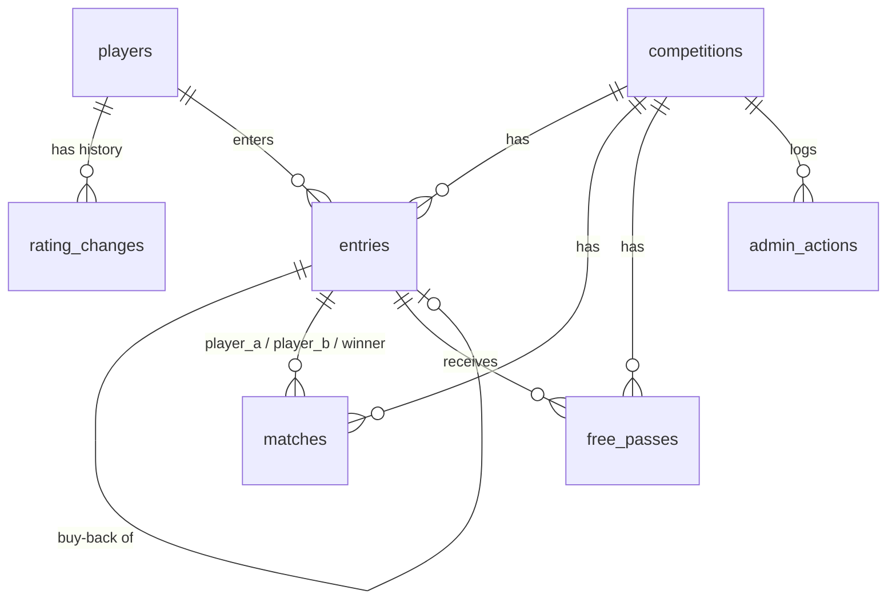

# Maroubra Seals Snooker — Specification

**This file is the source of truth for what the app does.** Technical choices — stack, hosting, database, deployment, cost — live in [CLAUDE.md](CLAUDE.md). If the two disagree, this file wins on behaviour and CLAUDE.md wins on infrastructure.

A single-night, single-elimination snooker competition manager. One organiser runs the night from the admin pages on the club phone; everyone else watches a public bracket.

**Section numbers here are cited from ~300 places in the code** (`spec 5.4`, `O-13`, `§6`). Do not renumber sections — add new ones.

## Vocabulary

Used consistently in code, UI and this document.

| Term | Meaning |
| --- | --- |
| **Bracket size** | 16 or 32, the number of round-one slots (§1, §8) |
| **Slot** | One of the `1..B` round-one positions. Slots `2k−1` and `2k` are match `k` (§8.2) |
| **Box** | One position of the fixed tree: box `k` of round `r` covers slots `(k−1)·2^r+1 .. k·2^r`, fed by boxes `2k−1` and `2k` below (5.4) |
| **Rating** | A player's stored handicap. **Lower is better, and it can be negative** — like a golf handicap (§6, 5.6) |
| **Start** | The head start the weaker player — the one with the **higher** rating number — receives (§6) |
| **Waiting player** | A player in the current round with no opponent yet |
| **Buy-back** | A round-one loser re-entering once, optionally, for one more round-one match (§3) |
| **Late arrival** | A player who joins after the draw: takes an open slot, placed like a buy-back, but flagged `late`, and may still buy back once if they lose (§3, §8.3) |
| **Free pass** | Advancing without playing, because the other half of your box is empty (§4, §11) |
| **Force Pair** | Pairs two waiting players at random, round one only (§10) |
| **Close Buy-Backs** | Locks the player list. The button reads **No More Buy-Backs / Late Entries** (§11) |
| **End night here** | Closes a night that ran out of time: complete, no winner, "completed (unfinished)" (O-16). Not the same as **Abandon** |
| **Master override** | Organiser screen that can change anything, bypassing the normal guards (O-5) |
| **Table** | One of the club's snooker tables, numbered `1..table_count` (four unless the night says otherwise). A match in play occupies one (5.14) |

---

# Part A — Player rules

The player-facing rules. Print or hand these out.

## 1. Format

- Single-elimination knockout, one night, **16 or 32 player** round-one bracket.
- Every match is **one frame** with a **25-minute time limit** (§5).
- Lose in round one and you can **buy back** for one more round-one match. Lose in round two or later and you are out.
- If the club's time runs out before the final, the organiser **ends the night where it stands**. Every result played counts and handicaps are adjusted as usual (§6, §13); the title is simply not awarded that week.

## 2. Fees

| | AUD |
| --- | --- |
| Competition entry | **5** |
| Buy-back | **2** |

Fees are not tracked anywhere in the app; the buy-back amount appears in the complete dialog as a reminder only.

## 3. Round one and buy-backs

- All entered players are drawn at random into round one.
- A round-one loser can buy back **once**, if they want to — never automatic. A buy-back goes straight into the bracket: a **random empty match** while one is left, otherwise the empty seat beside a **random player still waiting for an opponent**, first-draw or buy-back alike (§9). Winners join the first-draw winners in round two.
- **Buy-backs are limited to the empty slots, first come first served.** A bracket with no empty slots has no room for any; when the last slot goes, the next loser is out however willing they are to pay. The organiser picks the bracket size with this in mind.
- A player who arrives after the draw enters as a **late arrival**, taking an empty slot and placed the same way as a buy-back (§9). A late arrival is *not* a buy-back: if they lose in round one they can still buy back once, like everyone else.
- Once the organiser closes the buy-back window, no more entries for the night. (If closed by mistake, the organiser can reopen it from the override screen.)

## 4. Free passes and the bracket

- The bracket is **fixed**: the winners of matches 1 and 2 meet in round two, the winners of 3 and 4 meet next to them, and so on to the final. Your place in the tree is set by the slot you drew in round one.
- A **free pass** is what you get when the other side of your next match is empty — nobody drawn there, or everyone there already knocked out. You move on without playing.
- When the buy-back window closes, **every** round-one player still without an opponent gets a free pass to round two: two half-filled matches means two free passes. If the organiser would rather those two played each other, they use **Force Pair** (§10) before closing.
- A free pass can happen in any round, more than once in the same round, and the same player can get several in a row: with few players the bottom of the bracket is empty and whoever sits just above it climbs until they meet someone. Buy-backs filling the empty matches is what keeps that rare.

## 5. Time limit

- The 25-minute clock starts when the organiser starts the match in the app. The app alerts when time is up.
- If the frame is unfinished at time, the player **ahead on points** wins. If level, a **re-spotted black** decides it.

## 6. Handicaps

- Every player has a handicap rating. **The lower the number, the better the player, and ratings can go below zero** — it runs like a golf handicap.
- The weaker player — the one with the **higher** number — starts the frame with **two thirds of the difference**, rounded to the nearest point.
- Example: ratings 45 and 20 give a difference of 25, so the player on **45** starts on **17**. Negatives work the same way: 20 against −5 is also a difference of 25, so the player on 20 starts on 17.
- Ratings are reviewed **weekly** on the previous week's results: a good night brings your number **down**, a bad night puts it **up** (§13). The organiser has final say.

## 7. Conduct

- Be at the table when your match is called, or the organiser may award it to your opponent.
- Standard snooker rules apply at the table. The organiser's decision on any dispute is final.

## §8–§13 — App behaviour

The old rules document carried a Part B (§8–13) that restated the app spec. It has been folded into Part 1 and Part 2 below to remove the duplication. Existing `§` citations resolve here:

| Was | Now |
| --- | --- |
| §8 Setup and start | 3.3 (setup and draw), 3.4 (the night), 5.1 (round-one fill), 5.11 (end / abandon) |
| §8.1 bracket size fixed after start | 3.3, 4.2 |
| §8.2 fill top to bottom, open slots | 5.1 |
| §8.3 adding players after start | 3.4 (Add late arrival), 5.2, 5.10 (override) |
| §9 Buy-back placement | 5.2 |
| §10 Force Pair | 3.4, 5.5 |
| §11 Closing buy-backs, moving up the bracket | 5.3 (close), 5.4 (the tree) |
| §12 Match timer and status | 4.1 (states), 5.8 (cancel start), 5.12 (timer) |
| §13 Handicap ratings in the app | 3.2 (players), 3.7 (review), 5.6 (start), 5.9 (adjustment) |

---

# Part 1 — For the organiser

## 1. Overview

The app runs one snooker competition on one night. Before the night, the organiser keeps a list of club players and their ratings (§13). On the night, the organiser picks the bracket size, ticks the players who have entered and presses **Start Competition**; the app draws round one at random (§8). From then on the organiser uses the admin page on the club phone to start each match, watch the 25-minute clock, enter the winner, and record whether a round-one loser buys back (§12). Winners climb a fixed bracket automatically (§4, §11), buy-backs go straight into a random empty match (§9), the organiser can Force Pair waiting players when a table is free (§10), and Close Buy-Backs when the night's entries are done (§11). Everyone else watches the public bracket on their own phone. The competition is single-elimination and finishes when one player is left.

**Nothing on the night is a one-way door.** A match started by mistake can be un-started (O-5), a result corrected (§12), a whole night abandoned (O-7), and the master override screen (3.9, O-5) can add or remove players and rebuild pairings at any point.

## 2. Roles and access

| Role | How they get in | What they can do |
| --- | --- | --- |
| **Organiser** | Types one of the club's **admin codes** on the login screen. A session cookie keeps the phone logged in. | Everything: players and ratings, setup and start, buy-backs, start/complete/cancel/correct matches, Force Pair, Close Buy-Backs, master override, end or abandon the night, adjust ratings afterwards, settings. |
| **Public viewer** | Opens the public page. No login. | Read only: bracket, match states and clocks, players, ratings and starts. |

- There are **several admin codes, one per organiser, each with a name** (O-8). The name attached to the code that was used is recorded as "changed by" on every rating change (§13) and as the actor on every override. No accounts, no password resets, no email: the code *is* the identity.
- The organiser stays logged in until the cookie expires or **their** code changes. Each cookie is signed with the code that created it, so changing one person's code logs out only that person (7.1).
- The public page **never** changes anything. Every change is checked on the server, not just hidden in the interface.
- More than one device can be logged in at once, with the same code or different ones.

## 3. Screens

All screens are designed for a phone held upright. The club badge is the browser icon, sits above the title on 3.1 and 3.8, and at the left of the admin top bar.

| # | Screen | Who | Route |
| --- | --- | --- | --- |
| 3.1 | Admin login | Organiser | `/admin/login` |
| 3.2 | Players and ratings | Organiser | `/admin/players` |
| 3.3 | Competition setup and draw | Organiser | `/admin/setup` |
| 3.4 | Admin bracket and match control | Organiser | `/admin` |
| 3.5 | Complete match / review result | Organiser | dialog on 3.4 |
| 3.6 | Match timer view | — | *Removed: the countdown on the match card is the clock.* |
| 3.7 | End-of-night rating review | Organiser | `/admin/ratings` |
| 3.8 | Public bracket | Everyone | `/` |
| 3.9 | Master override | Organiser | `/admin/override` |
| 3.10 | Settings | Organiser | `/admin/settings` |
| 3.11 | History | Organiser | `/admin/history` |

### 3.1 Admin login

One input box for the code (nothing else is typed on a phone); the app works out which organiser it belongs to (O-8). A match sets the session cookie and goes to the admin bracket (3.4), or to setup (3.3) if no competition is running. No match shows "Code not accepted" and changes nothing. A link goes to the public bracket.

Every admin screen shows **"Signed in as Gabriel"** with a **Log out** link, so it is always obvious whose name will be recorded. Any admin page opened without a valid cookie redirects here.

### 3.2 Players and ratings

The club's player list persists week to week. Each player has a stored rating (§13) and is **active** or **inactive**. **Players are never deleted** (O-9): someone who has left is deactivated, hiding them from tonight's entry list while keeping their rating history and past results.

Shows every active player's name and rating, inactive players behind a toggle, and — on the edit sheet — the rating change history with who changed it and when (§13).

| Action | What happens |
| --- | --- |
| Add player | Name and starting rating. The first rating is recorded as a rating change so its origin is in the history. |
| Edit → Save | Overrides the rating. A history row records old value, new value, the signed-in organiser and the time (O-8). **Changing a rating never changes the start of a match already created tonight** (5.6). |
| Active / Inactive | Deactivating hides the player from the entry list and the public list, and blocks them from being entered. Neither direction touches their history. A player in tonight's competition cannot be deactivated until the night is complete or abandoned. |

There is no delete (O-9). If a player was added by mistake, deactivate them.

### 3.3 Competition setup and draw

Shown when no competition is in progress. Implements §8.1–8.2.

Shows the competition name, bracket size, a one-line reminder of the time limit, tables and rating scale linking to 3.10, two lists side by side (stacked on a phone) — **active** club players not yet entered, with a search box, and tonight's entered players — and a live summary line ("13 players → 6 matches, 1 waiting player, 3 open slots for buy-backs").

| Action | What happens |
| --- | --- |
| Bracket size | 16 or 32 (§8.1). Disabled if more players are ticked than the size allows. |
| Change › / Settings › | Opens 3.10. The time limit and rating scale are deliberately off this screen so the night's setup is two decisions: size and players. |
| Add › / ‹ Remove | Tick any number in one list and move them across in **one request** (`player_ids` / `entry_ids`, 7.4); the reply carries the bracket, so the screen never re-fetches. Add is disabled, with the reason, when the ticked players would not fit. |
| New player | Opens the add-player dialog from 3.2 and enters them straight into tonight's list. |
| **Start Competition** | Confirms ("Start with 13 players in a 16 bracket? The bracket size cannot be changed afterwards."). Shuffles the entered players, fills round one top to bottom with no gaps, leaves the rest open for buy-backs and late arrivals, and makes any odd player out a waiting player (§8.2). Each slot fixes that player's place in the whole tree (5.4). Lands on 3.4. |

After Start the bracket size is locked (§8.1) and players are added only as late arrivals (§8.3) or through the override (3.9). Setup is unreachable until the night is complete or abandoned.

### 3.4 Admin bracket and match control

The main screen for the night. Lists every match with its state colour, the players awaiting an opponent, and the round-one controls, with a **List | Tree** switch at the top. The list lays cards out in columns on a wide screen and one column on a phone; the tree draws the whole night as a fixed bracket (5.4), filling the width and scrolling sideways on a phone. Both run matches: every tree box carries its own **Start** button (**Complete** once in play), and tapping the box opens the same card as the list for the rarer taps. Default is the **tree on a wide screen** (900 px or wider) and the **list on a phone**; a tap on the switch is remembered on that device.

```
┌──────────────────────────────────────┐
│ Friday 11 Sep · Round 1  [List|Tree] │
│ Buy-backs OPEN      Open slots: 2/16 │
│ [ No More Buy-Backs / Late Entries ] │
│ [ Force Pair ]                       │
│ [ + Add late arrival ]               │
├──────────────────────────────────────┤
│ R1M1 ● IN PLAY            18:42 left │
│     Alice Chen (45)  starts on 17    │
│     Bob Smith (20)                   │
│     Alice Chen starts on 17 — two    │
│     thirds of the 25 difference      │
│ ┌──────────────────────────────────┐ │
│ │            Complete              │ │
│ └──────────────────────────────────┘ │
│     [ ⤺ Cancel start ]               │
├──────────────────────────────────────┤
│ R1M2 ○ NOT STARTED limit: 25 min ▾   │
│     Carl Diaz (33)   starts on 2     │
│     Dee Park (30)                    │
├──────────────────────────────────────┤
│ R1M3 ■ FINISHED                      │
│   ✔ Eve Long (28)                    │
│     Fay Ng (41)  → bought back       │
│     [ Review result ]                │
├──────────────────────────────────────┤
│ R1M4 ● IN PLAY  ⚠ TIMED OUT    00:00 │
│     Hal Ito (36) / Ida Roy (36)      │
│     level, no start                  │
├──────────────────────────────────────┤
│ R1M8 ○ AWAITING OPPONENT  slot 15    │
│     Fay Ng (41)      buy-back #1     │
│     open seat — next buy-back        │
├──────────────────────────────────────┤
│ Players & ratings ›   Public page ›  │
│ Master override ›     Abandon night  │
└──────────────────────────────────────┘
```

`⤺` is **Cancel start** (O-5). A box holding one player shows as **AWAITING OPPONENT** in every round: in round one a half-full slot pair, from round two a winner whose opponent's match is still going (5.4).

**Start** and **Complete** are the taps of the night, so each is **the full width of its card**, in the list and in the tree alike; the rarer buttons stay small and wrap underneath.

**The handicap start is shown twice on a card** (§6, 5.6): as "starts on 17" on the receiving player's own line — the one with the higher number — and again as one short line of working under both names, "Alice Chen starts on 17 (⅔ of 25)", so the number can be checked at the table without arithmetic and without a sentence on every card (UX review, Sep 2026). Level ratings read "Level, no start". In the tree the start rides beside the weaker player's rating as "+17".

**State chips and colours** (4.1, UX review Sep 2026): every card carries a chip — **LIVE** in felt green with the countdown beside it, **READY** in amber, **FINISHED** neutral grey, **AWAITING OPPONENT** amber — and the card itself is outlined green only while live and shaded neutral once finished. Red is kept for errors and for taps that cannot be undone. The title block above the list names the night, the player count and the bracket size, with three chips for how many matches are live, how many are ready, and whether buy-backs are open and how many slots are left.

**Tables** (5.14): a strip along the top shows every table — green **Free**, or the match on it with its clock — and the title block's chips count the free ones. **Start asks which table**: a centred card lists the tables as large buttons, the free ones tappable and the busy ones greyed with the match on them, and the tap on a table is what starts the match. Nothing is picked in advance, and with every table busy the card says so and nothing can start. Every in-play card then carries a navy **Table 2** chip beside its state; tapping it moves the match to another free table (in play) or notes where it will go (not started). A match can never be put on a table another match is playing on. In the tree the table rides beside the clock as "T2".

**Find player**: a name box beside the List | Tree switch. Typing narrows the list to matches involving that name and says where each of their entries stands ("Playing now in R1M2 against Dee Park · 12:40 left", "Waiting in R2M1 for the winner of R1M2", "Out — lost in round one").

**Matches are named by round and position**: R1M1 … R1M8, R2M1 … R2M4, R3M1, R3M2 and **Final** for a 16 bracket (up to R4M2 and Final for 32). A card waiting for its second player says who fills it: in round one the next buy-back or late arrival (5.2), from round two the winner of the box below ("winner of R1M6"). The stored match number stays positional (5.4); only the display name differs.

**The tapped button shows what it is doing.** It is disabled and carries a spinner until the server answers; the reply carries the new bracket, so the screen updates without a second request. A double tap cannot start or complete a match twice. **Only the match being updated is locked** (UX review, Sep 2026): a Start, Record result, Cancel start or limit change disables that card's buttons and no other, so the organiser can serve the next table while the first save is in flight. A night-wide tap — No More Buy-Backs, Force Pair, End night here, Abandon — locks the whole page. Replies are applied in version order (7.2), so two saves whose replies cross in the air, or a refresh answered from before a save, can never put an older bracket over a newer one.

Rounds overlap: R2M1 can be in play while R1M7 has not started, so the list shows every round with anything in it, newest first, finished rounds collapsed. Once buy-backs close the round-one controls disappear (§10, §11).

**Data shown:** competition name, the lowest round still being played, the signed-in organiser, and whether buy-backs are open. Every match of the current round: number, state and colour (§12), both players with ratings, the start (5.6), the countdown while in play, a timed-out warning at zero, the winner tick and the loser's buy-back decision when finished. Boxes holding one player, with the slot number in round one. Open slots remaining (O-3). **All** free-pass holders — round one can have more than one (§4, O-4). There is no separate waiting list: everyone is placed the moment they enter (O-13).

| Action | Available when | What happens |
| --- | --- | --- |
| **Start** | Match not started, a table free | Asks which free table (5.14), then turns green and the countdown begins from the match's limit (§12). The started time is stored on the server, so the clock keeps running wherever the organiser goes, after a refresh, and while the phone is locked. |
| Table 2 ▾ | Match not started or in play | Notes the table a match will go on (it stands in for the Start question while free), or moves a match in play to a free table. Blank clears it (5.14). |
| limit: 25 min ▾ | Match not started | Overrides the time limit for this match only. Rarely needed, so it hides behind the card's note rather than taking a button. |
| **Complete** | Match in play | Opens 3.5. A result cannot be entered on a match that has not started (§12). |
| **⤺ Cancel start** | Match in play | Confirms, then returns the match to `not_started`, clears `started_at`, the frozen limit and the table, writes an audit row. For the wrong match having been started (O-5). Players, ratings and start untouched. |
| **Review result** | Match finished, winner's next match not started | Opens 3.5 to change the result; the corrected winner is pulled back out of the next round (§12). Otherwise replaced by "Result locked: next match started" — the override (3.9) is the way through. |
| **Force Pair** | Buy-backs open, ≥2 waiting in round one | Pairs two waiting players at random, whichever way they entered (§10). Under two waiting it is disabled with "Needs 2 waiting players". Never touches an existing match. Hidden once buy-backs close. |
| **No More Buy-Backs / Late Entries** | Buy-backs open | Confirms, naming the consequence: "…2 players have no opponent and will go straight to round 2." Locks the player list and gives a free pass to **every** round-one player still without an opponent (O-4); the tree then moves on (5.3, 5.4). **The only way the window closes** (O-15): once every round-one match is finished a notice says so, names anyone waiting alone, and the button turns primary. |
| **List \| Tree** | Always | Switches views; the choice is remembered on that device. |
| **Add late arrival** | Buy-backs open, ≥1 open slot | A **New player — not on the club list** tick chooses the form: unticked shows only the club list, ticked shows only Name and Rating (and adds them to the club list for next week). The player must be active and **not in tonight's competition**, and enters as a **late arrival** (§3, §8.3) — a `late` entry, tagged "late arrival", not a buy-back. Takes one open slot, placed per 5.2; the reply says "Placed into R1M8, awaiting an opponent" or "Placed into R1M7 v Gus Ray". If they lose in round one they are offered the buy-back like anyone else. A round-one loser is refused here (409, naming the fix): they buy back through **Review result**. |
| **End night here ›** | In progress | The night has run out of time (O-16). Confirms with what the tap costs, from a `dry_run`: matches left unplayed, clocks discarded, who is still in. Closes the night as `complete` with **no winner** (5.11); the header reads "Complete (unfinished)" and the rating review link is the same one a finished night gets. Cannot be undone. |
| **Abandon night** | In progress | Confirms, then sets the competition to `abandoned` (O-7) and returns to setup. Everything played is kept but counts for nothing. |
| **Master override ›** | Any time | Opens 3.9. |

Automatic behaviour (no button):

- Buy-backs **never close by themselves** (O-15). Entries keep taking open slots until the organiser taps the button, however far round one has got.
- Every result **moves its winner up the tree at once** (§11, 5.4): into the next match if the other side is ready, otherwise into that box as *awaiting opponent*. Once buy-backs are closed, a player whose other side is empty gets a free pass and keeps climbing. The reply says which: "Alice Chen goes to R2M1" / "waits in round 2 for an opponent" / "has a free pass to round 3".
- **The night hands over to the rating review by itself.** The moment the competition turns `complete` — the final completed, or End night here — the organiser is taken to `/admin/ratings?competition=<id>`, because the review is always the next step (§13). Only that transition redirects; reopening a finished night's bracket stays put. The review then hands over to history the same way (3.7).

### 3.5 Complete match / review result

Dialog opened from 3.4 (list or tree), centred like every dialog in the app. Implements §12 "Complete".

**Every dialog in the app is the app's own.** `alert()`, `confirm()` and `prompt()` are not used anywhere: they cannot be styled, have no room for the consequences a confirmation here must show, and a phone set to suppress them answers "cancel" without the organiser seeing the question. Confirmations and the one text field that used to be a `prompt` (the per-match time limit) are the same centred `.sheet` card — a title that asks the question, the explanation, the consequences as bullets read from the action's `dry_run`, then **the button that goes ahead first** (red when it cannot be undone) and the one that backs out beside it. Escape and a backdrop tap back out; a text field validates in place. An ESLint rule (`no-restricted-globals`) keeps the browser dialogs out.

The dialog asks for the winner, and for a round-one match where the loser has not already bought back, whether they buy back or decline (§3: **once**, and always the player's choice). From round two there is only the winner choice. If buy-backs are closed it reads "Buy-backs are closed. Bob Smith is out."

**Nothing is chosen for the organiser** (UX review, Sep 2026). The dialog opens titled "Record result" with **no winner and no buy-back decision selected**; each is a large tappable row under "Who won?" and "Buy-back decision". **Save result stays disabled** until the winner and, when it is asked, the decision have both been tapped. A one-line summary above the buttons says what the tap will do — "Dee Park wins R1M2. Hal Ito buys back ($2)." — and changing the winner clears the decision, because it is now a different player's. On Save the dialog closes at once and the card carries the spinner (3.4), so the next result can be entered while this one saves; the reply's note appears at the top of the page.

**Slots run out first come, first served** (O-3). Every buy-back consumes one open slot; when the last goes, "Buys back" is disabled with "No open slots left — Bob Smith is out", and the loser is out even though they were willing to pay. The remaining count is shown next to the option so the organiser sees it coming.

| Action | What happens |
| --- | --- |
| Save result | The match turns red, the clock stops, the winner is advanced up the tree (§12, 5.4). A loser who buys back takes an open slot and goes straight into the bracket (§9, 5.2); one who declines is out. The buy-back window is untouched (O-15). The reply says where the winner and the buy-back went. |
| Cancel | Nothing changes; the match stays in play. |

**Review result** uses the same dialog titled "Review R1M1" with the current result pre-selected. Saving replaces the result: the previous winner is removed from the next round and the new winner takes their place (§12). What happens to the previous loser's buy-back is in 5.7 — if that buy-back match has started, the correction is refused (O-6) and the override is the only way through.

### 3.6 Match timer view

**Removed.** The countdown on the match card (3.4, list and tree) is the clock; a separate full-screen timer was a screen nobody used. Everything it did lives on the card: the countdown is worked out from the server's stored start time and the match's limit, not a counter on the phone, so leaving the screen, refreshing, or locking the phone shows the correct remaining time (§12); at zero the app plays the voice alert **"Match timed out"** on any admin page and shows the warning (5.12); the match stays green until a result is entered. `/admin/match/{id}` no longer exists.

### 3.7 End-of-night rating review

Implements §13 with the scale from O-1. The app **proposes** every new rating from the four settings on the competition and the organiser can change any before saving (§13: "The organiser has final say").

Shows every player who took part, in finishing order (5.9), with the proposed rating pre-filled in an editable box and the adjustment that produced it. The scale in use is shown at the top; players outside both groups are listed as unchanged.

**Finishing order** is how far the player got: the winner first, then the runner-up, the beaten semi-finalists, and so on down to players knocked out in round one who did not win a buy-back match (5.9). A player who bought back is ranked on the better of their two runs.

| Action | What happens |
| --- | --- |
| Edit a box | Overrides the proposal for that player. |
| Save rating changes | Writes a rating change per player whose value differs from their current rating, with the signed-in organiser and the time (§13, O-8). Unchanged rows are not written. The review can be reopened and saved again; it always compares against the current rating, so saving twice does not apply the adjustment twice. On success the organiser is taken to **that night in the history** (`/admin/history?night=<id>`), where the changes just saved are listed under Handicap results — the last step of the night. |

### 3.8 Public bracket

Read-only, no login. Refreshes every 10 seconds so clocks and results stay current.

Shows the same match list as 3.4 (state colour, players, ratings, start, countdown, timed-out warning, winner, buy-back decision), boxes awaiting an opponent, open slots, all free-pass holders, the round structure for the whole night, and the **active** player list with ratings — or, with the switch on **Tree**, the whole bracket drawn as on paper (5.4): every box of every round, connectors, the winner at the right, empty boxes dashed, free passes marked.

With no competition running it shows the player list and "No competition tonight yet". An abandoned competition is not shown at all. A night ended early (O-16) is shown as it stands, headed "Complete (unfinished)" with "Night ended early — no winner this week."

**Actions:** none that change anything. Tapping a match expands it to show the start time and limit. List | Tree defaults as on 3.4 and is remembered on that device.

**Live play first** (UX review, Sep 2026). The page has three sections, as tabs along the top of the navy header on a desktop and along the bottom of the screen on a phone:

- **Tonight** (default): **Find my match** — a name box; typing shows where each of that player's entries stands, in the words of 3.4's Find player, with the table when they are playing ("Playing now on table 2 in R1M3 …") — then the **table strip** (every table, free or with its match and clock) and **Playing now** (every in-play match as a card with its **table** and the countdown as its headline, the two names either side of "vs", and the start on one line), **Up next** (every match with two players not yet started, earlier rounds first), **Waiting for an opponent** (lone players and free-pass holders as rows) and **Results** (finished matches, newest first, one line each: "Gus Ray beat Eve Long · bought back"). A finished night shows the winner, or "Night ended early — no winner this week", at the top.
- **Draw**: the full bracket as in 3.4 — the same List | Tree switch, every round, open slots and free passes.
- **Players**: the active club list as searchable rows with a **Handicap** column, and one line explaining it: lower is better, it can be negative, and the higher number starts with two thirds of the difference.

With no competition the Tonight tab says nothing is running and that the draw appears the moment the organiser sets up the next night; Draw is disabled; Players still works. The hosting badge the free tier injects floats over the page, so the page keeps clear space under its last card.

### 3.9 Master override

The escape hatch (O-5). Everything the normal screens refuse is possible here, on the organiser's word. It exists because a club night goes wrong in ways no specification predicts: the wrong name was ticked, two players swapped tables, someone went home, a result was entered against the wrong match an hour ago.

Shows every player in tonight's competition with their position, every match with its state, every free pass, the night-level switches, and the audit log of overrides already made tonight. Each action shows a plain-English confirmation naming every consequence before it runs, and writes an `admin_actions` row with the signed-in organiser's name (O-8).

| Action | What happens |
| --- | --- |
| Add a player to the night | Enters an active player at any point, ignoring the bracket size, the closed window and the one-buy-back rule. Placed by the 5.2 rule; if the bracket is full it is grown to 32 first (or refused on a full 32). |
| Remove a player | Their not-started matches are deleted and the opponent returns to waiting; a finished match they won is voided and the pairing re-opened, as far back as the last round that has not started. The confirmation lists exactly which matches change. |
| Replace a player in a match | Swaps one player for another in a not-started or in-play match. The start is recalculated from the two current ratings (5.6); the clock is left alone. |
| Reset a match | Back to `not_started`: clears the result, winner and clock, and pulls the winner out of the next round if that round has not started. Like Cancel start (O-5) but it also works on a finished match. |
| Delete a match | Removes the match; both players return to waiting in that round. |
| Pair two waiting players | Creates a match between any two chosen waiting players, without the §10 randomness. |
| Grant / revoke a free pass | Moves a player into the next round without playing, or takes that back. |
| Reopen buy-backs | Clears `buybacks_closed_at` and returns round one to open. The one place §3's "no more entries for the night" can be undone. |
| Grow bracket 16 → 32 | Adds slots 17–32 as open slots. Existing slots, matches and results untouched. It cannot shrink. |
| Abandon this competition | As on 3.4 (O-7). |

The override refuses only one thing: it will not leave the competition in a state the app cannot render — a match with one player is fine (it becomes a box awaiting an opponent), a match with the same player twice is not.

### 3.10 Settings

The things that rarely change, kept off the setup screen so the night's setup is size and players only: the live competition's **match time limit** (§12), the number of **snooker tables** the club plays on tonight (5.14; **four** unless changed, carried over from the previous night), and the four **rating adjustment** numbers (top X by Y, bottom Z by W — O-1).

With no competition set up it says so and links to 3.3: a new night starts with the previous night's values (7.4), so there is nothing to edit until one exists.

Save writes through `PATCH /api/admin/competitions/{id}`. The time limit and the table count can change any time before the night is complete (the count cannot drop below a table a match is playing on); the time limit affects matches not yet started; the rating scale is locked once the night has started (7.4). Reached from "Settings ›" at the bottom of 3.3, 3.4 and 3.9; not in the top bar.

### 3.11 History

Every past night in one place, and how the handicaps have moved across them (§13). Two tabs switched by `?tab=` so either can be bookmarked.

**Comp history** (default): a row of past nights newest first, one selected (`?night=<id>`, newest by default). For the selected night — name, date, bracket size, players, winner and runner-up (blank when the title came by free pass, and "ended early, no winner" for a night closed on time, O-16, whose tab is tagged "(unfinished)"), a link to its rating review, then the whole night as the **tree** of 3.4, read-only, every match with its winner ticked and free passes and late arrivals tagged. Under it, **Handicap results**: the rating changes saved against that night in its review, with who saved them (O-8). An abandoned night shows its summary, no tree and no results. Tonight's competition is not history yet and does not appear.

**Handicap history**: a grid of every player who took part in a completed night against every completed night, oldest left, newest right, with the rating each player left the night with after the review, the change that produced it, and their rating today in the last column. A dash means they played and their number did not change; a blank means they did not play. Each date links to that night's comp history.

**Actions:** none that change anything. Ratings are changed on 3.7 or 3.2. The screen reads the database directly and needs no API route.

## 4. Match and tournament state machine

### 4.1 Match states (§12)

| State | Colour | Meaning |
| --- | --- | --- |
| `not_started` | amber chip **READY**, plain card | Match exists, players known, clock has not begun. |
| `in_play` | green chip **LIVE**, green outline | Clock is running (or has run out). |
| `finished` | neutral chip **FINISHED**, grey card | Winner recorded, clock stopped, winner advanced. |

Red is not a match colour: it is reserved for errors and for buttons that cannot be undone (UX review, Sep 2026).

"Timed out" is **not** a separate state. It is a warning on an in-play match once the clock reaches zero; the match stays green until a result is entered (§12).

```
                Start (organiser)             Complete (organiser)
  not_started ───────────────────►  in_play ───────────────────────►  finished
       ▲                               │                                 │ ▲
       │  Cancel start (O-5)           │ clock reaches zero              │ │ Review result
       └───────────────────────────────┤                                 │ │ only while the winner's
       │                               ▼                                 └─┘ next match is not started
       │                         in_play + TIMED OUT warning
       │                         (still green, still in_play)
       └──────────── Reset, master override 3.9 (O-5) ───────────────────────┘
```

| From | To | Trigger | Guard | Side effects |
| --- | --- | --- | --- | --- |
| `not_started` | `in_play` | **Start** | Match has two players; a free table chosen (5.14). | `started_at` set to now on the server. Time limit frozen for this match. `table_number` set to the chosen table. |
| `in_play` | `not_started` | **Cancel start** (O-5) | Match is `in_play`. | `started_at`, frozen limit and `table_number` cleared. Audit row. No result is involved, so nothing else changes. |
| `in_play` | `in_play` (timed out) | Clock reaches zero | — | Voice alert on the organiser's device; warning shown everywhere. No data change. |
| `in_play` | `finished` | **Complete** | Winner chosen. Round one: loser's buy-back decision chosen (unless already bought back, window closed, or no open slot). | Winner recorded, `finished_at` set, winner advanced up the tree (5.4). Loser buys back (takes a slot, placed at once per 5.2) or is out. Window untouched (O-15). |
| `finished` | `finished` (new result) | **Review result** | Previous winner's next match not started (§12), and the previous loser's buy-back match not started (O-6). | Previous winner removed from the next round; new winner advanced. Details in 5.7. |
| any | `not_started` | Override **Reset** (O-5) | None. | Result, winner and clock cleared; next round unwound as far as it can be. Audit row. |

A result still cannot be entered on a `not_started` match (§12), and the server rejects it.

### 4.2 Tournament states

| State | Meaning | Organiser can |
| --- | --- | --- |
| `setup` | Players ticked, size chosen, nothing drawn. | Change anything on 3.3 and 3.10. |
| `in_progress`, buy-backs open | Round one under way, entries still accepted. Later-round matches form as their feeders finish, so rounds overlap. | Start/Complete/Cancel/Review, add buy-backs and late arrivals, Force Pair, Close Buy-Backs, override, end, abandon. |
| `in_progress`, buy-backs closed | Player list locked. Winners climb the fixed bracket; empty halves give free passes (5.4). No buy-backs, no Force Pair (§11). | Start/Complete/Cancel/Review, override, end, abandon. |
| `complete` | One player left, or the night was ended early (O-16). | Review ratings (3.7). Start a new competition next week. |
| `abandoned` | The night was called off (O-7). | Nothing. The row is kept; a new competition can be set up straight away. |

```
 setup ──Start Competition (§8)──► in_progress, buy-backs open
                                       │  every result moves its winner up the tree;
                                       │  a round-two match forms when both feeders are done
                 Close Buy-Backs: the organiser's tap, never automatic (§11, O-15)
                                       ▼
                            in_progress, buy-backs closed
                                       │  free passes for every lone player (O-4) and for
                                       │  every empty half of the tree (O-14), then climb …
                                       ▼
                                   complete

 any in_progress state ──Abandon (O-7)───────► abandoned
 in_progress ──End night here (O-16)──► complete, no winner ("unfinished")
```

Reversal rules:

- **Bracket size** cannot be reduced, and cannot change at all on the normal screens after Start (§8.1). The override can grow 16 → 32, which only adds open slots.
- **A mistaken Start is reversible** with Cancel start (O-5); there is no data to lose.
- **Ending the night on time is not reversible** (O-16), and neither is Abandon (O-7). They are the two one-way doors.
- **A mistaken draw** is handled by Abandon and setting up again, or by rebuilding pairings on 3.9.
- **Buy-backs closed** cannot be reopened on the normal screens, but the override can (O-5).
- **Round advancement** is reversed through Review result, and only while the affected winner's next match is not started (§12). Correcting a match can therefore dissolve a not-started next-round match (5.7). Past that point it is the override's job.
- There is no round draw to reverse: a winner's next match exists only because of their result, so correcting it deletes that match (if not started) and the new winner takes the same box.

---

# Part 2 — For the developer

Architecture rules from [CLAUDE.md](CLAUDE.md) apply throughout: all bracket logic in pure server-side functions under `lib/`; the database is the source of truth; every write route checks the admin cookie; the timer derives from `started_at`.

## 5. Bracket logic

All functions below are pure: they take the current competition data and return the new rows to write. Route handlers validate, call them, persist in one transaction, and return.

### 5.1 Round-one fill (§8.2)

Inputs: bracket size `B` ∈ {16, 32}, `N` entered players, a random source.

1. `2 ≤ N ≤ B`. Fewer than 2 cannot form a match; more than `B` is rejected ("Choose the 32 bracket").
2. Shuffle the `N` players (Fisher–Yates with a cryptographically random source; only the resulting slots are stored).
3. Number the slots `1..B`. Place the shuffled players in slots `1..N`, top to bottom, no gaps.
4. Slots `2k−1` and `2k` form match `k`. A **match row exists only once both of its slots are occupied**, so matches `1..⌊N/2⌋` are created as `not_started`.
5. If `N` is odd, the player in slot `N` has no opponent and is a **waiting player** (§8.2). They keep their slot; their match `⌈N/2⌉` is half-full and shows as "awaiting opponent".
6. Slots `N+1..B` are **open slots**, reserved for buy-backs and late arrivals. `open_slots = B − N`.

| Bracket | Players | Matches created | Half-full | Empty matches | Open slots |
| --- | --- | --- | --- | --- | --- |
| 16 | 16 | 8 | — | — | 0 |
| 16 | 13 | 6 | M7 (slot 13) | M8 | 3 |
| 16 | 10 | 5 | — | M6, M7, M8 | 6 |
| 32 | 32 | 16 | — | — | 0 |
| 32 | 21 | 10 | M11 (slot 21) | M12–M16 | 11 |
| 32 | 17 | 8 | M9 (slot 17) | M10–M16 | 15 |

**Slot capacity is the hard cap on buy-backs, first come first served** (O-3). Every buy-back or late arrival consumes one open slot at the moment it is recorded. A full bracket accepts none; a 13-player 16-bracket accepts three. When `open_slots` reaches zero the "Buys back" option is disabled and any further loser is out (3.5). The organiser expecting buy-backs chooses the bracket size accordingly, or grows the bracket on 3.9.

### 5.2 Where a buy-back goes: placement on entry (§3, §8.2, §9, O-13)

A buy-back entry is created when a round-one loser chooses "Buys back" on Complete. Buying back is always the player's choice and available **once** per player (§3). The player consumes an open slot, gets a `buyback_seq` (1, 2, 3, … in order of re-entry), and is **placed into a slot in the same transaction** — there is no unplaced state and no waiting list (O-13). A **late arrival** consumes an open slot and is placed by the same rule, but as a `late` entry with no `buyback_seq`: they keep their one buy-back for if they lose (§3).

**The placement rule** (`pickFreeSlot`, random with the injected source):

1. While any **empty match** remains (both slots of a pair free), a random one; the player takes its lower slot and shows as *awaiting opponent*.
2. Otherwise a random **free seat beside a player waiting in round one**, first-draw or buy-back alike. The match is created at once.

A seat beside a player who is not waiting (a free-pass holder after close) is not free — filling it would pair someone who has already advanced. If nothing is free the entry is refused ("No free slot in the bracket"), which the O-3 cap already prevents in normal play.

**16 bracket, 13 first-draw players.** After the draw: M1–M6 full, M7 half-full (Gus Ray in slot 13), M8 empty.

| Event | Slot taken | Result |
| --- | --- | --- |
| Buy-back #1 (Fay Ng) | 15 | M8 is the only empty match. Fay waits there, "awaiting opponent" |
| Buy-back #2 (Ivan Poe) | 14 or 16, at random | **M7 created** (Gus v Ivan) or **M8 created** (Fay v Ivan) |
| Buy-back #3 (Jo Kerr) | the remaining seat | The other match is created |

`open_slots` goes 3 → 2 → 1 → 0, and the bracket ends with 8 matches and no free pass.

**16 bracket, 10 first-draw players.** M1–M5 full, M6–M8 empty. Buy-backs #1, #2 and #3 each take a **different** empty match, in random order, and each waits alone; #4 sits beside one of them at random and that match forms. This is the organiser's worked example (O-13): a buy-back takes an empty match even while another player waits alone, and only when nothing is empty does it pair with a random lone player.

**Force Pair** (5.5) is the organiser's tool for pairing two lone players sooner than the rule would.

### 5.3 Close Buy-Backs and round-one free passes (§11, O-4)

**Trigger.** The organiser presses **No More Buy-Backs / Late Entries**, and nothing else (O-15). There is no automatic close: after the last round-one result the window is still open, entries still take open slots, and lone players keep waiting. Screen 3.4 prompts for the tap once every round-one match is finished.

**Effect, in one transaction:**

1. Set `buybacks_closed_at`. No more entries, and no Complete may record "Buys back" from now on (§3).
2. Run the advancement step (5.4). Its round-one rule gives **every player still without an opponent a free pass to round two** (O-4) — there may be several — and then everything above moves as far as it can: two pass-holders whose boxes feed the same round-two box meet there at once; a pass-holder whose other side is empty passes again.

Point 2's first half **replaces** §11's old "fills every possible round-one match before giving a free pass". The two leftovers of a 16-bracket are not paired with each other at close; they both go through — and if they feed the same round-two box (M7 and M8 do), they meet there.

Worked, 16 bracket, 13 first-draw players:

| Buy-backs before the close | Round one at close | Free passes | What follows |
| --- | --- | --- | --- |
| 3 | M8 and M7 both created | none | — |
| 2 | one of M7/M8 created, one lone player | 1 | the lone player waits in round two for the other match's winner |
| 1 | Gus Ray alone in M7, the buy-back alone in M8 | **2** | both feed box 4 of round two: **M12 is created at once**, Gus v the buy-back |
| 0 | Gus alone in M7, M8 empty | 1 | M8 is empty, so Gus passes round two as well and waits in M14 |

The one-buy-back row is the case the organiser described: two matches each holding a single player, and both go to round two. If the organiser would rather they played each other *in round one*, **Force Pair** before closing does exactly that.

### 5.4 The fixed bracket: advancing up the tree (§4, §11, O-14)

The bracket is a fixed single-elimination tree and every player's place follows from their round-one `slot`:

- Rounds run `1 .. log2(B)`: four for 16, five for 32. The final is the last round, box 1.
- **Box** `k` of round `r` covers slots `(k−1)·2^r + 1 .. k·2^r` and is fed by boxes `2k−1` and `2k` of round `r−1`. A player in slot `s` sits in box `⌈s / 2^r⌉` of round `r`. A player's opponent must come from the *other* half of the box.
- **Match numbers are positional**: box `k` of round `r` is `M(B − B/2^(r−1) + k)`. For 16: M1–M8, M9–M12, M13–M14, M15. For 32: M1–M16, M17–M24, M25–M28, M29–M30, M31. Growing 16 → 32 renumbers later rounds by this formula (5.10). The screens name a box `R{r}M{k}`, the last round as Final (3.4), so a renumbering never shows.

**Advancement is progressive, not per round.** After every write — a result, a placement, a close, an override — one automatic step (`advanceAll`) pushes every waiting player as far up the tree as their position allows, and repeats until nothing moves:

| Waiting in | Condition | Effect |
| --- | --- | --- |
| round `r ≥ 2`, box `k` | someone is waiting in round `r` in the other half of the box | **match `(r, k)` is created**, `not_started`, lower slot as player A, origin `advance` |
| round `r ≥ 2`, box `k` | buy-backs closed, and nobody in the other half can still reach round `r` | **free pass from round `r`**; the player is now waiting in round `r+1` and the step runs again for them |
| round `r ≥ 2`, box `k` | otherwise (a feeder is still to be played, or the half is empty but buy-backs are open) | waits in the box as *awaiting opponent* |
| round 1, after close | seat-mate missing or out | free pass from round one (O-4). Two waiting seat-mates (a deleted match) are left for the organiser |
| beyond the final round | — | the competition is **complete** and this player is the winner |

While buy-backs are open nothing skips a round: an empty half may still fill with a buy-back, so a winner whose other side is empty waits. The moment the window closes those waits resolve.

Consequences worth knowing (recorded in §4):

- A round-two match is ready as soon as both feeders are done, while the rest of round one is still going. Rounds overlap.
- A round can hold **more than one free pass**, and the same player can receive several in a row: with 9 players in a 16 bracket and no buy-backs, the player in slot 9 passes rounds one, two and three and plays only the final. Buy-backs filling random empty matches make this rare; the 13-player night with three buy-backs is a perfect eight with no free pass at all.
- With 8 players in a 16 bracket the top half decides the night: M13's winner passes the empty bottom half and is champion. The tree draws that honestly.

**A player left waiting when nothing can resolve them** cannot happen after close in normal play, because an empty half gives a pass. A correction (5.7) or an override (5.10) that leaves two seat-mates waiting in round one is the one case, and it is the organiser's to pair.

### 5.5 Force Pair (§10)

| Check | Failure response |
| --- | --- |
| Buy-backs are open | 409 "Force Pair is only available in round one, while buy-backs are open" |
| At least two waiting players | 409 "Needs 2 waiting players" (no-op) |

Effect: choose two waiting players uniformly at random (any mix of first-draw and buy-back), and create one `not_started` round-one match between them.

- If one already occupies a slot in a half-full match, the other is placed into that match's free slot.
- If both occupy slots in different half-full matches, the lower-numbered match is used and the other player's slot is released back to the free-slot order.
- If neither is placed, both go into the lowest-numbered empty match.

Nothing else changes: existing matches are never modified (§10), buy-backs remain open, and `open_slots` is unchanged because the players had already consumed their slots. Force Pair may be pressed repeatedly, and is refused once buy-backs close.

### 5.6 Handicap start (§6, §13)

**A rating is a handicap and runs like a golf handicap: the lower the number, the better the player.** A player on 20 is stronger than one on 45. Ratings **can go negative** — a player on −5 is stronger again — and nothing in the arithmetic cares about the sign.

This is what §6's "the lower-rated player" means: the player rated lower *in ability*, who carries the **higher** handicap number. They receive the start. Read as "lower number" it says the opposite of what it means.

```
diff  = | rating_a − rating_b |
start = round_to_nearest( (2/3) × diff )
```

The start goes to the player with the **higher** rating number. Equal ratings: no start.

| Ratings | Difference | Two thirds | Start | Goes to |
| --- | --- | --- | --- | --- |
| 45 v 20 | 25 | 16.67 | 17 | the 45 |
| 33 v 30 | 3 | 2.00 | 2 | the 33 |
| 41 v 28 | 13 | 8.67 | 9 | the 41 |
| 36 v 36 | 0 | 0 | 0 | nobody |
| 50 v 49 | 1 | 0.67 | 1 | the 50 |
| 40 v 38 | 2 | 1.33 | 1 | the 40 |
| 20 v −5 | 25 | 16.67 | 17 | the 20 |
| −2 v −8 | 6 | 4.00 | 4 | the −2 |
| 0 v 12 | 12 | 8.00 | 8 | the 12 |

Negative ratings are ordinary. The difference is an absolute value, so `20 v −5` and `45 v 20` produce the same 17-point start. Subtracting a negative is the one place a naive implementation goes wrong, so it is in the tests.

Two thirds of a whole number is never exactly `.5`, so "round to the nearest point" needs no tie-break. Ratings are whole numbers — positive, zero or negative.

The start is calculated **when the match is created** (§13) and the ratings are snapshotted on the match row (`rating_a`, `rating_b`, `start_points`, `start_entry_id`). A rating override later in the night (3.2) does not change a match already drawn; this keeps the bracket honest. The one thing that does recalculate a start is a player being swapped into a match on the override (3.9), because it is a different match afterwards.

### 5.7 Result correction (§12, O-6)

Allowed while the recorded winner's next match is `not_started` or does not yet exist. Rejected with 409 once that match is `in_play` or `finished`.

Saving a corrected result on match `M` (round `r`), in one transaction:

1. **Previous winner `W`** is pulled back out of every later round: their `not_started` later matches are deleted (the other player returns to waiting in that box) and their later free passes removed. If `W` had not gone anywhere, nothing to undo.
2. **New winner `W′`** is advanced exactly as a fresh Complete would be, by 5.4: they take the same box, so they meet the player left waiting in step 1, or receive the free pass `W` held. The correction is local by construction — the tree has only one place for the winner of `M`.
3. **Round one only, previous loser `W′`'s buy-back**: if `W′` had bought back and their buy-back match is `not_started`, that match is deleted, the buy-back entry and its slot released, their opponent returns to waiting, and `W′` is simply the winner. If that buy-back match is `in_play` or `finished`, the correction is **rejected** with 409 "Loser's buy-back match already started" (O-6: this should not happen; the override is the way through, and it will say what it is about to unwind).
4. **New loser `W` in round one** must record buy back or decline in the correction dialog, subject to the same slot and closed-window checks as Complete (O-3).
5. `finished_at` is left as is; `corrected_at` is set for the audit trail.

### 5.8 Cancel start (O-5)

`in_play → not_started` for a match started by mistake.

| Check | Failure response |
| --- | --- |
| Match is `in_play` | 409 "Only a match in play can have its start cancelled" |

Effect: clear `started_at` and the frozen `time_limit_minutes`, set `state = not_started`, write an `admin_actions` row naming the organiser and the match. No result exists yet, so nothing else is affected — the two players, the snapshotted ratings and the start stay as they were, and the match can be started again immediately.

There is deliberately no "pause" (§12 has no such concept). Cancelling and restarting gives the match a full clock again, which is the honest thing when the wrong match was started.

### 5.9 Rating adjustment after the night (§13, O-1)

Four settings snapshotted on the competition: `rating_top_count` (default 3), `rating_top_delta` (default **−1**), `rating_bottom_count` (default 3), `rating_bottom_delta` (default **+2**).

**Finishing order.** For every player who took part:

- `reached_round` — the highest round in which they had a match or held a free pass. A player with two entries (first draw plus buy-back) takes the higher.
- `won_final` — true only for the winner of the night. A night ended early (O-16) has no winner, and its labels are the plain round reached: nothing is called "final" when no final was played.

Best-first order is `(reached_round desc, won_final desc, rating asc, name asc)` — `rating asc` because the lower handicap is the better player (5.6). Worst-first is the same keys reversed, with `rating desc`, so among players knocked out at the same point the weakest is first. The last two keys exist only to make the cut deterministic; they carry no meaning, and the organiser can move any number by hand on 3.7.

**Groups.**

- **Top group**: the first `rating_top_count` players in best-first order. Each gets `rating + rating_top_delta`.
- **Bottom group**: the first `rating_bottom_count` in worst-first order, skipping anyone already in the top group. Each gets `rating + rating_bottom_delta`.
- Everyone else is unchanged.
- Results are clamped to the `−100..200` range (6.3). The negative end is real: a player who keeps winning keeps going down through zero.

With the defaults on a full 16-player night: the winner, the runner-up and the better beaten semi-finalist go **down** 1; the three weakest players knocked out in round one who did not win a buy-back match go **up** 2. Setting `rating_top_count` to 4 catches both semi-finalists.

**The direction is the right way round.** A good night lowers your handicap, which makes you the stronger-rated player, which means you *give away* more start next week (5.6). A bad night raises it and you receive more. The bottom delta being larger (+2 against −1) pulls the field together faster at the weak end than it stretches it at the strong end — the organiser's call, and a setting either way.

The review is idempotent: 3.7 always proposes `current rating + delta`, so saving twice with no edits writes nothing the second time.

### 5.10 Master override (O-5)

The override actions in 3.9 are the same pure functions the normal routes use, called with their guards switched off, plus two of their own:

| Override | Reuses | Extra behaviour |
| --- | --- | --- |
| Reset a match | 5.8 and 5.7 step 1 | Works from `finished` as well as `in_play`. Unwinds every later match and pass of the winner; if a later match has started, it resets that too, and says so in the confirmation. |
| Delete a match | — | **Round one only.** Both entries return to waiting and keep their slots. From round two the tree has exactly one place for those two players, so the automatic step would put the match straight back — Reset or Replace a player are the tools there; the route answers 409. |
| Remove a player | 5.7 | Their not-started matches are deleted and finished matches they **won** are voided, unwinding the winner's later place; a finished match they **lost** stays as history. Refuses, naming the match, if one of theirs is in play or a later match has started. The automatic step then runs. |
| Pair two waiting players | 5.5 | No randomness. In round one any two waiting players; from round two both must be waiting in the **same box** (409 otherwise). |
| Add a player to the night | 5.2 | Ignores `open_slots`, `buybacks_closed_at` and the one-buy-back rule. Takes an **open place** — an empty round-one slot not under a box already decided — chosen by the 5.2 placement rule: an empty match first, then a seat beside a lone waiting player (O-13), and the lowest open place only when neither is open; grows the bracket to 32 first if none is left; 409 if a 32 bracket has none. The automatic step then climbs them until they meet someone. |
| Replace a player in a match | 5.6 | Recomputes `start_points`, `start_entry_id` and both rating snapshots. In round one the two players swap slots; from round two the newcomer must be waiting in the match's box. |
| Grant / revoke a free pass | 5.4 | Direct write to `free_passes`, then the automatic step (grant). A revoke is refused once the holder is in a later match. |
| Reopen buy-backs | — | Clears `buybacks_closed_at` **and takes back what the close caused**: every free pass, and the not-started matches their holders reached through them. Refuses, naming the match, if one has started. |
| Grow bracket | 5.1, 5.4 | `bracket_size` 16 → 32; slots 17–32 become open slots and later-round matches are renumbered by position (M9 becomes M17). |
| Abandon (O-7) | — | 5.11. |

Every override writes an `admin_actions` row: the organiser's name from the session (O-8), the action, and a JSON snapshot of what changed. That log is what makes the escape hatch safe to hand to a club phone.

### 5.11 Closing a night: End night here, and Abandon

Two ways to close a night that has not played itself out. **End night here** is the ordinary one — the club's time is up, which is how most nights end. **Abandon** is for a night that should not count at all.

**End night here** (O-16)

| Check | Failure response |
| --- | --- |
| Competition is `in_progress` | 409 "Only a competition that is running can be ended" |

Effect: any match still `in_play` goes back to `not_started` with its clock thrown away (5.8 — the frame was not played out, and a countdown running on a closed night would be a lie); then `status = 'complete'`, `completed_at` set, `winner_entry_id` left **null**, and an `admin_actions` row (`end_early`) recording what was left unplayed and who was still in. Nothing is deleted.

A complete competition with no `winner_entry_id` is exactly what "ended early" means, so no column is needed for it: the admin bracket, the public page and history all read **"completed (unfinished)"** from it, and the rating review labels everyone by the round they reached rather than calling the furthest round played "the final". The night **counts**: it appears in history and its rating review opens as usual, because the review ranks on finishing order and never needed a champion. Confirming shows what the tap costs, from a `dry_run`.

**Abandon** (O-7)

| Check | Failure response |
| --- | --- |
| Competition is `setup` or `in_progress` | 409 "Only a competition that is running can be abandoned" |

Effect: set `status = 'abandoned'` and `abandoned_at`, write an `admin_actions` row. Nothing is deleted — every match, entry and result is kept so the night can be looked at afterwards — but the night is finished, hidden from the public page, and the partial unique index that allows only one live competition is freed, so a fresh one can be set up immediately. An abandoned competition never reaches the rating review.

### 5.12 Timer (§12)

Stored: `started_at` (server time, UTC) and `time_limit_minutes` (frozen at Start from the per-match override or the competition default).

Derived on any client, never stored:

```
ends_at        = started_at + time_limit_minutes
remaining      = max(0, ends_at − now)
timed_out      = state == 'in_play' AND now ≥ ends_at
```

The client reads `started_at` and the server's `now` in the same response and offsets its own clock by the difference, so a phone with a wrong clock still shows the right countdown. The alert fires when a client observes `timed_out` become true for a match it has not already alerted for (kept in memory per page load). The public page shows the warning but does not play the voice.

### 5.13 Test coverage

The minimum unit tests over `lib/`:

- Round-one fill with 16 and 32 for full, even and odd counts; open-slot arithmetic; half-full and empty match identification (5.1).
- Placement (O-13): the one empty match before the seat beside the lone first-draw player (13 of 16 → slot 15); a random empty match, not always the same one (10 of 16); three buy-backs take three different empty matches and the fourth joins one; the organiser's 5-player example; a full bracket has nowhere to place (5.2).
- Buy-back capacity: the cap is the open-slot count, granted first come first served, and "Buys back" is refused at zero (O-3).
- Close with 3, 2, 1 and 0 buy-backs on a 13-of-16 bracket produces 0, 1, **2** and 1 free passes (5.3, O-4), and with 1 the two pass-holders meet in M12 at once.
- The tree (O-14): positional numbering for 16 and 32; a round-two match forms while round one is still going; nobody skips a round while buy-backs are open; a dead half gives an immediate pass after close and cascades (9 players: slot 9 reaches the final unplayed); 13 players and 3 buy-backs make a perfect eight ending in M15; 4 players in a 32 bracket pass through to the title (5.4).
- Force Pair: no-op under two waiting players, never touches existing matches, rejected after close, and the right slot for each placement case (5.5).
- Handicap start: the §6 example (45 v 20 → 17) and the whole 5.6 table, including that the start goes to the **higher** number, and the three negative-rating rows.
- Correction pulling a winner out of a not-started next-round match (the other player waits in the box until the new winner arrives) and out of a free pass; rejection when the loser's buy-back match has started (5.7, O-6).
- Cancel start clears the clock, leaves the pairing intact, and the match can be started again (5.8).
- Rating adjustment: finishing order for a 16-player night with buy-backs, the default groups, no player in both, a winner whose handicap crosses zero into negative, clamping at −100 and 200, and idempotence on a second save (5.9).
- Overrides: delete refused from round two, pair needs the same box, add takes an open place and climbs, grow renumbers M9 → M17, reopen takes the close's passes back and refuses once a match reached through one has started (5.10).
- No automatic close: the window outlives the last round-one result and a late arrival still gets in until the tap (5.3, O-15); abandon freeing the live slot (5.11).
- End night here (O-16, 5.11): the night becomes complete with a null winner and every finished match kept, a match in play has its clock thrown away, the players left standing are named, a second tap is refused, the `dry_run` writes nothing, and the rating review still opens — labelling the furthest round reached `R2`, not "final".
- Tables (5.14): Start without a table is refused naming the free ones, a busy or out-of-range table is refused, a finished match frees its table but keeps the number, Cancel start clears it, a table noted before start counts as the choice only while free, every table busy refuses the start, moving in play needs a free table, and the count cannot drop below a table in play.

### 5.14 Tables

The club plays on a few numbered snooker tables — **four** unless a night's settings say otherwise (`competitions.table_count`, 1–16, carried over from the previous night like the rating scale). A match **in play** occupies one table; a finished match keeps the number it was played on as a record but occupies nothing.

- **Start needs a table chosen by the organiser** (`table`), which must be in range and free; the one noted on the match beforehand counts as the choice while it is still free. Nothing is picked for them: with no table the start is refused (`400`, naming the free tables), and with every table busy it is refused too (`409`). **A match never shares a table.** The screen asks with one button per free table and shows the busy ones greyed with the match on them.
- **Cancel start** and the override **Reset** clear the table with the clock; **End night here** and **Abandon** clear it on every match whose clock they discard.
- **Move / note a table** (`PATCH /api/admin/matches/{id} { table_number }`): before start any number in range is a note of where the match will go; in play the table must be free; a finished match is refused; `null` clears.
- **Table count** can change any time before the night is complete, but not below a table a match is currently playing on (`409`).

Nothing about tables changes who plays whom or who advances; it exists so a player can walk to the right table and the organiser can see what is free.

## 6. Data model

Two shapes are worth reading before the tables:

- **A slot is an entry, and the slot is the player's place in the whole tree.** One row in `entries` occupies one round-one slot; box `⌈slot / 2^r⌉` is where that player plays in round `r` (5.4). A player who buys back gets a **second** entry row linked to their first, so `open_slots = bracket_size − count(entries)` is a plain count with no special cases (O-3).
- **A match row exists only when both of its players are known.** A box holding one player is not a match; it is what the screens call "awaiting opponent". This is what makes multiple free passes fall out naturally (O-4, O-14).

### 6.1 ER diagram



A **player** is a permanent club member with a rating history, active or inactive but never deleted. A **competition** is one night. An **entry** is one player in one slot of one competition. A **match** joins two entries in a round. A **free pass** records one entry advancing without playing. An **admin action** records an override.

### 6.2 Enums

```sql
create type match_state as enum ('not_started', 'in_play', 'finished');
create type competition_status as enum ('setup', 'in_progress', 'complete', 'abandoned');
create type entry_source as enum ('draw', 'buyback', 'late'); -- 'late' added by 0003_late_arrivals.sql
create type buyback_decision as enum ('bought_back', 'declined', 'no_slots');
create type match_origin as enum ('draw', 'placement', 'force_pair', 'close', 'advance', 'correction', 'override');
```

`no_slots` records a loser who wanted to buy back but found the bracket full (O-3). Round-one open/closed is derived from `competitions.buybacks_closed_at`, and the current round from the lowest round with anything unfinished, so `competition_status` stays small. `placement` is a buy-back sitting down beside a lone player; `advance` is a match the tree formed from two winners.

### 6.3 Tables

**players** — the club list, persists across nights. Never deleted (O-9).

| Column | Type | Constraints |
| --- | --- | --- |
| id | uuid | PK, default `gen_random_uuid()` |
| name | text | not null, unique (case-insensitive), 1–60 chars |
| rating | integer | not null, `check (rating between -100 and 200)` — lower is better and **negative is allowed** (5.6) |
| active | boolean | not null, default `true` (O-9) |
| deactivated_at | timestamptz | nullable; `check ((deactivated_at is null) = active)` |
| created_at / updated_at | timestamptz | not null, default now() |

There is no delete route and no `on delete cascade` pointing at this table: history and past entries always resolve to a real player.

**rating_changes** — §13 audit of every rating change.

| Column | Type | Constraints |
| --- | --- | --- |
| id | bigint | PK, identity |
| player_id | uuid | FK → players, not null |
| competition_id | uuid | FK → competitions, nullable (null for ad-hoc overrides) |
| old_rating | integer | nullable (null for the first rating) |
| new_rating | integer | not null |
| changed_by | text | not null — the signed-in organiser's name from the session cookie, never typed (O-8) |
| reason | text | nullable |
| changed_at | timestamptz | not null, default now() |

**competitions** — one row per night.

| Column | Type | Constraints |
| --- | --- | --- |
| id | uuid | PK |
| name | text | not null |
| status | competition_status | not null, default `'setup'` |
| bracket_size | smallint | not null, `check (bracket_size in (16, 32))` |
| default_time_limit_minutes | smallint | not null, default 25, `check (between 1 and 180)` |
| table_count | smallint | not null, default 4, `check (between 1 and 16)` — the club's snooker tables tonight (5.14) |
| rating_top_count | smallint | not null, default 3, `check (>= 0)` (O-1) |
| rating_top_delta | smallint | not null, default **−1** (O-1) |
| rating_bottom_count | smallint | not null, default 3, `check (>= 0)` (O-1) |
| rating_bottom_delta | smallint | not null, default **+2** (O-1) |
| started_at | timestamptz | nullable; set by Start Competition, after which `bracket_size` may only be raised 16 → 32 by the override |
| buybacks_closed_at | timestamptz | nullable |
| completed_at | timestamptz | nullable |
| abandoned_at | timestamptz | nullable (O-7); `check ((abandoned_at is null) = (status <> 'abandoned'))` |
| winner_entry_id | uuid | FK → entries, nullable — **null on a night ended early** (O-16) |
| created_at | timestamptz | not null, default now() |
| updated_at | timestamptz | not null, default now(). Bumped by every write to the night inside its transaction; the bracket JSON carries it as `version` (7.2) |

At most one competition may be `setup` or `in_progress` at a time: partial unique index on a constant, `((1)) where status in ('setup','in_progress')`. Abandoning (5.11) frees it immediately.

The four rating columns are snapshotted from the previous competition when a new one is created, so last week's review is never rewritten by this week's settings (O-1).

**entries** — one player in one slot of one competition.

| Column | Type | Constraints |
| --- | --- | --- |
| id | uuid | PK |
| competition_id | uuid | FK → competitions, not null |
| player_id | uuid | FK → players, not null |
| source | entry_source | not null. `draw` = the first draw; `late` = a late arrival (§3), a first-life entry that arrived after the draw; `buyback` = a round-one loser re-entering |
| slot | smallint | nullable in the schema, **always set once the night has started**; `check (slot between 1 and 32)`; unique `(competition_id, slot)`. Fixes the player's box in every round (5.4) |
| buyback_seq | integer | nullable, set on a buy-back entry in order of re-entry; unique `(competition_id, buyback_seq)` |
| rebuy_of_entry_id | uuid | FK → entries, nullable, unique; on a buy-back entry, the `draw` or `late` entry that lost |
| buyback_decision | buyback_decision | nullable; set on a `draw` or `late` entry when it loses in round one |
| rating_at_entry | integer | not null, snapshot of the player's rating at entry time |
| joined_round | smallint | not null, default 1. Always 1: an override-added player takes a round-one slot and climbs with free passes (5.10) |
| entered_at | timestamptz | not null, default now() |

- Unique `(competition_id, player_id, source)`. A player has at most one buy-back entry a night, beside their one first-life entry (`draw` or `late`) — §3's "buy back **once**" enforced by the schema. The logic never creates both a `draw` and a `late` row for one player.
- `check (source = 'buyback' or (buyback_seq is null and rebuy_of_entry_id is null))`.
- `slot` is null only before Start. A buy-back is placed in the same transaction that records it (5.2, O-13).
- **Open slots** are `bracket_size − count(entries)`. Because a buy-back is its own row, this is the whole of the O-3 cap: the insert is rejected inside the transaction if it would take the count past `bracket_size`.
- Derived per-entry status (not stored): *waiting* in round `r`, *in match*, *out*, *winner*.

**matches** — a row exists only when both players of a box are known (5.1, 5.4).

| Column | Type | Constraints |
| --- | --- | --- |
| id | uuid | PK |
| competition_id | uuid | FK → competitions, not null |
| round | smallint | not null, `check (round >= 1)` |
| number | smallint | not null; unique `(competition_id, number)`, deferrable so a grow can renumber; positional: box `k` of round `r` is `B − B/2^(r−1) + k` (5.4) |
| player_a_id | uuid | FK → entries, not null |
| player_b_id | uuid | FK → entries, not null, `check (player_a_id <> player_b_id)` |
| rating_a / rating_b | integer | not null, snapshot |
| start_points | smallint | not null, `check (start_points >= 0)` |
| start_entry_id | uuid | FK → entries, nullable (null when `start_points = 0`) |
| state | match_state | not null, default `'not_started'` |
| origin | match_origin | not null |
| time_limit_minutes | smallint | nullable; per-match override before start, frozen at start, cleared again by Cancel start (O-5) |
| table_number | smallint | nullable, `check (>= 1)`; the table the match is on, chosen at Start, cleared by Cancel start, kept once finished (5.14) |
| started_at | timestamptz | nullable; `check ((started_at is null) = (state = 'not_started'))` |
| finished_at | timestamptz | nullable; `check ((finished_at is null) = (state <> 'finished'))` |
| winner_id | uuid | FK → entries, nullable; `check ((winner_id is null) = (state <> 'finished'))`; must equal `player_a_id` or `player_b_id` |
| corrected_at | timestamptz | nullable |
| created_at | timestamptz | not null, default now() |

Indexes: `(competition_id, round)`, `(competition_id, state)`.

The `started_at` check is what makes Cancel start (5.8) a two-column write: set `state = 'not_started'` and `started_at = null` together, or the constraint rejects it.

**free_passes** — any round may hold several (O-4, O-14): one per box whose other half is empty.

| Column | Type | Constraints |
| --- | --- | --- |
| id | uuid | PK |
| competition_id | uuid | FK → competitions, not null |
| entry_id | uuid | FK → entries, not null |
| from_round | smallint | not null; the round in which the player had no opponent |
| granted_at | timestamptz | not null, default now() |

Unique `(competition_id, entry_id, from_round)`. There is deliberately **no** unique index on `(competition_id, from_round)`: a round can produce more than one row (O-4, O-14), and a constraint forbidding it would be the old §11 rule smuggled back in.

**admin_actions** — the audit trail behind Cancel start, End night here, Abandon and every override (O-5, O-7, O-8).

| Column | Type | Constraints |
| --- | --- | --- |
| id | bigint | PK, identity |
| competition_id | uuid | FK → competitions, nullable |
| actor | text | not null — the signed-in organiser's name (O-8) |
| action | text | not null, e.g. `cancel_start`, `reset_match`, `remove_player`, `reopen_buybacks`, `grow_bracket`, `end_early`, `abandon` |
| details | jsonb | not null — what changed, enough to explain the action a week later |
| created_at | timestamptz | not null, default now() |

Index `(competition_id, created_at desc)` for the "Recent overrides" list on 3.9.

### 6.4 What the timer derives from

Only `matches.started_at` and `matches.time_limit_minutes` (falling back to `competitions.default_time_limit_minutes` for display before start). There is no `remaining_seconds`, `ends_at` or "paused" column, and no client-side counter is ever written back. The only client-side work is subtraction (5.12).

### 6.5 Access

Row Level Security is enabled on every table with **no policies**, so the anon key can read nothing. All reads and writes go through Next.js route handlers on the server. One credential, one place it lives, and the Supabase dashboard stays available for on-the-night manual fixes — though the master override (3.9) should be the first thing reached for, because it keeps the audit trail.

## 7. API routes

Next.js App Router route handlers under `app/api/`. JSON in, JSON out. Every route under `/api/admin/` runs the session check first and returns `401` without a valid cookie, **including reads**. Public routes under `/api/public/` are read-only. Errors return `{ error: "message" }` with `400`, `401`, `404` or `409` (not allowed in the current state).

State-changing routes use `update … where state = '…'` (or `select … for update` inside a transaction) so a double tap on a slow phone cannot start or complete a match twice.

Every write route resolves the organiser's name from the session cookie and passes it to whatever it writes — `rating_changes.changed_by`, `admin_actions.actor` (O-8). **No route accepts a name from the request body.**

### 7.1 Session

| Method + route | Input | Validation | Cookie |
| --- | --- | --- | --- |
| `POST /api/admin/login` | `{ code }` | Compare with **each** configured admin code in constant time and take the name of the one that matches (O-8). On success set cookie `seal_admin` = `{name}.{HMAC-SHA256(name, key = that organiser's code)}`, `HttpOnly; Secure; SameSite=Lax; Max-Age=30 days`. No match: `401` and a 1-second delay. | No |
| `POST /api/admin/logout` | — | Clears the cookie. | Yes |

Verifying a cookie means splitting off the name, looking it up in `ADMIN_CODES`, and recomputing the HMAC with that person's code. Two properties fall out: changing **one** organiser's code logs out only that organiser, and removing a name invalidates their sessions immediately. No session table, no extra secret.

### 7.2 Public reads

| Method + route | Returns | Cookie |
| --- | --- | --- |
| `GET /api/public/bracket` | The current (or most recent non-abandoned) competition: status, current round, `rounds_total`, `buybacks_closed_at`, open slots, and for every round its matches (players, ratings, start, state, `started_at`, `time_limit_minutes`, winner), the boxes awaiting an opponent, all free passes, and `boxes` — every box of the round for the tree view (match, lone player, pass-through, or empty); the winner; `server_now`; and `version` — the competition's `updated_at`, which every write bumps inside its own transaction. A screen keeps a payload only when its `version` is at least the one it shows (same competition), so a refresh answered from before a save, or two replies crossing in the air, never replace a newer bracket with an older one. `Cache-Control: s-maxage=5, stale-while-revalidate=10`. | No |
| `GET /api/public/players` | All **active** players with ratings. | No |

The `s-maxage=5` cache is a **cost control**, not a nicety — see CLAUDE.md. The admin bracket calls the same payload via `GET /api/admin/bracket` (cookie required, uncached) so the organiser is never behind the CDN.

### 7.3 Players and ratings (§13)

| Method + route | Input | Validation |
| --- | --- | --- |
| `GET /api/admin/players` | `?include_inactive=1` | — |
| `POST /api/admin/players` | `{ name, rating }` | Name 1–60 chars, unique; rating integer −100–200 (negatives allowed). Writes the player and an initial rating change attributed to the session (O-8). |
| `PATCH /api/admin/players/{id}` | any of `{ rating, reason, active }` | Rating integer −100–200; a change writes a `rating_changes` row. `active: false` is refused with `409` while the player is in a `setup` or `in_progress` competition (O-9). There is **no** `DELETE`. |
| `GET /api/admin/players/{id}/rating-history` | — | — |
| `GET /api/admin/competitions/{id}/rating-review` | — | Competition must be `complete`. Returns every player in finishing order with `reached_round`, current rating and the proposal from 5.9. |
| `POST /api/admin/competitions/{id}/rating-review` | `{ changes: [{ player_id, new_rating }] }` | Competition `complete`; each player must have an entry; each rating −100–200. One rating change per row that differs from the current rating. |

All require the cookie.

### 7.4 Competition setup and control (§8–§11)

| Method + route | Input | Validation |
| --- | --- | --- |
| `POST /api/admin/competitions` | `{ name, bracket_size, default_time_limit_minutes?, table_count?, rating_*? }` | No other competition `setup` or `in_progress`; size ∈ {16, 32}; limit 1–180; tables 1–16; rating counts ≥ 0. Table count and rating settings default from the previous competition (four tables on the first night). Creates in `setup`; the reply carries the empty `bracket`. |
| `PATCH /api/admin/competitions/{id}` | any of `{ name, bracket_size, default_time_limit_minutes, table_count, rating_* }` | `bracket_size` and `rating_*` only while `setup`. `default_time_limit_minutes` and `table_count` any time before `complete`; the limit affects matches not yet started, the count cannot drop below a table in play (`409`, 5.14). What 3.3 and 3.10 call. |
| `POST /api/admin/competitions/{id}/entries` | `{ player_id }`, `{ new_player: {...} }` or `{ player_ids: [...] }` | Player must be active (O-9). `setup`: adds a first-draw entry; total ≤ `bracket_size`. `in_progress` with buy-backs open: adds a **late arrival** as a `late` entry (§3, §8.3), requires an open slot (O-3), places at once (5.2); the reply carries `match_number` or `awaiting_in`. A player already in tonight's competition is `409`; a round-one loser is `409` naming Review result. `player_ids` (up to 64) is `setup` only. |
| `DELETE /api/admin/competitions/{id}/entries/{entry_id}` | — | `setup` only. Removing a player from a running night is an override. |
| `DELETE /api/admin/competitions/{id}/entries` | `{ entry_ids: [...] }` | Several at once, `setup` only. |
| `POST /api/admin/competitions/{id}/start` | — | `setup`; `2 ≤ entries ≤ bracket_size`. Runs 5.1 in a transaction. |
| `POST /api/admin/competitions/{id}/force-pair` | — | Buy-backs open; ≥ 2 waiting; else `409`. Runs 5.5. |
| `POST /api/admin/competitions/{id}/close-buybacks` | `{ dry_run? }` | Buy-backs open; else `409`. Runs 5.3. Reports how many free passes were granted and to whom, and which matches the cascade created; `dry_run` returns the same without writing, which is what the 3.4 confirmation uses. |
| `POST /api/admin/competitions/{id}/end` | `{ dry_run? }` | `in_progress`; else `409`. Runs End night here (5.11, O-16): `complete` with no winner. Returns `unplayed`, `clocks_cancelled` and `still_in`. Writes an `admin_actions` row. |
| `POST /api/admin/competitions/{id}/abandon` | — | `setup` or `in_progress`; else `409`. Runs 5.11, writes an `admin_actions` row (O-7). |
| `GET /api/admin/bracket` | — | Same payload as the public bracket, uncached. |

All require the cookie. **Automatic transitions (advancement up the tree, completion) are not routes.** They run inside the `complete`, `correct`, `close-buybacks`, `entries` and override handlers after the primary write, in the same transaction. Every mutating route returns the fresh `bracket` payload, and the screens use it directly instead of fetching again — one round trip per tap.

### 7.5 Matches (§12)

| Method + route | Input | Validation |
| --- | --- | --- |
| `PATCH /api/admin/matches/{id}` | `{ time_limit_minutes }` and/or `{ table_number }` | Limit: match `not_started`; 1–180, or `null` to revert to the competition default. Table (5.14): 1–`table_count` or `null`; before start a note, in play the table must be free (`409`), refused on a finished match. |
| `POST /api/admin/matches/{id}/start` | `{ table, time_limit_minutes? }` | Match `not_started` (`409` otherwise). `table` 1–`table_count` and free (`409` when in use, `400` when missing, naming the free tables; a table noted on the match beforehand stands in while free). Sets `started_at = now()`, freezes the limit, `state = in_play`, `table_number = table` (5.14); the reply carries `table_number`. |
| `POST /api/admin/matches/{id}/cancel-start` | — | Match `in_play` (`409` otherwise). Runs 5.8, writes an `admin_actions` row (O-5). |
| `POST /api/admin/matches/{id}/complete` | `{ winner_entry_id, loser_decision? }` | Match `in_play` (`409` if `not_started`, per §12, or already `finished`). Winner must be a player of the match. Round one, loser eligible, buy-backs open: `loser_decision` required ∈ {`bought_back`, `declined`}; `bought_back` requires an open slot or the server records `no_slots` and returns the reason (O-3). Otherwise `loser_decision` must be absent. Then `state = finished`, `finished_at`, `winner_id`; apply the decision and place a buy-back (5.2); run advancement (5.4), which also detects completion. The window is untouched (O-15). The reply's `winner_to` says where the winner went: `match` (with `match_number`), `awaiting`, `free_pass` (with `round`) or `winner`. |
| `POST /api/admin/matches/{id}/correct` | `{ winner_entry_id, loser_decision? }` | Match `finished`; guards in 5.7 — `409` if the winner's next match has started, or if the loser's buy-back match has started (O-6). Same decision rules as complete. Runs 5.7 and sets `corrected_at`. |

All require the cookie.

### 7.6 Master override (O-5)

Every route here is a normal admin route with the state guards removed, and every one writes an `admin_actions` row. They all accept `{ dry_run: true }`, which returns the list of changes the action would make without writing — that is what the 3.9 confirmation shows.

| Method + route | Input | What it does |
| --- | --- | --- |
| `POST /api/admin/competitions/{id}/override/entries` | `{ player_id }` or `{ new_player }` | Adds a player at any point into an open place of the tree by the 5.2 rule, ignoring open slots, the closed window and the one-buy-back rule. Grows the bracket first if needed; `409` if a 32 bracket has no open place. |
| `DELETE /api/admin/competitions/{id}/override/entries/{entry_id}` | — | Removes a player and cascades per 5.10. `409` naming the match if the cascade cannot complete. |
| `POST /api/admin/matches/{id}/override/replace-player` | `{ slot: "a" \| "b", entry_id }` | Swaps a player in; recomputes the start (5.6). |
| `POST /api/admin/matches/{id}/override/reset` | — | Any state → `not_started`, unwinding the next round (5.10). |
| `DELETE /api/admin/matches/{id}/override` | — | Round one only: deletes the match; both entries return to waiting and keep their slots. `409` from round two. |
| `POST /api/admin/competitions/{id}/override/pair` | `{ entry_id_a, entry_id_b }` | Creates a match between two waiting players in the same round — and, from round two, the same box. |
| `POST /api/admin/competitions/{id}/override/free-pass` | `{ entry_id, from_round }` | Grants a free pass. |
| `DELETE /api/admin/competitions/{id}/override/free-pass/{id}` | — | Revokes one. |
| `POST /api/admin/competitions/{id}/override/reopen-buybacks` | — | Clears `buybacks_closed_at` and takes back every free pass and the not-started matches reached through them; `409` naming a match that has started. |
| `POST /api/admin/competitions/{id}/override/grow-bracket` | — | `bracket_size` 16 → 32, renumbering later rounds. `409` on a 32 bracket. |
| `GET /api/admin/competitions/{id}/admin-actions` | — | The audit log for 3.9. |

### 7.7 Housekeeping

| Method + route | Validation | Cookie |
| --- | --- | --- |
| `GET /api/cron/ping` | Header `Authorization: Bearer ${CRON_SECRET}`, sent by the Netlify scheduled function. Runs `select 1`. Keeps the free-tier database from pausing. | No (secret header instead) |

## 8. Deployment

**Moved to [CLAUDE.md](CLAUDE.md)** — hosting, environment variables and the deploy steps are infrastructure, not behaviour. `ADMIN_CODES` and the rest are documented there.

## 9. Cost

**Moved to [CLAUDE.md](CLAUDE.md).** The one thing with a behavioural consequence stays here: the `s-maxage=5` cache on `/api/public/bracket` (7.2) is what keeps the site inside the free function-invocation limit. Do not remove it without reading the note in CLAUDE.md.

## 10. Decisions

Nothing here was implemented by guessing. Each row is the organiser's ruling and where it lives.

| # | Question | Ruling | Where |
| --- | --- | --- | --- |
| O-1 | Handicap adjustment amounts | **Configurable, four numbers.** The top X finishers change by Y, the bottom Z by W, everyone else unchanged. Defaults **X = 3, Y = −1, Z = 3, W = +2**. | 3.7, 3.10, 5.9, 6.3 |
| O-2 | Data model detail | **Produce one.** Section 6: one entry per slot, a second entry row for a buy-back, and a match row only once both slots of a pair are filled. | 6 |
| O-3 | Buy-back capacity | **Capped by the open slots, first come first served.** When the slots run out the loser is out, however willing they were. | 3.5, 5.1, 6.3 |
| O-4 | Free passes | **One optional buy-back per player.** At close, **every** player left without an opponent goes to round two, so round one may produce several free passes. | 5.2, 5.3, 5.4, 6.3 |
| O-5 | Cancelling a mistaken Start | **Yes, reversible** — plus a master override screen that can add and remove players and rebuild pairings whenever the organiser wishes. | 3.4, 3.9, 5.8, 5.10, 7.5, 7.6 |
| O-6 | Correction when the loser's buy-back match has started | **It should not happen.** The correction is refused; the override is the way through. | 5.7, 7.5 |
| O-7 | Abandoning a competition | **Yes, an explicit action.** The night is closed, everything kept, a new competition can start immediately. | 3.4, 3.9, 4.2, 5.11, 7.4 |
| O-8 | "Who changed a rating" with one shared code | **Several admin codes, one per organiser, each with a name.** The name comes from the code used, so nothing is typed and nothing can be mistyped. | 2, 3.1, 6.3, 7.1 |
| O-9 | Removing players from the club list | **Never remove — deactivate.** No delete route exists. | 3.2, 6.3, 7.3 |
| O-10 | Vercel Hobby's non-commercial terms | **Move off Vercel.** Host on Netlify, whose free tier permits club use. | CLAUDE.md |
| O-11 | Database choice | **Supabase**, free tier — permits club use and has the row editor the organiser needs on the night. | CLAUDE.md |
| O-12 | Buy-backs after a manual close | **Confirmed as specified.** Close is allowed at any time in round one; losers who arise afterwards are out. | 3.4, 5.3 |
| O-13 | Buy-back placement | **One rule, no setting.** A buy-back or late arrival is placed the moment they enter: a **random empty match** while one exists (even if a first-draw player waits alone elsewhere), otherwise the seat beside a **random lone player**, first-draw or buy-back alike. | 3.4, 5.2, 6.2, 7.4 |
| O-14 | How later rounds are paired | **A fixed bracket, like the paper diagram.** The winners of M1 and M2 meet in round two, and so on up the tree; a winner moves up the moment their match ends; a free pass is what an empty other half gives you, in any round, possibly several times to the same player. Drawn as a tree on both pages. | 3.4, 3.8, 5.3, 5.4, 5.7, 5.10, 6.3 |
| O-15 | When the buy-back window closes | **Only on the organiser's tap.** Entries are accepted until **No More Buy-Backs / Late Entries** is pressed — even after every round-one match has been played. That tap gives every lone round-one player their free pass (O-4) and locks the list. Nothing closes it automatically. | 3.4, 3.5, 4.1, 4.2, 5.3, 7.5 |
| O-16 | Nights that run out of time | **A night ended early counts as "completed (unfinished)".** The organiser taps **End night here**; the night becomes `complete` with **no winner**, keeps every result, appears in history and opens its rating review as usual. Abandon (O-7) stays what it is: a night that should not count at all. | 3.4, 3.8, 3.11, 5.9, 5.11, 7.4 |

### 10.1 Still worth a word from the organiser

None of these block anything; each has a working answer that can be changed in one place.

| Thing | What the app does now | Why it is flagged |
| --- | --- | --- |
| The default for **Z**, the size of the bottom group | 3, mirroring the top group | O-1 gave defaults for X, Y and W but not Z. |
| **Ties inside a finishing group** — on a 16-player night, eight are knocked out in round one and "bottom 3" must choose between them | Broken by handicap (weakest first at the bottom, best first at the top), then by name; every value on 3.7 is editable before saving | This tie-break is the app's invention, not a rule. To adjust *everyone* knocked out in round one, set Z above the field size. |
| The **rating range**, now that negatives are allowed | Stored and validated as −100 to 200; the review clamps to it | Nobody said where a handicap should stop. The club's numbers sit around 20–45. One line in the schema if you want it tighter. |
| Whether the **master override** should need a second code | Any organiser code opens 3.9; every action is logged with their name | The override can undo a finished match, so a club with several organisers may want it narrower. |
| Fees (§2) | Not recorded anywhere; the complete dialog shows the $2 amount as a reminder only | Nothing ever asked for fee tracking, so nothing was built. |
